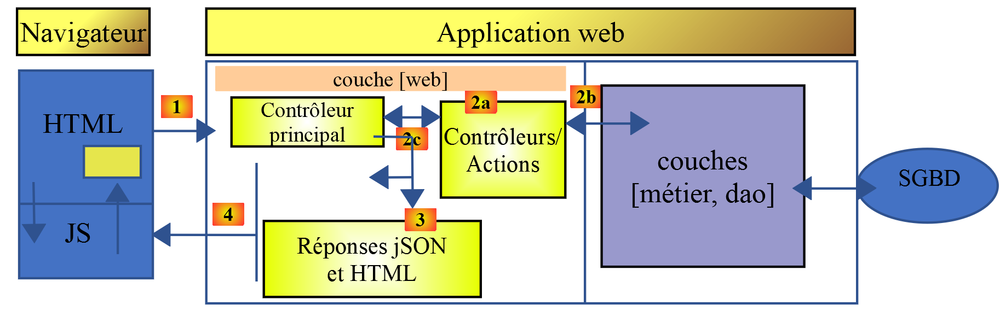

Introduction au framework VUE.JS
================================

Ce document fait partie d’une série de quatre articles :

1. \|[`Introduction au langage PHP7 par
   l’exemple <https://tahe.developpez.com/tutoriels-cours/php7>`__\ \| ;

2. \|\ `Introduction au langage ECMASCRIPT 6 par
   l’exemple <https://tahe.developpez.com/tutoriels-cours/ecmascript6>`__\ \| ;

3. \|\ `Introduction au framework VUE.JS par
   l’exemple <https://tahe.developpez.com/tutoriels-cours/vuejs>`__\ \|.
   **C’est le document présent** ;

4. \|\ `Introduction au framework NUXT.JS par
   l’exemple <https://tahe.developpez.com/tutoriels-cours/nuxtjs>`__\ \| ;

Ce sont tous des documents pour **débutants**. Les articles ont une
suite logique mais **sont faiblement couplés** :

-  le document [1] présente le langage PHP 7. Le lecteur seulement
   intéressé par le langage PHP et pas par le langage Javascript des
   articles suivants s’arrêtera là ;

-  les documents [2-4] visent tous à construire un client Javascript au
   serveur de calcul de l’impôt développé dans le document [1] ;

-  les frameworks Javascript [vue.js] et [nuxt.js] des articles 3 et 4
   nécessitent de connaître le Javascript des dernières versions
   d’ECMASCRIPT, celles de la version 6. Le document [2] est donc
   destiné à ceux qui ne connaissent pas cette version de JavaScript. Il
   fait référence au serveur de calcul de l’impôt construit dans le
   document [1]. Le lecteur de [2] aura alors parfois besoin de se
   référer au document [1] ;

-  une fois ECMASCRIPT 6 maîtrisé, on peut aborder le framework VUE.JS
   qui permet de construire des clients Javascript s’exécutant dans un
   navigateur en mode SPA (Single Page Application). C’est le document
   [3]. Il fait référence à la fois au serveur de calcul de l’impôt
   construit dans le document [1] et au code du client JavaScript
   autonome construit en [2]. Le lecteur de [3] aura alors parfois
   besoin de se référer aux documents [1] et [2] ;

-  une fois VUE.JS maîtrisé, on peut aborder le framework NUXT.JS qui
   permet de construire des clients Javascript s’exécutant dans un
   navigateur en mode SSR (Server Side Rendered). Il fait référence à la
   fois au serveur de calcul de l’impôt construit dans le document [1],
   au code du client Javascript autonome construit en [2] ainsi qu’à
   l’application [vue.js] développée dans le document [3]. Le lecteur de
   [4] aura alors parfois besoin de se référer aux documents [1] [2] et
   [3] ;

La dernière version du serveur de calcul de l’impôt développée dans le
document [1] (cf document
\|\ https://tahe.developpez.com/tutoriels-cours/php7\ \|) peut être
améliorée de diverses manières :

-  la version écrite est centrée sur le serveur. La tendance est
   désormais (sept 2019) au client / serveur :

   -  le serveur fonctionne en service jSON ;

   -  une page statique ou non est le point d’entrée de l’application
      web. Cette page contient du HTML /CSS mais aussi du JavaScript ;

   -  les autres pages de l’application web sont obtenues dynamiquement
      par le JavaScript :

      -  la page HTML peut être obtenue par assemblage de fragments
         statiques ou non, fournis par le même serveur qui a fourni la
         page d’entrée, ou bien construites par le Javascript du
         client ;

      -  ces différentes pages affichent des données qui sont demandées
         au service jSON ;

Ainsi le travail est réparti sur le client et le serveur. Le serveur
ainsi déchargé peut servir davantage d’utilisateurs.

L’architecture correspondant à ce modèle est le suivant :

|image0|

**JS** : JavaScript

Le navigateur est client :

-  d’un service de pages ou fragments statiques ou non (non représenté
   ci-dessus) ;

-  d’un service de données jSON ;

Le code JavaScript est donc un client jSON et à ce titre peut être
organisé en couches **[UI, métier, dao]** (UI : User Interface) comme
l’ont été nos clients jSON écrits en PHP. Au final, le navigateur ne
charge qu’une unique page, la page d’accueil. Toutes les autres sont
obtenues et construites par le JavaScript. On appelle ce type
d’application **SPA** : **S**\ ingle **P**\ age **A**\ pplication ou
encore **APU** : **A**\ pplication à **P**\ age **U**\ nique.

Ce type d’application fait également partie des applications dites
**AJAX** : **A**\ synchronous **J**\ avascript **A**\ nd **X**\ M :

-  **Asynchronous** : parce que les appels du client Javascript au
   serveur jSON sont asynchrones ;

-  **XML** : parce que XML était la technologie utilisée avant
   l’avènement du jSON. On a cependant gardé l’acronyme AJAX ;

Nous allons étudier une telle architecture dans ce document. Côté
client, nous utiliserons le framework Javascript **[Vue.js]**
**[https://vuejs.org/]** pour écrire le client Javascript du serveur
jSON PHP que nous avons écrit dans le document [1].

**[Vue.js]** est un framework JavaScript. Nous avons présenté le langage
Javascript dans le document [2]. Nous ne ferons pas une étude exhaustive
du framework [vue.js]. Nous nous contenterons de présenter les concepts
qui seront utilisés ensuite dans l’écriture d’un client **[Vue.js]**
pour la version jSON de la version 14 du serveur de calcul de l’impôt
(cf \|\ https://tahe.developpez.com/tutoriels-cours/php7\ \|).

Les scripts de ce document sont commentés et leur exécution console
reproduite. Des explications supplémentaires sont parfois fournies. Le
document nécessite une lecture active : pour comprendre un script, il
faut à la fois lire son code, ses commentaires et ses résultats
d'exécution.

Les exemples du document sont disponibles
\|\ `ici <https://tahe.developpez.com/tutoriels-cours/vuejs/documents/vuejs.rar>`__\ **\ \|**.

L’application serveur PHP 7 peut être testée
\|\ `ici <https://sergetahe.com/apps/impot/serveur-php7/>`__\ **\ \|**.

Serge Tahé, octobre 2019

