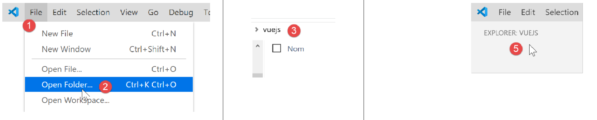
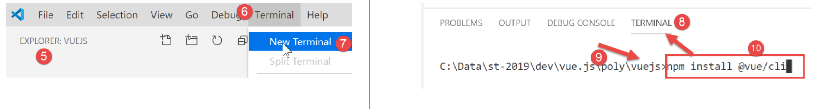
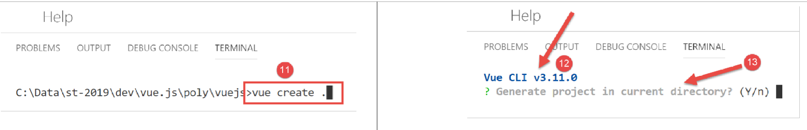
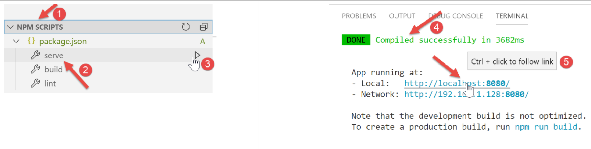
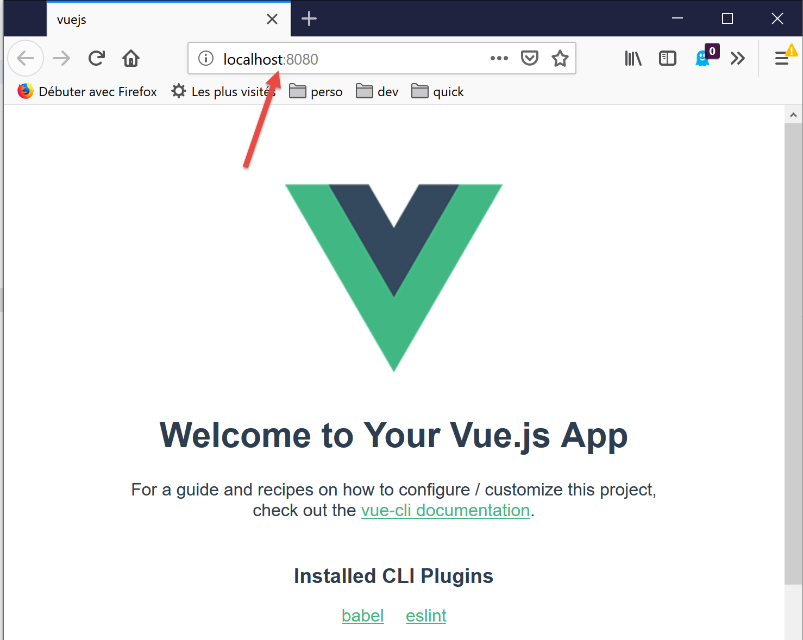
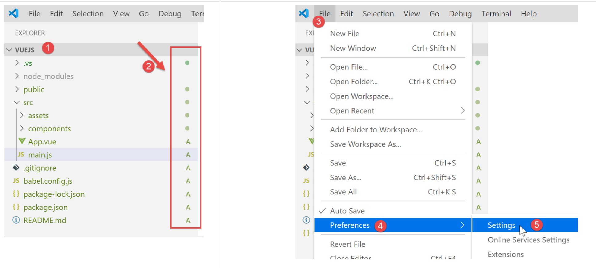
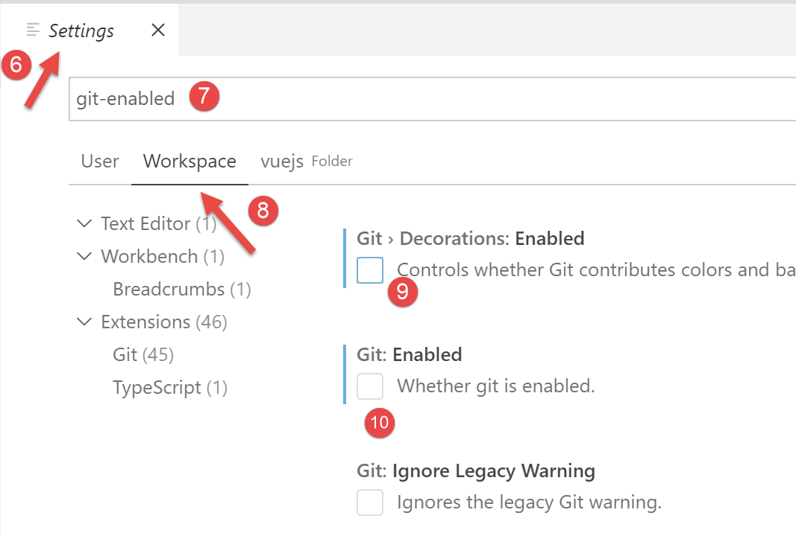
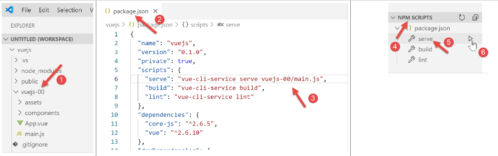
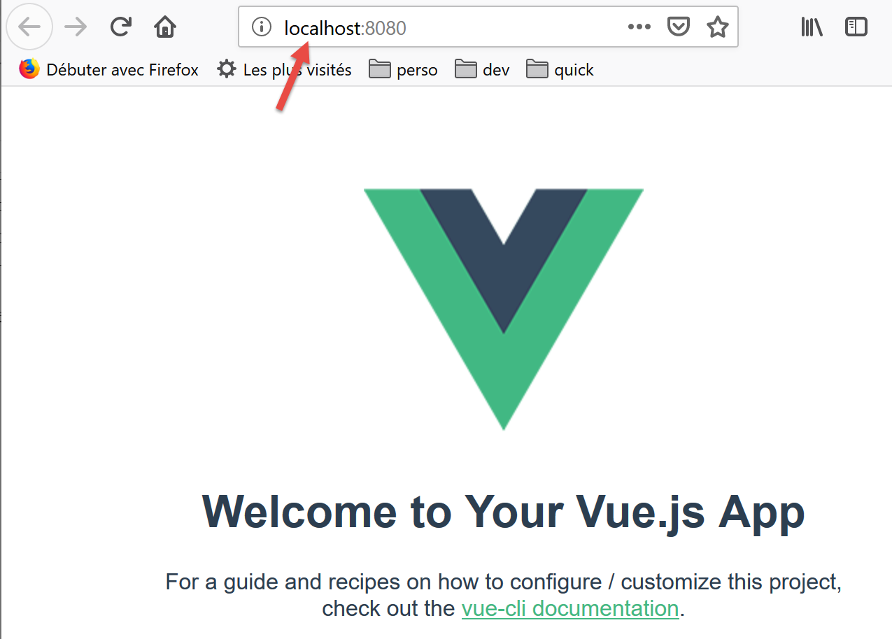
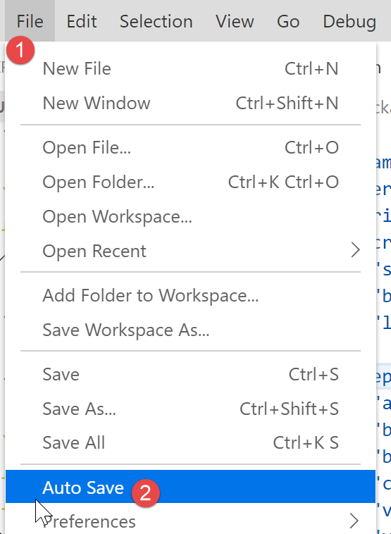

Création d’un environnement de travail
======================================

Nous reprenons l’environnement de travail détaillé dans le document
[2] :

-  Visual Studio Code (VSCode) pour écrire les codes JavaScript ;

-  **[node.js]** pour les exécuter ;

-  **[npm]** pour télécharger et installer les bibliothèques JavaScript
   dont nous aurons besoin ;

Nous créons un environnement de travail dans **[VSCode]** :

|image0|

-  en **[1-5]**, nous ouvrons un dossier **[vuejs]** vide dans
   **[VSCode]** ;

|image1|

-  en **[8-10]**, on installe la dépendance **[@vue/cli]** qui va nous
   permettre d’initialiser un projet **[vue.js]**. Cette dépendance
   amène un grand nombre de packages (plusieurs centaines) ;

Dans le même terminal, on tape ensuite la commande **[vue create .]**
qui demande à créer un projet **[vue.js]** dans le dossier courant (.) :

|image2|

-  en **[13]**, commence une série de questions qui servent à configurer
   le projet ;

|image3|

-  une fois toutes les questions répondues, de nouveaux packages sont
   téléchargés et un projet généré dans le dossier courant **[14]**.

Regardons ce qui a été généré. Le fichier **[package.json]** est le
suivant :


.. code-block:: json 
  :linenos:

   {
     "name": "vuejs",
     "version": "0.1.0",
     "private": true,
     "scripts": {
       "serve": "vue-cli-service serve vuejs-20/main.js",
       "build": "vue-cli-service build vuejs-20/main.js",
       "lint": "vue-cli-service lint"
     },
     "dependencies": {
       "axios": "^0.19.0",
       "bootstrap": "^4.3.1",
       "bootstrap-vue": "^2.0.2",
       "core-js": "^2.6.5",
       "vue": "^2.6.10",
       "vue-router": "^3.1.3",
       "vuex": "^3.1.1"
     },
     "devDependencies": {
       "@vue/cli-plugin-babel": "^3.11.0",
       "@vue/cli-plugin-eslint": "^3.11.0",
       "@vue/cli-service": "^3.11.0",
       "babel-eslint": "^10.0.1",
       "eslint": "^5.16.0",
       "eslint-plugin-vue": "^5.0.0",
       "vue-template-compiler": "^2.6.10"
     },
     "eslintConfig": {
       "root": true,
       "env": {
         "node": true
       },
       "extends": [
         "plugin:vue/essential",
         "eslint:recommended"
       ],
       "rules": {},
       "parserOptions": {
         "parser": "babel-eslint"
       }
     },
     "postcss": {
       "plugins": {
         "autoprefixer": {}
       }
     },
     "browserslist": [
       "> 1%",
       "last 2 versions"
     ]
   }

**Commentaires**

-  lignes 14-22 : dans les dépendances nécessaires au développement on
   voit des références aux deux outils **[eslint, babel]** déjà utilisés
   dans les deux chapitres précédents. S’y ajoutent des plugins de ces
   deux outils destinés à leur utilisation au sein de **[vue.js]** ;

-  ligne 34 : c’est le package **[babel-eslint]** qui opèrera la
   transpilation ES6 -> ES5 des codes jS ;

-  lignes 5-9 : trois tâches **[npm]** ont été créées :

   -  **[build]** : sert à construire la version compilée du projet
      prête à entrer en production ;

   -  **[serve]** : exécute le projet sur un serveur web. C’est avec cet
      outil que sont faits les tests lors du développement. Comme avec
      **[webpack-dev-server]**, une modification d’un code source du
      projet provoque automatiquement la recompilation du projet et son
      rechargement par le serveur web ;

   -  **[lint]** : sert à analyser les codes jS et délivre des rapports.
      Nous n’utiliserons pas cet outil ici ;

Un fichier **[README.md]** a été généré avec le contenu suivant :


.. code-block:: markdown
  :linenos:

   # vuejs

   ## Project setup
   ```
   npm install
   ```

   ### Compiles and hot-reloads for development
   ```
   npm run serve
   ```

   ### Compiles and minifies for production
   ```
   npm run build
   ```

   ### Run your tests
   ```
   npm run test
   ```

   ### Lints and fixes files
   ```
   npm run lint
   ```

   ### Customize configuration
   See [Configuration Reference](https://cli.vuejs.org/config/).

Ce fichier résume les commandes à utiliser pour gérer le projet.

Nous savons que dans **[VSCode]**, les tâches **[npm]** sont proposées à
l’exécution :

|image4|

-  en **[1-3]**, nous exécutons la commande **[serve]** qui va compiler,
   puis exécuter le projet **[4-5]** ;

A l’URL **[http://localhost:8080]**, nous obtenons la page suivante :

|image5|

Nous expliquerons un peu plus loin ce qui a amené à cette page.

Continuons à configurer notre environnement de travail :

|image6|

-  en **[2]** ci-dessus, nous voyons des indicateurs **[git]**.
   **[git]** est un gestionnaire de code source permettant de gérer des
   versions successives de celui-ci et de les partager entre
   développeurs. Nous allons désactiver cet outil pour le projet ;

-  en **[3-5]**, nous allons dans les propriétés du projet ;

|image7|

-  en **[9-10]**, on désactive l’utilisation de **[git]** dans le
   projet ;

Nous allons écrire divers tests pour montrer le fonctionnement de
**[vue.js]**. Nous ne voulons cependant pas créer à chaque fois un
nouveau projet car il faudrait alors à chaque fois générer un dossier
**[node_modules]** alors que celui-ci fait plusieurs centaines de
méga-octets. Revenons sur les tâches **[npm]** du fichier
**[package.json]** :


.. code-block:: json
  :linenos:

     "scripts": {
       "serve": "vue-cli-service serve vuejs-00/main.js",
       "build": "vue-cli-service build vuejs-00/main.js",
       "lint": "vue-cli-service lint"
     },

-  ligne 2 : la commande **[serve]** utilise par défaut :

   -  le fichier **[public/index.html]** ;

   -  associé au fichier **[src/main.js]** ;

Ligne 2, il est possible de préciser à la commande **[serve]**, le point
d’entrée du projet, par exemple :


.. code-block:: json
  :linenos:

   "serve": "vue-cli-service serve vuejs-00/main.js",

Essayons :

|image8|

-  en **[1]**, le dossier **[src]** a été renommé en **[vuejs-00]** ;

-  en **[2-3]**, on a modifié la commande **[serve]** ;

-  en **[4-6]**, on exécute le projet ;

On obtient le même résultat que précédemment :

|image9|

Pour nos tests, nous procéderons donc ainsi :

-  écriture de code dans un dossier **[vuejs-xx]** du projet ;

-  test de ce projet avec la commande **[vue-cli-service serve
   vuejs-xx/main.js]** dans le fichier **[package.json]** ;

Lorsque le serveur de développement est lancé, toute modification d’un
des fichiers du projet provoque une recompilation. Pour cette raison,
nous inhibons le mode **[Auto Save]** de **[VSCode]**. En effet, nous ne
voulons pas de recompilation dès qu’on tape des caractères dans un des
fichiers du projet. Nous ne voulons de recompilation qu’à certains
moments :

|image10|

-  en **[2]**, l’option **[Auto Save]** ne doit pas être cochée ;




.. |image3| image:: chap-03/media/image4.png
   :width: 1.65748in
   :height: 1.85827in







