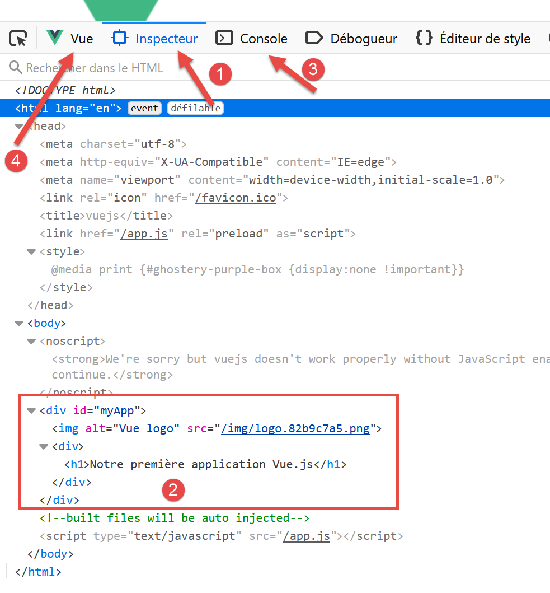

projet [vuejs-01] : les bases
=============================

Pour expliquer le code exécuté dans **[vuejs-00]** nous allons le
simplifier dans **[vuejs-01]**. Nous dupliquons le dossier
**[vuejs-00]** dans **[vuejs-01]** :

|image0|

Le projet **[vuejs-01]** comprend essentiellement quatre fichiers :

-  **[main.js]** **[2]** est le point d’entrée du projet ;

-  **[App.vue, HelloWorld.vue]** **[3-4]** sont des composants
   **[Vue.js]**, comprenant de façon facultative les éléments suivants :

   -  **[<template>...</template>]** : du code HTML ;

   -  **[]** : le code Javascript associé au code
      HTML ;

   -  **[]** : le style CSS associé au code HTML ;

-  **[public/index.html]** **[5]** : le document HTML visualisé par la
   commande **[npm run serve]** ;

Le fichier **[public/index.html]** affiché à l’exécution du projet est
celui-ci :

.. code-block:: html 
  :linenos:

   <!DOCTYPE html>
   <html lang="en">
     <head>
       <meta charset="utf-8">
       <meta http-equiv="X-UA-Compatible" content="IE=edge">
       <meta name="viewport" content="width=device-width,initial-scale=1.0">
       <link rel="icon" href="<%= BASE_URL %>favicon.ico">
       <title>vuejs</title>
     </head>
     <body>
       <noscript>
         <strong>We're sorry but vuejs doesn't work properly without JavaScript enabled. Please enable it to continue.</strong>
       </noscript>
       

       <!-- built files will be auto injected -->
     </body>
   </html>

Ce fichier HTML n’affiche donc rien **statiquement**. Il n’y a ici pas
de code HTML. L’affichage est **dynamique** : le code jS du projet va
générer du HTML qui va remplacer entièrement la balise **[
]** de la ligne 14. Le code HTML généré par le code jS du
projet et inséré à la place de la balise **[
]** de la ligne 14
provient des balises **[template]** des composants **[vue.js]**, les
fichiers ayant le suffixe **[.vue]**.

Le code HTML est inséré dynamiquement ligne 14 par le script
**[vuejs-01/main.js]** suivant :

.. code-block:: javascript 
  :linenos:

   // imports
   import Vue from 'vue'
   import App from './App.vue'

   // configuration
   Vue.config.productionTip = false

   // instanciation projet [App]
   new Vue({
     render: h => h(App),
   }).$mount('#app')

**Commentaires**

-  ligne 2 : l’objet **[Vue]** est fourni par le framework
   **[vue.js]** ;

-  ligne 3 : l’objet **[App]** est fourni par le fichier
   **[vuejs-01/App.vue]** ;

-  ligne 6 : configuration de l’objet **[Vue]** ;

-  lignes 9-11 : ce sont les lignes qui :

   -  génèrent le code HTML de l’application. Ligne 10, c’est le fichier
      **[App.vue]** qui le génère ;

   -  chargent le code HTML généré ligne 10 dans la section **[

]** du fichier **[public/index.html]** ;

Tout projet **[Vue.js]** peut conserver le fichier **[index.html]** tel
quel.

Le fichier **[App.vue]** du projet initial **[vuejs-00]** est simplifié
de la façon suivante dans le projet **[vuejs-01]** :

.. code-block:: html 
  :linenos:

   <template>
     

       
       <HelloWorld msg="Notre première application Vue.js" />
     

   </template>

   

**Commentaires**

-  un fragment **[.vue]** comprend au plus trois sections :

   -  **[<template>...</template>]** : du code HTML ;

   -  **[]** : le code Javascript associé au code
      HTML ;

   -  **[]** : le style CSS associé au code HTML ;

..

   Ici, nous n’avons pas de section **[style]**.

-  lignes 1-6 : le code HTML du fragment (page, composant, vue, ...) ;

-  lignes 2-5 : la section **[template]** ne peut contenir qu’un
   élément. On met en général une section **[div]** qui englobe tout le
   HTML du fragment. On peut mettre également une balise <template> ;

-  ligne 3 : une image ;

|image1|

-  ligne 4 : un composant nommé **[HelloWorld]**. Le principe de
   **[Vue.js]** est de construire des pages web à l’aide de fragments
   définis dans des fichiers **[.vue]** comme ici **[App.vue]**. Ce
   composant est défini par le fichier **[HelloWorld.vue]** défini ligne
   9 du script jS associé ;

-  ligne 4 : un composant peut accepter des paramètres. Le paramètre est
   ici l’attribut **[msg]** ;

-  lignes 8-17 : le script jS du fragment (ou composant) ;

-  ligne 9 : pour pouvoir utiliser le composant **[HelloWorld]** dans le
   composant **[App]**, il faut importer sa définition dans la partie
   **[script]** ;

-  lignes 11-16 : le script définit un objet et l’exporte afin de le
   rendre disponible à l’extérieur ;

-  ligne 12 : l’attribut **[name]** : définit le nom du composant
   exporté ;

-  lignes 13-15 : l’attribut **[components]** liste les composants
   utilisés par le composant **[App]**. Ils sont exportés avec lui ;

Ligne 9, il n’y a pas obligation que le composant **[HelloWorld]** porte
le même nom que le fichier qui le définit. On pourrait l’importer en
tant que **[X]** et l’exporter en tant que composant **[Bonjour]** :

|image2|

-  ligne 14 : le composant **[X]** est exporté sous le nom
   **[Bonjour]**. Il est alors utilisé sous ce nom, ligne 4 ;

La première version est la version la plus courante, aussi
définirons-nous nos composants de cette façon ;

.. code-block:: html 
  :linenos:

   <template>
     

       
       <HelloWorld msg="Notre première application Vue.js" />
     

   </template>

   

La ligne 14 est un raccourci pour le code **[HelloWorld :
HelloWorld]** : le composant **[HelloWorld]** (à droite, importé ligne
9) est exporté sous le nom **[HelloWorld]** (à gauche).

|image3|

Nous simplifions le composant **[HelloWorld.vue]** de la façon
suivante :

.. code-block:: html 
  :linenos:

   <template>
     

       <h1>{{ msg }}</h1>
     

   </template>

   

**Commentaires**

-  le composant **[HelloWorld]** a la même structure de fichier que le
   composant principal **[App]** ;

-  ligne 3 : on a ici une évaluation d’expression Javascript, ici
   l’expression **[msg]** ;

-  lignes 10-12 : définissent les propriétés du composant, plus
   exactement ses paramètres. Lorsque le composant **[App]** a instancié
   un composant **[HelloWorld]**, il l’a fait avec la syntaxe suivante :

.. code-block:: html 
  :linenos:

   <HelloWorld msg="Notre première application Vue.js" />

..

   Le composant **[HelloWorld]** est instancié en donnant une valeur au
   paramètre (attribut) **[msg]**. Si on suit le **[template]** du
   composant **[HelloWorld]**, celui-ci devient :

.. code-block:: html 
  :linenos:

   

       <h1>Notre première application Vue.js</h1>
   

-  lignes 7-14 : les propriétés du composant définies sous la forme d’un
   objet qui est exporté ;

   -  ligne 9 : le composant est exporté sous le nom **[HelloWorld]** ;

   -  lignes 10-12 : ses paramètres sont définis par la propriété
      **[props]** ;

Au final, si on rassemble les templates des deux composants **[App,
HelloWorld]** utilisés, le fichier **[index.html]** affiché sera le
suivant :

.. code-block:: html 
  :linenos:

   <!DOCTYPE html>
   <html lang="en">
   <head>
     <meta charset="utf-8">
     <meta http-equiv="X-UA-Compatible" content="IE=edge">
     <meta name="viewport" content="width=device-width,initial-scale=1.0">
     <link rel="icon" href="<%= BASE_URL %>favicon.ico">
     <title>vuejs</title>
   </head>
   <body>
     <noscript>
       <strong>We're sorry but vuejs doesn't work properly without JavaScript enabled. Please enable it to continue.</strong>
     </noscript>
     

       
       

         <h1>Notre première application Vue.js</h1>
       

     
</body>
   </html>

Nous lançons l’application en modifiant la commande **[serve]** **[1]**
du fichier **[package.json]** :

|image4|

La page affichée est alors **[2]**.

Maintenant regardons le code de cette page :

|image5|

-  en **[1]**, faire **[clic droit]** ;

-  en **[2]**, le code source de la page. On voit que c’est le code du
   fichier initial **[index.html]** et ce n’est pas ça qui a été
   affiché. C’est bien la page **[index.html]** qui a été chargée
   initialement. Ensuite, dynamiquement, du code Javascript a modifié
   cette page, mais cela ne nous est pas montré ;

Lorsque les pages sont générées dynamiquement par du Javascript,
l’option **[2]** ne sert à rien. Il faut aller dans les outils du
navigateur (F12 sur Firefox) pour voir le code de la page actuellement
affichée :

|image6|

-  en **[1]**, l’inspecteur du DOM (Document Object Model) du document
   affiché ;

-  en **[2]**, ce que contient réellement ce DOM ;

-  **[3-4]**, des outils que nous utiliserons pour afficher les objets
   Javascript utilisés par le framework **[Vue.js]** ;

-  **[4]** est une extension (ici Firefox) pour déboguer des
   applications **[Vue.js]** :

   -  pour Firefox :
      **[https://addons.mozilla.org/fr/firefox/addon/vue-js-devtools/]**;

   -  pour Chrome :
      **[https://chrome.google.com/webstore/detail/vuejs-devtools/nhdogjmejiglipccpnnnanhbledajbpd]**;

Examinons l’onglet **[Vue]** **[4]** :

|image7|

La vue **[1-4]** nous montre la structure **[Vue.js]** du document : la
racine du document **[2]** (index.html) comprend le composant **[App]**
(3) qui lui même comprend le composant **[HelloWorld]** (4). Cliquer sur
**[4]** fait apparaître les propriétés du composant **[HelloWorld]**
**[5]**.

On voit en **[4]** (à droite), l’indicateur **[$vm0]**. C’est le nom de
la variable qu’on peut utiliser dans la console JavaScript **[6]** pour
désigner l’objet **[HelloWorld]**. Faisons-le :

|image8|

-  en **[2]**, on fait évaluer l’expression **[$vm0]**, ce qui a pour
   effet d’afficher sa structure. Normalement nous n’aurons pas à
   utiliser directement cette structure ;

Terminons en montrant la capacité de **[hot reload]** de la commande
**[serve]** utilisée pour exécuter le projet :

-  dans **[App.vue]**, modifiez le message affiché par
   **[HelloWorld]** :

|image9|

-  en **[1]**, on modifie le message affiché ;

-  en **[2-3]**, la page est automatiquement mise en jour sans
   intervention de notre part ;

Nous allons maintenant créer divers projets **[vuejs-xx]** pour
illustrer les points importants de **[Vue.js]**. Par ‘importants’, il
faut entendre ‘que nous allons utiliser dans le client **[vue.js]** du
serveur de calcul de l’impôt’. D’autres points ‘importants’ seront
passés sous silence s’ils ne sont pas utilisés dans le client. Ce n’est
donc pas une présentation exhaustive de **[vue.js]** qui sera faite.

.. |image7| image:: chap-04/media/image8.png
   :width: 6.37008in
   :height: 2.03543in

