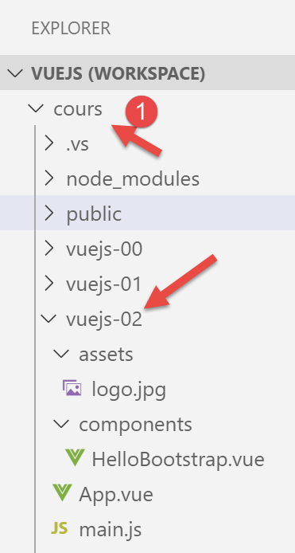
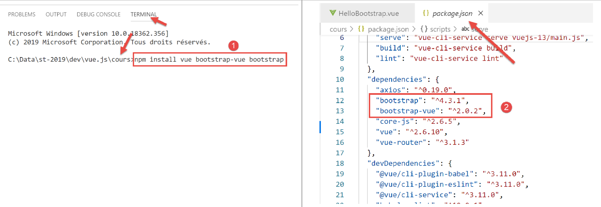
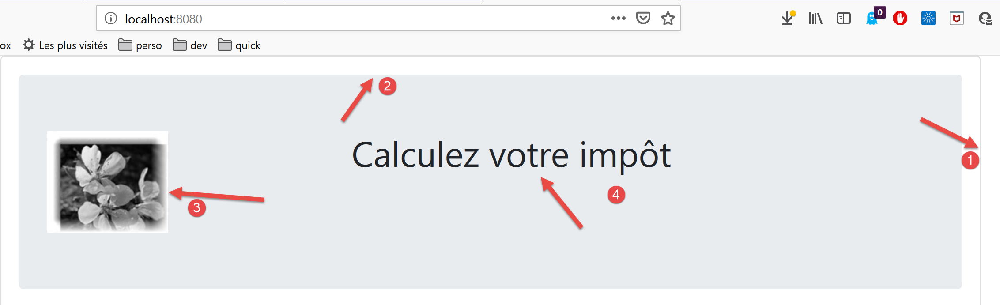
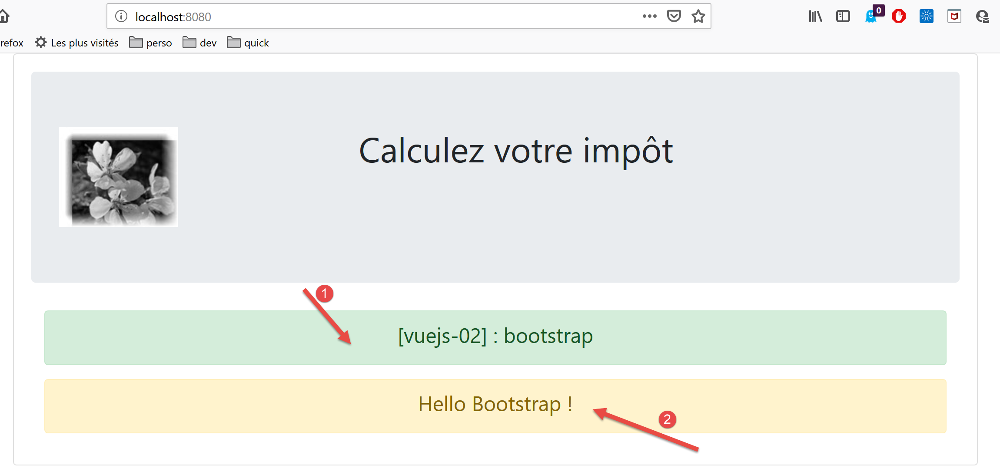
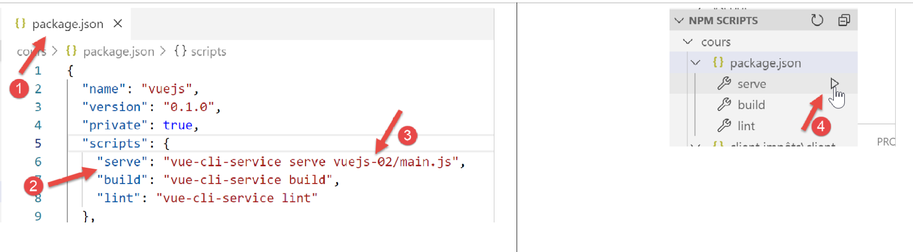

projet [vuejs-02] : utilisation du framework CSS Bootstrap
==========================================================

Le projet **[vuejs-02]** présente l’utilisation de Bootstrap dans un
projet **[vue.js]**. C’est le framework CSS qui sera utilisé dans tous
nos projets. Nous utiliserons une variation de Bootstrap appelée
**[BootstrapVue]** **[https://bootstrap-vue.js.org/]**.

L’arborescence du projet sera la suivante :

|image0|

**Note** : ci-dessus le dossier **[vuejs]** a été renommée **[cours]**
**[1]** dans la suite du document.

Installation du framework [BootstrapVue]
----------------------------------------

**[BootstrapVue]** est un framework qu’on ajoute au projet avec l’outil
**[npm]** :

|image1|

-  en **[1]**, c’est donc deux frameworks qu’on installe :
   **[Bootstrap]** et sa variante **[BootstrapVue]** ;

-  en **[2]**, les deux dépendances apparaissent dans le fichier
   **[package.json]** ;

Le script [main.js]
-------------------

Le script principal **[main.js]** est le suivant :

.. code-block:: javascript
  :linenos:

   // imports
   import Vue from 'vue'
   import App from './App.vue'

   // plugins
   import BootstrapVue from 'bootstrap-vue'
   Vue.use(BootstrapVue);

   // bootstrap
   import 'bootstrap/dist/css/bootstrap.css'
   import 'bootstrap-vue/dist/bootstrap-vue.css'

   // configuration
   Vue.config.productionTip = false

   // instanciation projet [App]
   new Vue({
     render: h => h(App),
   }).$mount('#app')

-  ligne 2 : import du framework **[Vue]** ;

-  ligne 3 : import de la vue principale ;

-  ligne 6 : import du framework **[BootstrapVue]** ;

-  ligne 7 : ce framework est conçu comme un plugin du framework
   **[Vue]**. La ligne 7 inclut ce plugin dans le framework **[Vue]** ;

-  lignes 10-11 : import des fichiers CSS des frameworks **[Bootstrap]**
   et **[BootstrapVue]** ;

-  les lignes 5-11 sont donc entièrement consacrées à l’utilisation de
   **[BootstrapVue]**. Le reste du code est identique à ce qu’on avait
   vu au paragraphe précédent ;

Le composant [App.vue]
----------------------

.. code-block:: html
  :linenos:

   <template>
     <b-container>
       <b-card>
         <!-- Bootstrap Jumbotron -->
         <b-jumbotron>
           <!-- ligne -->
           <b-row>
             <!-- colonne de largeur 4 -->
             <b-col cols="4">
               
             </b-col>
             <!-- colonne de largeur 8 -->
             <b-col cols="8">
               <h1>Calculez votre impôt</h1>
             </b-col>
           </b-row>
         </b-jumbotron>
         <HelloBootstrap msg="Hello Bootstrap !" />
       </b-card>
     </b-container>
   </template>

   

**Commentaires**

-  lignes 1-21 : toutes les balises <b-xx> sont des balises du framework
   **[BootstrapVue]** ;

-  lignes 2, 20 : la balise <b-container> définit un conteneur
   Bootstrap. A l’intérieur de ce conteneur, on va pouvoir définir des
   lignes avec la balise <b-row> et des colonnes avec la balise
   <b-col> ;

-  lignes 3, 19 : la balise <b-card> définit une ‘carte’ Bootstrap. Cela
   se matérialise visuellement par un rectangle avec une bordure ;

-  lignes 5, 17 : la balise <b-jumbotron> permet de mettre en avant une
   partie de la page, ici une image et un texte. On l’utilisera dans nos
   divers projets comme identification visuelle du projet ;

-  ligne 7 : la balise <b-row> définit une ligne ;

-  lignes 9-11 : la balise <b-col> définit une colonne de la ligne
   précédente. Bootstrap attribue 12 colonnes à chaque ligne. L’attribut
   **[cols=’4’]** indique que la colonne <b-col> va occuper 4 de ces 12
   colonnes ;

-  ligne 10 : une image

-  lignes 13-15 : une colonne qui va occuper 8 des 12 colonnes de la
   ligne. on y met un texte ;

-  ligne 18 : utilisation d’un composant appelé **[HelloBootstrap]**
   avec une propriété nommée **[msg]** ;

-  lignes 24-33 : la partie 

**Commentaires**

-  ligne 3 : la balise <b-alert show> affiche un rectangle de couleur
   dans lequel on met en général un texte (ligne 6). L’attribut
   **[variant]** permet de sélectionner un type d’alerte. Chaque type
   d’alerte a une couleur de fond différente. La couleur de la variante
   **[success]** est le vert. L’attribut **[align]** permet d’aligner le
   texte de l’alerte (gauche, droite, centré). On notera que l’attribut
   **[show]** est obligatoire pour afficher l’alerte. Sans cet attribut,
   l’alerte n’est pas visible ;

-  les valeurs possibles de **[variant]** :

   -  **[primary]** : bleu ;

   -  **[secondary]** : gris ;

   -  **[success]**:vert ;

   -  **[danger]** : rouge léger ;

   -  **[warning]** : jaune ;

   -  **[info]** : turquoise ;

   -  **[light]** : pas de couleur de fond ;

   -  **[dark]** : gris un peu plus foncé que **[secondary]** ;

-  ligne 12 : **[msg]** est un paramètre du composant
   **[HelloBootstrap]** (lignes 21-23) ;

Le rendu visuel est le suivant :

|image3|

-  **[1]** : balise <b-alert show variant=’success’> ;

-  **[2]** : balise <b-alert show variant=’warning’> ;

Exécution du projet
-------------------

Pour exécuter le projet, on modifie d’abord le fichier
**[package.json]** :

|image4|

-  en **[3]**, on modifie le script exécuté par la commande **[serve]**
   **[2]** du fichier package.json **[1]** ;

-  en **[4]**, on exécute le projet ;

**Note** : dans tout ce qui suit on utilisera les balises du framework
BootstrapVue, des balises de la forme <b-qqchose>. Ce n’est pas
obligatoire. On peut utiliser les balises originelles du framework
Bootstrap. Elles sont fonctionnelles dans les templates de **[Vue.js]**.
Aussi le développeur habitué aux balises Bootstrap peut continuer à les
utiliser.

