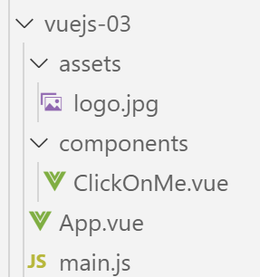
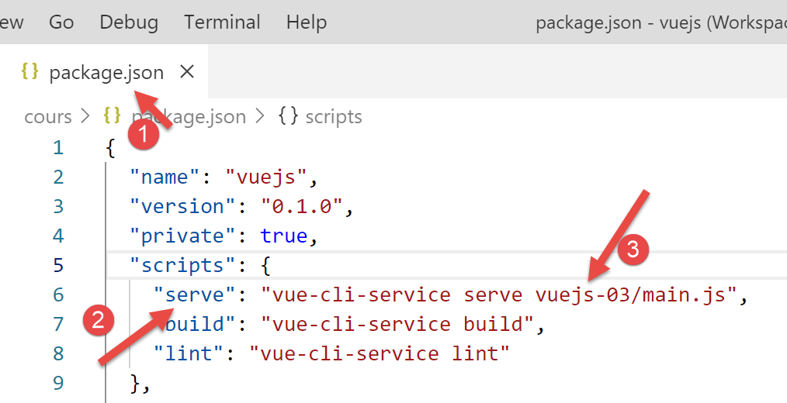
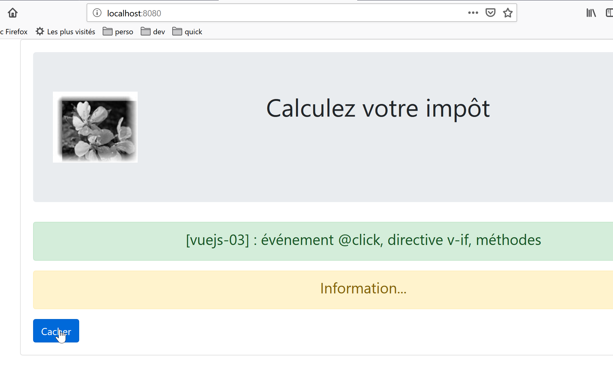
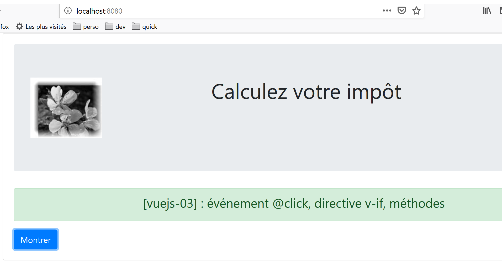

projet [vuejs-03] : gestion des événements
==========================================

Le projet **[vuejs-03]** introduit deux concepts :

-  la gestion d’un événement **[clic]** sur un bouton ;

-  la directive **[v-if]** qui permet d’afficher un bloc HTML de façon
   conditionnelle ;

L’arborescence du projet est la suivante :

|image0|

Le script principal [main.js]
-----------------------------

Le script **[main.js]** reste inchangé :

.. code-block:: javascript
  :linenos:

   // imports
   import Vue from 'vue'
   import App from './App.vue'

   // plugins
   import BootstrapVue from 'bootstrap-vue'
   Vue.use(BootstrapVue);

   // bootstrap
   import 'bootstrap/dist/css/bootstrap.css'
   import 'bootstrap-vue/dist/bootstrap-vue.css'

   // configuration
   Vue.config.productionTip = false

   // instanciation projet [App]
   new Vue({
     render: h => h(App),
   }).$mount('#app')

Le composant principal [App.vue]
--------------------------------

Le composant principal **[App.vue]** utilise le composant
**[ClickOnMe]** au lieu du composant **[HelloBootstrap]** :

.. code-block:: html
  :linenos:

   <template>
     <b-container>
       <b-card>
       <!-- Bootstrap Jumbotron -->
       <b-jumbotron>
         <!-- ligne -->
         <b-row>
           <!-- colonne de largeur 4 -->
           <b-col cols="4">
             
           </b-col>
           <!-- colonne de largeur 8 -->
           <b-col cols="8">
             <h1>Calculez votre impôt</h1>
           </b-col>
         </b-row>
       </b-jumbotron>
       <!-- composant -->
       <ClickOnMe msg="Information..." />
       </b-card>
     </b-container>
   </template>

   

Le composant [ClickOnMe]
------------------------

Le composant **[ClickOnMe]** introduit les nouveaux concepts :

.. code-block:: html
  :linenos:

   <template>
     

       <!-- message sur fond vert -->
       <b-alert show variant="success" align="center">
         <h4>[vuejs-03] : événement @click, directive v-if, méthodes</h4>
       </b-alert>
       <!-- message sur fond jaune -->
       <b-alert show variant="warning" align="center" v-if="show">
         <h4>{{msg}}</h4>
       </b-alert>
       <!-- bouton bleu -->
       <b-button variant="primary" @click="changer">{{buttonTitle}}</b-button>
     

   </template>

   

**Commentaires**

-  lignes 4-6 : une alerte verte Bootstrap. Le nombre de colonnes
   occupées n’est pas indiqué. Ce sont alors les 12 colonnes de
   Bootstrap qui sont utilisées ;

-  lignes 8-10 : une alerte jaune Bootstrap :

   -  ligne 8 : la directive **[v-if]** de **[Vue.js]** contrôle la
      visibilité d’un bloc HTML. L’alerte est ici contrôlée par un
      booléen **[show]** (ligne 29). Si **[show==true]** alors l’alerte
      sera visible sinon elle ne le sera pas ;

   -  ligne 9 : l’alerte affiche un message **[msg]** qui est une
      propriété (lignes 20-22) du composant ;

-  ligne 12 : un bouton de couleur bleue sur laquelle on clique pour
   cacher / montrer l’alerte **[warning]** ;

-  lignes 16-48 : le code jS du composant. Ce code règle le
   fonctionnement dynamique du composant :

-  lignes 20-22 : les propriétés du composant ;

-  lignes 24-31 : les attributs du composant ;

Quelle est la différence entre **[propriétés]** et **[attributs]** d’un
composant, entre les champs **[props]** et **[data]** de l’objet exporté
par le composant aux lignes 17-47 ?

-  comme nous l’avons déjà vu, les propriétés **[props]** d’un composant
   sont des paramètres du composant. Leurs valeurs sont fixées de
   l’\ **extérieur** du composant. Un composant A utilisant un composant
   B ayant les propriétés **[prop1, prop2, ..., propn]** l’utilisera de
   la façon suivante : **<B :prop1=’val1’ :prop2=’val2’ ...>** ;

-  l’objet rendu par la fonction **[data]** des lignes 24-31 représente
   l’état du composant ou **attributs** du composant. Cet état est
   manipulé par les méthodes du composant (lignes 33-46). Le <template>
   des lignes 1-14 utilise aussi bien des éléments **[propriétés]** que
   **[attributs]** :

   -  les valeurs des propriétés sont fixées par un composant parent ;

   -  les valeurs des attributs sont fixées initialement par la fonction
      **[data]** puis peuvent être modifiées par les méthodes ;

   -  dans les deux cas, le rendu visuel **réagit** immédiatement aux
      changements d’une propriété (composant parent) ou d’un attribut
      (méthode du composant). On parle alors d’interface **réactive** ;

..

   Dans le **[template]** d’un composant, rien ne diffère une propriété
   **[prop]** d’un attribut **[data]**. Pour savoir si une donnée
   dynamique du **[template]** doit être mise dans l’attribut
   **[props]** ou dans l’objet rendu par la fonction **[data]**, il faut
   simplement se demander qui fixe la valeur de cette donnée :

-  si la réponse est le composant parent, alors on mettra la donnée dans
   l’attribut **[props]** ;

-  si la réponse est la méthode gérant tel événement du composant, alors
   on mettra la donnée dans l’objet rendu par la fonction **[data]** ;

..

   Le **[template]** utilise ici les données dynamiques suivantes :

-  **[show]**, ligne 8. Cette donnée est manipulée en interne par la
   méthode **[changer]** qui gère l’événement **[click]** sur le bouton
   de la ligne 12. C’est donc un attribut construit par la fonction
   **[data]** (ligne 29) ;

-  **[msg]**, ligne 9. C’est un message fixé par le composant parent. On
   le met donc dans l’attribut **[props]** (ligne 21) ;

-  **[buttonTitle]** ligne 12. Cette donnée est manipulée en interne par
   la méthode **[changer]** qui gère l’événement **[click]** sur le
   bouton de la ligne 12. C’est donc un attribut construit par la
   fonction **[data]** (ligne 27) ;

-  les noms des attributs **[name, props, data, methods]** de l’objet
   exporté par le composant sont prédéfinis. On ne peut pas utiliser
   d’autres noms ;

-  ligne 12 : l’attribut **[@click]** du bouton sert à désigner la
   méthode qui doit réagir au clic sur le bouton. Cette méthode doit se
   trouver dans la propriété **[methods]** du composant ;

-  ligne 33 : l’attribut **[methods]** du composant réunit toutes les
   méthodes de celui-ci. La plupart du temps ce sont des fonctions qui
   réagissent à un événement du composant ;

-  lignes 35-46 : la méthode **[changer]** est appelée lorsque
   l’utilisateur clique sur le bouton :

   -  si l’alerte **[warning]** est affichée alors elle est cachée et le
      texte du bouton devient **[Montrer]** (ligne 39) ;

   -  si l’alerte **[warning]** est cachée alors elle est affichée et le
      texte du bouton devient **[Cacher]** (ligne 43) ;

   -  pour afficher / cacher l’alerte **[warning]**, on modifie la
      valeur du booléen **[show]** (lignes 38 et 42) ;

   -  lorsqu’une méthode doit référencer l’attribut **[attr]** rendu par
      la fonction **[data]**, on écrit **[this.attr]** (lignes 38 et
      42). Cela signifie que les attributs de l’objet rendu par la
      fonction **[data]** sont des attributs directs du composant
      **[this]** ;

Exécution du projet
-------------------

|image1|

Le résultat est le suivant :

|image2|

|image3|

