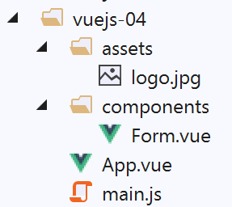
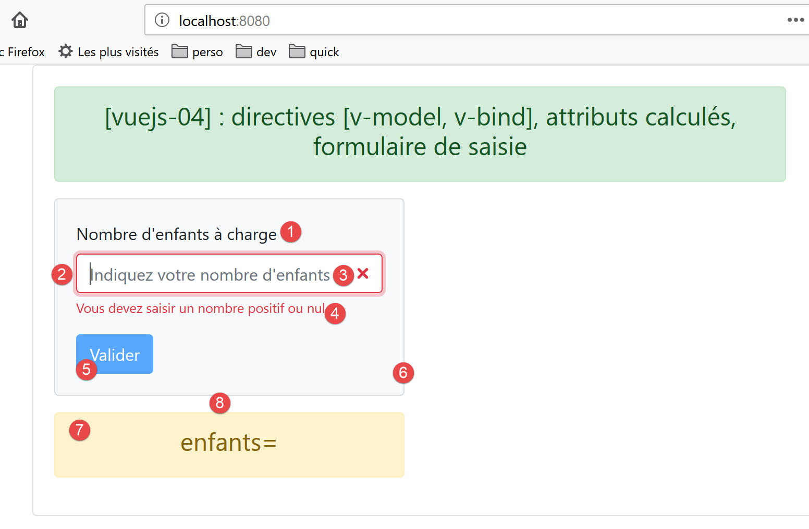
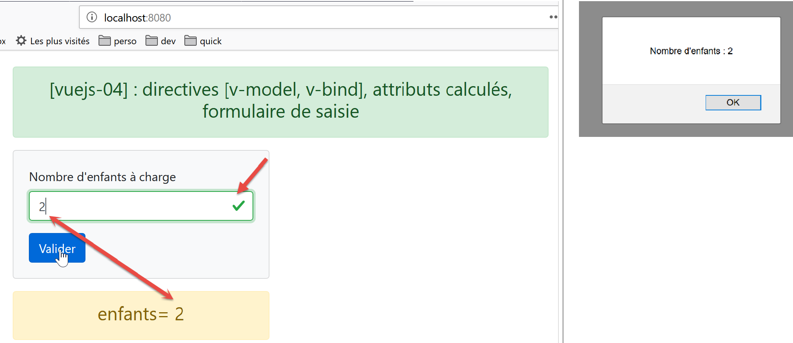
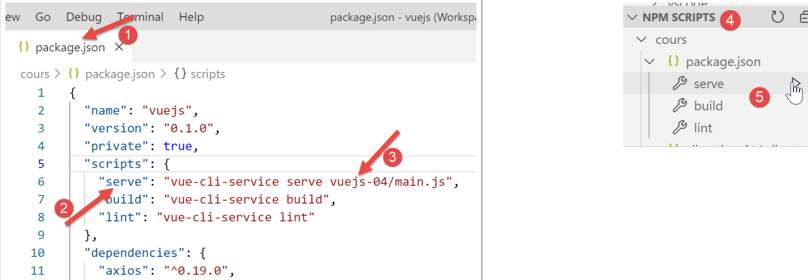

projet [vuejs-04] : directives [v-model, v-bind], attributs calculés, formulaire de saisie
==========================================================================================

L’arborescence du projet **[vuejs-04]** est la suivante :

|image0|

Le script principal [main.js]
-----------------------------

C’est le même que dans l’exemple précédent.

Le composant principal [App]
----------------------------

Le code de **[App.vue]** est le suivant :

.. code-block:: html
   :linenos: 

   <template>
     <b-container>
       <b-card>
         <!-- message de présentation -->
         <b-row>
           <b-col cols="8">
             <b-alert show variant="success" align="center">
               <h4>[vuejs-04] : directives [v-model, v-bind], attributs calculés, formulaire de saisie</h4>
             </b-alert>
           </b-col>
         </b-row>
         <Form />
       </b-card>
     </b-container>
   </template>

   

Le composant **[App.vue]** utilise le nouveau composant **[Form]**
(lignes 12, 19, 24).

Le composant [Form]
-------------------

Le code du composant **[Form]** est le suivant :

.. code-block:: html
   :linenos: 

   <template>
     

       <!-- formulaire -->
       <b-form>
         <!-- éléments du formulaire -->
         <b-row>
           <b-col cols="4">
             <b-card bg-variant="light">
               <b-form-group label="Nombre d'enfants à charge" label-for="enfants">
                 <b-input type="text"
                          id="enfants"
                          placeholder="Indiquez votre nombre d'enfants"
                          v-model="enfants"
                          v-bind:state="enfantsValide" />
                 <b-form-invalid-feedback :state="enfantsValide">Vous devez saisir un nombre positif ou nul</b-form-invalid-feedback>
               </b-form-group>
               <!-- bouton -->
               <b-button variant="primary" :disabled="formInvalide" @click="doSomething">Valider</b-button>
             </b-card>
           </b-col>
         </b-row>
       </b-form>
       <b-row class="mt-3">
         <b-col cols="4">
           <b-alert show variant="warning" align="center">
             <h4>enfants= {{enfants}}</h4>
           </b-alert>
         </b-col>
       </b-row>
     

   </template>

   <!-- script -->
   

**Rendu visuel**

|image1|\ |image2|

**Commentaires**

-  lignes 4-32 : la balise <b-form> introduit un formulaire Bootstrap ;

-  ligne 6 : la balise <b-row> introduit une ligne dans le formulaire ;

-  ligne 7 : la balise <b-col cols=’4’> introduit une colonne s’étalant
   sur 4 colonnes Bootstrap ;

-  ligne 8 : la balise <b-card> **[6]** introduit une carte Bootstrap,
   une zone encadrée par une bordure ;

-  ligne 9 : la balise <b-form-group> introduit un groupe d’éléments du
   formulaire liés entre-eux. Ici un texte (attribut **[label]**)
   **[1]** est lié à une zone de saisie (attribut **[label-for]**). La
   valeur de **[label-for]** est la valeur du champ **[id]**, ligne 12,
   de la zone de saisie ;

-  lignes 10-14 : la balise <b-input> **[2]** introduit une zone de
   saisie :

   -  ligne 10 : **[type=’text’]** indique qu’on peut taper du texte
      dans la zone de saisie. On aurait pu écrire **[type=’number’]**
      avec des contraintes **[min=’val1’ max=’val2’ step=’val3’]**
      puisqu’on attend un nombre d’enfants. On a mis **[type=’text’]**
      afin de montrer comment vérifier la validité d’une saisie ;

   -  ligne 12 : l’attribut **[placeholder]** **[3]** fixe le message
      affiché dans la zone de saisie tant que l’utilisateur n’a rien
      saisi ;

   -  ligne 13 : la directive **[v-model]** associe, de façon
      **bidirectionnelle** la valeur saisie avec l’attribut
      **[enfants]**, ligne 42, du composant :

      -  lorsque la valeur saisie change, alors la valeur de l’attribut
         **[enfants]** change également ;

      -  lorsque la valeur de l’attribut **[enfants]** change, alors la
         valeur saisie change également, ç-à-d que le contenu de **[2]**
         change ;

      -  le point important à comprendre est que, grâce au mécanisme
         précédent, lorsque l’utilisateur clique sur le bouton
         **[Valider]** **[5]**, l’attribut **[enfants]** de la ligne 42
         a pour valeur, la valeur saisie en **[2]** ;

   -  ligne 14 : la directive **[v-bind]** introduit une liaison entre
      d’un côté un attribut de la balise <b-input>, ici l’attribut
      **[state]** avec un attribut du composant, ici
      **[enfantsValide]**, ligne 53. L’attribut **[enfantsValide]** est
      particulier en ce sens que c’est une **fonction** qui rend la
      valeur de l’attribut. On appelle, attribut **calculé**, ce type
      d’attribut. On trouve les attributs calculés dans la propriété
      **[computed]**, ligne 47, du composant. Les attributs calculés
      s’utilisent de la même façon que les attributs statiques de la
      fonction **[data]** : On n’écrit pas, ligne 14,
      **[v-bind:state=’enfantsValide()’]** mais
      **[v-bind:state=’enfantsValide’]**, **sans les parenthèses**.
      Aussi à la lecture du **[template]**, on ne sait pas distinguer un
      attribut **calculé** d’un attribut **statique**. Il faut pour cela
      regarder le code du script du composant ;

   -  ligne 14 : l’attribut **[state]** va fixer l’état valide /
      invalide de la valeur saisie : si **[enfantsValide]** rend la
      valeur **[true]**, la valeur saisie est considérée comme valide,
      sinon comme invalide. La copie d’écran ci-dessus montre le
      composant **[b-input]** lorsque la fonction **[enfantsValide]**
      rend la valeur **[false]** ;

   -  ligne 15 : la balise <b-form-invalid-feedback> **[4]** permet
      d’afficher un message lorsque la saisie en **[2]** est invalide.
      Son attribut **[:state=’enfantsValide’]** est identique à
      l’attribut **[v-bind:state=’enfantsValide’]** de la ligne 14. On
      peut omettre la directive **[v-bind]** mais il faut garder le
      signe **[:]**. Le message d’erreur s’affiche donc lorsque
      l’attribut **[enfantsValide]** vaut **[false]** ;

   -  ligne 16 : fin du groupe d’éléments <b-group> ;

   -  ligne 18 : le bouton **[5]** qui va permettre de valider la
      saisie :

      -  il sera bleu **[variant=’primary’]** ;

      -  **[:disabled="formInvalide"]** : l’attribut **[disabled]**
         permet de valider / invalider le bouton. Cet attribut est lié
         (v-bind) à l’attribut calculé **[formInvalide]** de la ligne
         49 ;

      -  **[@click="doSomething"]** : lorsque l’utilisateur cliquera sur
         le bouton, la méthode **[doSomething]**, ligne 59, sera
         exécutée ;

   -  lignes 19-22 : fermeture des différentes balises ouvertes ;

   -  lignes 23-29 : une nouvelle ligne dans le **[template]**.
      **[class=’mt-3’]** signifie **[margin (m) top (t) égale à 3
      spacers]**. **[spacer]** est une mesure d’espacement de Bootstrap.
      Cette classe génère l’espacement **[8]** dans la copie d’écran
      ci-dessus. Sans cette classe, la zone **[7]** est collée à la zone
      **[1-6]** ;

   -  ligne 24 : une colonne occupant 4 colonnes Bootstrap ;

   -  lignes 25-27 : une alerte **[warning]** affichant la valeur de
      l’attribut statique **[enfants]** (ligne 42). Comme cet attribut a
      une liaison bidirectionnelle avec la zone de saisie, dès que
      l’utilisateur modifie celle-ci, la valeur affichée dans l’alerte
      change également ;

   -  lignes 34-65 : le code jS du composant ;

   -  ligne 42 : l’unique attribut statique du composant ;

   -  lignes 47-56 : les attributs calculés du composant ;

   -  lignes 53-55 : la saisie est considérée valide si c’est un nombre
      entier positif éventuellement précédé / suivi par des ‘espaces’ ;

   -  lignes 49-51 : le formulaire est considéré comme valide si la
      saisie du nombre d’enfants est valide. En général, un formulaire a
      plusieurs saisies et est considéré valide si celles-ci sont toutes
      valides ;

   -  lignes 58-63 : les méthodes du composant qui réagissent aux
      événements de celui-ci. Ici, il n’y a qu’un événement : le
      **[click]** sur le bouton. On se contente d’afficher la valeur
      saisie pour montrer qu’on a bien accès à celle-ci ;

Exécution du projet
-------------------

On modifie le fichier **[package.json]** et on exécute le projet :

|image3|

