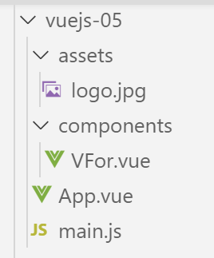
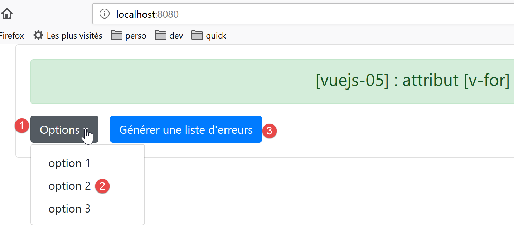
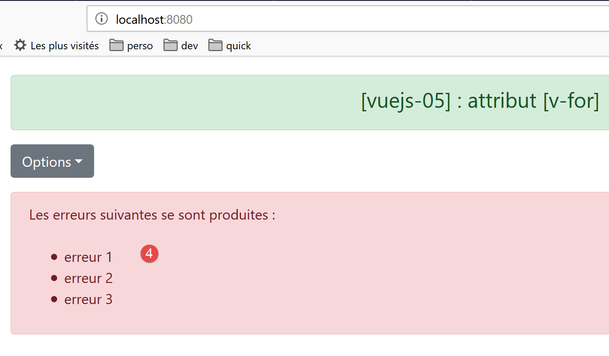
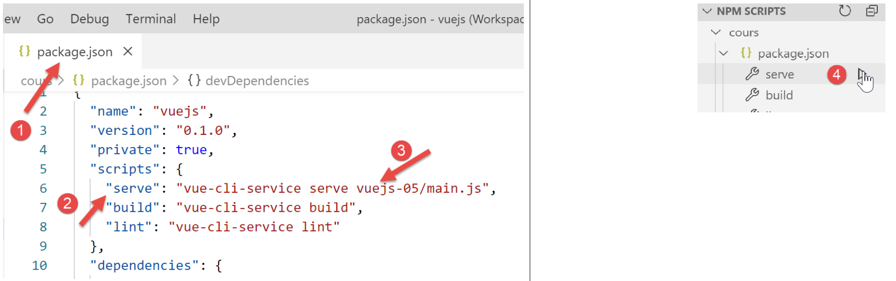

projet [vuejs-05] : directive [v-for]
=====================================

Le projet **[vuejs-05]** présente la directive **[v-for]** :

|image0|

Le script principal [main.js]
-----------------------------

Le code du script principal **[main.js]** est identique à celui du
script **[main.js]** des projets précédents.

Le composant principal [App]
----------------------------

Le code du composant **[App]** est le suivant :

.. code-block:: html
  :linenos:

   <template>
     <b-container>
       <b-card>
         <b-alert show variant="success" align="center">
           <h4>[vuejs-05] : attribut [v-for]</h4>
         </b-alert>
         <VFor />
       </b-card>
     </b-container>
   </template>

   

-  lignes 7, 14, 19 : le composant **[App]** utilise le composant
   **[VFor]** ;

Le composant [VFor]
-------------------

Le rendu visuel sera le suivant :

|image1|

|image2|

Le code du composant **[VFor]** est le suivant :

.. code-block:: html
  :linenos:

   <template>
     

       <!-- une liste déroulante -->
       <b-dropdown id="dropdown" text="Options">
         <b-dropdown-item v-for="(option,index) in options"
                          :key="option.id"
                          @click="select(index)">{{option.text}}</b-dropdown-item>
       </b-dropdown>
       <!-- bouton -->
       <b-button class="ml-3"
                 variant="primary"
                 @click="generateErrors"
                 v-if="!error">Générer une liste d'erreurs</b-button>
       <!-- alerte -->
       <b-alert show variant="danger" v-if="error" class="mt-3">
         Les erreurs suivantes se sont produites :
          
         <ul>
           <li v-for="(erreur,index) in erreurs" :key="index">{{erreur}}</li>
         </ul>
       </b-alert>
     

   </template>
   <!-- script -->
   

**Commentaires**

-  ligne 4 : la balise <b-dropdown> sert à définir une liste déroulante
   **[1]** sous la forme d’un bouton qu’on clique pour voir les options
   de la liste **[2]**. **[text=’Options’]** définit le texte affiché
   sur le bouton **[1]** ;

-  lignes 5-7 : la balise <dropdown-item> définit un élément de la liste
   déroulante ;

-  ligne 5 : l’attribut **[v-for]** indique que la balise
   <dropdown-item> doit être répétée pour chaque élément **[option]** de
   l’attribut **[options]**, lignes 37-41, du composant. **[index]**
   représente le n° de l’élément dans la liste **[0, 1, ..., n]**. Le
   nom de l’élément **[option]** ainsi que celui de l’index sont libres.
   On aurait pu écrire **[<b-dropdown-item v-for="(o,i) in options"
   :key="o.id" @click="select(i)">{{o.text}}</b-dropdown-item>]** ;

-  ligne 6 : si on oublie l’attribut **[key]**, ESLint émet un warning.
   La valeur de l’attribut **[key]** doit persister dans le temps. Aussi
   la valeur **[index]** de l’élément ne convient-elle pas. Car si cet
   élément est supprimé, les valeurs **[index]** de ceux qui sont
   derrière lui dans la liste vont être décrémentées de 1. Aussi ici,
   prend-on comme valeur de clé la valeur **[option.id]**, lignes 38-40,
   qui ne changera pas en cas de suppression d’un élément. L’attribut
   **[key]** est un élément d’optimisation de régénération du DOM
   (Document Object Model) par **[Vue.js]** lorsque la liste doit être
   régénérée. Notez la notation **[:key]**, car **[key]** a une valeur
   dynamique ;

-  ligne 7 : la méthode **[select(index)]**, lignes 49-51, sera appelée
   lorsque l’utilisateur cliquera sur un élément de la liste ;

-  ligne 7 : le texte de l’option sera la valeur **[option.text]**
   définie aux lignes 37-41 ;

-  ligne 10 : le bouton **[3]**. **[class=’ml-3]** signifie margin (m)
   left (l) de trois spacers. **[@click="generateErrors"]** indique que
   la méthode **[generateErrors]**, lignes 45-48, sera exécutée lors
   d’un **[click]** sur le bouton. **[v-if="!error"]** indique que
   l’affichage du bouton est conditionné à la valeur de l’attribut
   statique **[error]** de la ligne 35 ;

-  lignes 15-21 : une alerte de type **[danger]** **[4]** contrôlée
   elle-aussi par l’attribut statique **[error]** de la ligne 35.
   L’attribut **[class=’mt-3’]** (**m**\ argin **t**\ op **3** spacers)
   fixe l’espace entre cette alerte et l’élément qui est au-dessus de
   lui ;

-  ligne 27 : la balise HTML   fait un saut de ligne ;

-  ligne 18 : début d’une liste non ordonnée **[ul=unordered list]** ;

-  ligne 19 : la balise <li> définit un élément de la liste <ul>. Là
   encore, on utilise une directive **[v-for]** pour générer la balise
   plusieurs fois. Autant de fois ici que le tableau **[erreurs]** de la
   ligne 33 aura d’éléments. On utilise ici l’attribut **[:key=index]**.
   On a dit précédemment que l’index des éléments d’une liste ne faisait
   pas un bon discriminant entre éléments de la liste car en cas de
   suppression d’un élément, tous les éléments qui suivent voient leur
   index changer. Ici ça n’a pas d’importance car les éléments de la
   liste d’erreurs ne sont pas susceptibles d’être supprimés ;

-  ligne 19 : l’élément sert à afficher l’élément **[erreur]** de la
   liste **[erreurs]** ;

-  lignes 30-43 : tous les éléments dynamiques du **[template]** sont
   des attributs du composant. Il n’y a ici aucune propriété de type
   **[props]** dont la valeur serait fixée par le composant parent ;

-  lignes 48-55 : la méthode **[generateErrors]** génère la liste
   d’erreurs à afficher par la balise <ul> des lignes 16-18. De plus,
   elle modifie l’attribut statique **[error]**, à la fois pour afficher
   cette liste d’erreurs (ligne 15) et cacher le bouton de génération
   (ligne 13) ;

Exécution du projet
-------------------

|image3|

