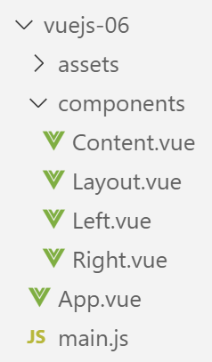
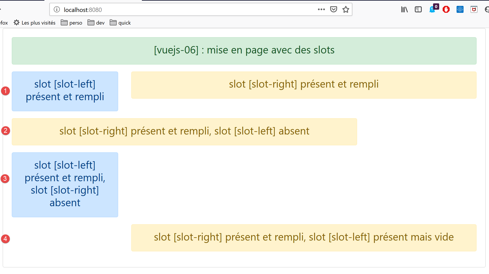

projet [vuejs-06] : mise en page d’une vue avec des slots
=========================================================

|image0|

Le script principal [main.js]
-----------------------------

Le script principal **[main.js]** reste inchangé.

Le composant principal [App]
----------------------------

Le code du composant **[App]** est le suivant :

.. code-block:: html
  :linenos:

   <template>
     

       <b-card>
         <b-alert show variant="success" align="center">
           <h4>[vuejs-06] : mise en page avec des slots</h4>
         </b-alert>
         <Content />
       </b-card>
     

   </template>

   

Le composant **[App]** introduit un nouveau composant appelé
**[Content]** (lignes 7, 14, 19).

Le composant [Layout]
---------------------

Le composant **[Layout]** sert à définir une mise en page des vues de
l’application :

.. code-block:: html
  :linenos:

   <template>
     <!-- ligne -->
     <b-row>
       <!-- zone à trois colonnes -->
       <b-col cols="3" v-if="left">
         <slot name="slot-left" />
       </b-col>
       <!-- zone à neuf colonnes -->
       <b-col cols="9" v-if="right">
         <slot name="slot-right" />
       </b-col>
     </b-row>
   </template>

   

**Commentaires**

-  le composant **[Layout]** définit une unique ligne (lignes 3-12).
   Celle-ci est divisée en deux colonnes :

   -  une colonne composée de 3 colonnes Bootstrap (lignes 5-7) ;

   -  une colonne composée de 9 colonnes Bootstrap (lignes 9-11) ;

-  ligne 5 : la présence de la colonne de gauche (lignes 5-7) est
   conditionnée par la valeur du paramètre **[left]**, définie dans la
   propriété **[props]** du composant (lignes 20-22) ;

-  ligne 9 : la présence de la colonne de droite (lignes 9-11) est
   conditionnée par la valeur du paramètre **[right]**, définie dans la
   propriété **[props]** du composant (lignes 23-25) ;

-  les valeurs des paramètres **[left, right]** doivent être fixées par
   un composant parent du composant **[Layout]** ;

-  ligne 6 : on ne fixe pas le contenu de la colonne de gauche. On donne
   simplement un nom à cette colonne avec la balise <slot>. Ici elle
   s’appelera **[slot-left]**. Un composant utilisant le composant
   **[Content]** devra indiquer ce qu’il veut mettre dans la zone
   appelée **[slot-left]** ;

-  ligne 10 : la colonne de droite s’appellera **[slot-right]** ;

Le composant [Right]
--------------------

Le composant **[Right]** est le suivant :

.. code-block:: html
  :linenos:

   <template>
     <!-- un message dans une alerte de type warning -->
     <b-alert show variant="warning" align="center">
       <h4>{{msg}}</h4>
     </b-alert>
   </template>

   <!-- script -->
   

-  lignes 3-5 : le composant **[Right]** affiche un message dans une
   alerte de type **[warning]**. Ce message **[msg]** est défini comme
   étant un paramètre du composant, ligne 14. Le composant parent devra
   donc lui donner une valeur ;

Le composant [Left]
-------------------

Le composant **[Left]** est le suivant :

.. code-block:: html
  :linenos:

   <template>
     <!-- un message dans une alerte de type primary -->
     <b-alert show variant="primary" align="center">
       <h4>{{msg}}</h4>
     </b-alert>
   </template>

   <!-- script -->
   

-  lignes 3-5 : le composant **[Left]** affiche un message dans une
   alerte de type **[primary]**. Ce message **[msg]** est défini comme
   étant un paramètre du composant, ligne 14. Le composant parent devra
   donc lui donner une valeur ;

Le composant [Content]
----------------------

On se rappelle que le composant **[Content]** est le composant affiché
par la vue principale **[App.vue]** :

.. code-block:: html
  :linenos:

   <template>
     

       <!-- colonnes gauche et droite remplies -->
       <Layout :left="true" :right="true">
         <Right slot="slot-right" msg="slot [slot-right] présent et rempli" />
         <Left slot="slot-left" msg="slot [slot-left] présent et rempli" />
       </Layout>
       <!-- colonnes gauche basente. colonne droite remplie -->
       <Layout :left="false" :right="true">
         <Right slot="slot-right" msg="slot [slot-right] présent et rempli, slot [slot-left] absent" />
       </Layout>
       <!-- colonnes gauche remplie, colonne droite absente -->
       <Layout :left="true" :right="false">
         <Left slot="slot-left" msg="slot [slot-left] présent et rempli, slot [slot-right] absent" />
       </Layout>
       <!-- colonnes gauche présente mais pas remplie, colonne droite remplie -->
       <Layout :left="true" :right="true">
         <Right slot="slot-right" msg="slot [slot-right] présent et rempli, slot [slot-left] présent mais vide" />
       </Layout>
     

   </template>

   <!-- script -->
   

**Rendu visuel**

|image1|

**Commentaires**

-  le composant **[Layout]** est utilisé 4 fois (lignes 4-7, 9-11,
   13-15, 17-19). Si on se rappelle que le composant **[Layout]**
   définit 1 ligne, le **[template]** ci-dessus définit quatre lignes.
   On se rappelle également que la ligne du **[Layout]** définit deux
   colonnes :

   -  une colonne appelée **[slot-left]** qui occupe les 3 colonnes
      Bootstrap de gauche ;

   -  une colonne appelée **[slot-Right]** qui occupe les 9 colonnes
      Bootstrap de droite ;

-  lignes 4-7 : définit une ligne **[1]** où le composant **[Left]**
   occupe la colonne **[slot-left]** et le composant **[Right]** la
   colonne **[slot-right]** ;

-  lignes 9-11 : définit une ligne **[2]** où la colonne **[slot-left]**
   n’est pas affichée et le composant **[Right]** occupe la colonne
   **[slot-right]** ;

-  lignes 13-15 : définit une ligne **[3]** où la colonne
   **[slot-right]** n’est pas affichée et le composant **[Left]** occupe
   la colonne **[slot-left]** ;

-  lignes 17-19 : définit une ligne **[4]** où la colonne
   **[slot-left]** est affichée **[:left=’true’]** mais pas remplie et
   le composant **[Right]** occupe la colonne **[slot-right]** ;

Au final, le composant **[Layout]** a servi de mise en page au composant
**[Content]**.

