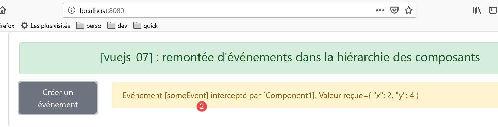

projet [vuejs-07] : remontée d’événements dans la hiérarchie des composants
===========================================================================

L’arborescence du projet est la suivante :

|image0|

Le script principal [main.js]
-----------------------------

Le script principal **[main.js]** reste inchangé.

Le composant principal [App]
----------------------------

Le code du composant **[App]** est le suivant :

.. code-block:: html
  :linenos:

   <template>
     

       <b-card>
         <b-alert show variant="success" align="center">
           <h4>[vuejs-07] : remontée d'événements dans la hiérarchie des composants</h4>
         </b-alert>
         <Component1 />
       </b-card>
     

   </template>

   

Le composant **[App]** utilise un nouveau composant **[Component1]**
(lignes 7, 13, 17).

Le composant [Component11]
--------------------------

Le code du composant **[Component11]** est le suivant :

.. code-block:: html
  :linenos:

   <template>
     <b-button @click="createEvent">Créer un événement</b-button>
   </template>
   <!-- script -->
   

**Commentaires**

-  lignes 1-3 : le composant **[Component11]** ne comporte qu’un bouton
   qu’on peut cliquer. Lorsqu’on le clique, la méthode **[createEvent]**
   des lignes 11-14 est exécutée ;

-  ligne 13 : chaque instance **[Vue]** dispose d’une méthode
   **[$emit]** qui permet d’émettre un événement :

   -  le 1\ :sup:`er` paramètre est le nom de l’événement émis ;

   -  le second paramètre est la donnée que l’on veut associer à cet
      événement ;

   -  l’événement émis remonte la hiérarchie des composants qui
      chapeautent le composant **[Component11]**. Il remonte la
      hiérarchie jusqu’à ce qu’il trouve un composant disposé à le
      traiter. Cette remontée commence par le composant parent de
      **[Component11]** ;

Le composant [Component1]
-------------------------

Le code du composant **[Component1]** est le suivant :

.. code-block:: html
  :linenos:

   <template>
     <b-row>
       <!-- le composant qui lance l'événement -->
       <b-col cols="2">
         <Component11 @someEvent="doSomething" />
       </b-col>
       <!-- message affiché par la méthode de gestion de l'évt-->
       <b-col>
         <b-alert show
                  variant="warning"
                  v-if="showMsg">Evénement [someEvent] intercepté par [Component1]. Valeur reçue={{data}}</b-alert>
       </b-col>
     </b-row>
   </template>

   

**Rendu visuel**

|image1|

|image2|

**Commentaires**

-  ligne 5 : **[Component1]** est parent de **[Component11]** et peut
   donc ‘écouter’ (c’est le terme) les événements émis par ce composant.
   On sait que celui-ci peut émettre l’événement **[someEvent]**.
   L’attribut **[@someEvent="doSomething"]** indique que si l’événement
   **[someEvent]** émis par **[Component11]** se produit, alors la
   méthode **[doSomething]** de la ligne 33 doit être exécutée ;

-  lignes 9-11 : un message affiché par la méthode **[doSomething]**.
   Son affichage est contrôlé par le booléen **[showMsg]** de la ligne
   28. L’alerte affiche l’attribut **[data]** de la ligne 27 ;

-  ligne 33 : la méthode **[doSomething]** exécutée lorsque l’événement
   **[someEvent]** se produit ligne 5, reçoit comme paramètre la donnée
   **[data]** associée à cet événement. Ce paramètre est affecté à
   l’attribut **[data]** de la ligne 27 et qui est affiché par la ligne
   11 ;

-  ligne 37 : on met l’attribut **[showMsg]** à **[true]** pour afficher
   l’alerte des lignes 9-11 ;

Exécution du projet
-------------------

|image3|

.. |image3| image:: chap-10/media/image4.png
   :width: 6.58661in
   :height: 1.87441in
