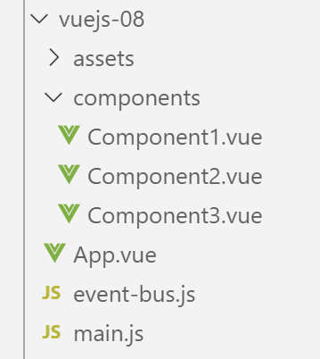
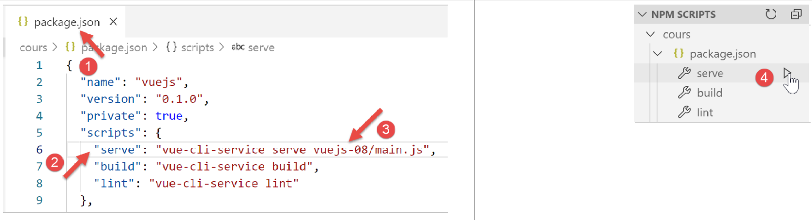
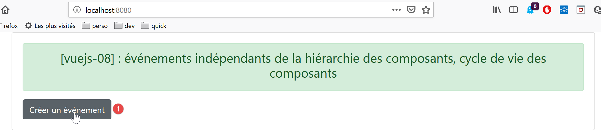
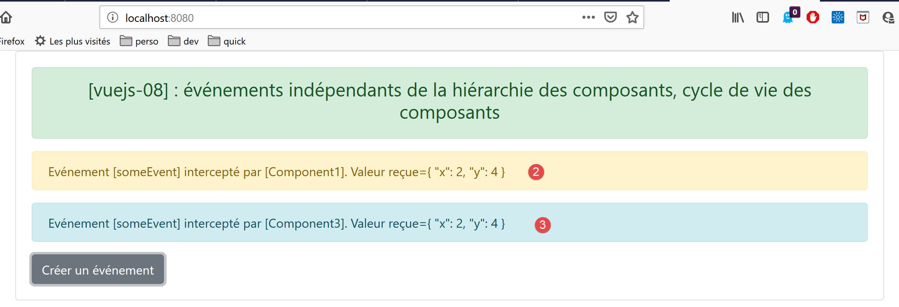

projet [vuejs-08] : événements indépendants de la hiérarchie des composants, cycle de vie des composants
========================================================================================================

Le projet **[vuejs-08]** lontre comment des composants non reliés
directement dans la hiérarchie des composants peuvent néanmoins
communiquer via des événements. L’arborescence du projet **[vuejs-08]**
est la suivante :

|image0|

Le script principal [main.js]
-----------------------------

Le script **[main.js]** reste ce qu’il était dans les exemples
précédents.

Le script [even-bus.js]
-----------------------

Le script **[event-bus.js]** est l’outil que nous allons utiliser pour
émettre et écouter des événements :

.. code-block:: javascript
  :linenos:

   import Vue from 'vue';
   const eventBus = new Vue();
   export default eventBus;

Le script **[event-bus]** se contente de créer une instance de la classe
**[Vue]** (lignes 1-2) et de l’exporter (ligne 3). La classe **[Vue]**
possède deux méthodes pour gérer les événements :

-  **[Vue].$emit(nom, donnée)** : permet d’émettre un événement nommé
   **[nom]** et associé à la donnée **[donnée]** ;

-  **[Vue].$on(nom, fn)** : permet d’intercepter l’événement nommé
   **[nom]** et de le faire traiter par la fonction **[fn]**. La
   fonction **[fn]** recevra en paramètre la donnée **[donnée]**
   associée à l’événement par son émetteur ;

Cette gestion d’événements n’est pas liée à la hiérarchie des
composants. Il faut simplement que les composants qui veulent
communiquer ainsi utilisent **la même instance** de la classe **[Vue]**
pour émettre / écouter les événements. Dans notre exemple, nous
utiliserons l’instance **[eventBus]** définie par le script
**[event-bus.js]** précédent.

La vue principale [App.vue]
---------------------------

Le code de la vue principale **[App]** est le suivant :

.. code-block:: html
  :linenos:

   <template>
     

       <b-card>
         <b-alert show variant="success" align="center">
           <h4>[vuejs-08] : événements indépendants de la hiérarchie des composants, cycle de vie des composants</h4>
         </b-alert>
         <!-- les trois composants qui communiquent par évt -->
         <Component1 />
         <Component3 />
         <Component2 />
       </b-card>
     

   </template>

   

-  lignes 8-10 : la vue principale **[App]** utilise trois composants
   **[Component1, Component2, Component3]** qui vont communiquer par
   événements. Les trois composants sont au même niveau dans la vue
   **[App]**. De plus, il n’y aura pas de relation de hiérarchie entre
   eux ;

Le composant [Component1]
-------------------------

Le code du composant **[Component1]** est le suivant :

.. code-block:: html
  :linenos:

   <template>
     <b-row>
       <b-col>
         <b-alert show
                  variant="warning"
                  v-if="showMsg">Evénement [someEvent] intercepté par [Component1]. Valeur reçue={{data}}</b-alert>
       </b-col>
     </b-row>
   </template>

   

**Commentaires**

-  lignes 4-6 : une alerte qui affiche la donnée **[data]** de la ligne
   18. Cette donnée sera initialisée par le gestionnaire d’événement
   **[doSomething]** de la ligne 25. Ce gestionnaire est activé à
   réception de l’événement **[someEvent]** (ligne 34). L’alerte est
   affichée conditionnellement à la valeur de l’attribut **[showMsg]**
   de la ligne 19. Cet attribut est lui également positionné par le
   gestionnaire d’événement **[doSomething]** de la ligne 25 ;

-  ligne 32 : la fonction **[created]** est un gestionnaire d’événement.
   Elle gère l’événement **[created]**, un événement émis au cours du
   cycle de vie du composant. Il en existe d’autres **[beforeCreate,
   created, beforeMount, mounted, beforeUpdate, updated, beforeDestroy,
   destroyed]**. L’événement **[created]** est émis lorsque le composant
   a été créé ;

-  ligne 12 : l’instance **[eventBus]** de la classe **[Vue]** est
   importée ;

-  ligne 34 : elle est utilisée pour écouter l’événement
   **[someEvent]**. Lorsque celui-ci se produit, la méthode
   **[doSomething]** de la ligne 25 est appelée ;

-  ligne 25 : la méthode **[doSomething]** reçoit comme paramètre
   **[data]** la donnée que l’émetteur de l’événement **[someEvent]** a
   associée à l’événement ;

-  lignes 26-27 : l’état du composant est modifié pour que l’alerte des
   lignes 4-6 affiche la donnée reçue ;

Le composant [Component2]
-------------------------

Le composant **[Component2]** est le suivant :

.. code-block:: html
  :linenos:

   <template>
     

       <b-button @click="createEvent">Créer un événement</b-button>
     

   </template>
   <!-- script -->
   

**Commentaires**

-  ligne 3 : un bouton pour créer un événement. Lorsque l’utilisateur
   clique sur ce bouton, la méthode **[createEvent]** de la ligne 13 est
   appelée ;

-  ligne 8 : l’instance **[eventBus]** définie par le script
   **[event-bus.js]** est importée ;

-  ligne 14 : cette instance est utilisée pour émettre un événement
   nommé **[someEvent]** associé à la donnée **[{ x: 2, y: 4 }]**. Au
   final, lorsque l’utilisateur clique sur le bouton de la ligne 3,
   l’événement **[someEvent]** est émis. Si on se rappelle la définition
   de **[Component1]**, celui-ci interceptera cet événement ;

Le composant [Component3]
-------------------------

Le code de ce composant est le suivant :

.. code-block:: html
  :linenos:

   <template>
     <b-row>
       <b-col>
         <b-alert show
                  v-if="showMsg">Evénement [someEvent] intercepté par [Component3]. Valeur reçue={{data}}</b-alert>
       </b-col>
     </b-row>
   </template>

   

**[Component3]** est un clone de **[Component1]**. Il n’est là que pour
montrer qu’un événement peut être intercepté par plusieurs composants.

Exécution du projet [vuejs-08]
------------------------------

|image1|

|image2|

|image3|

