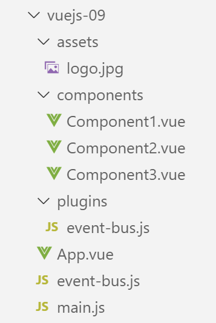
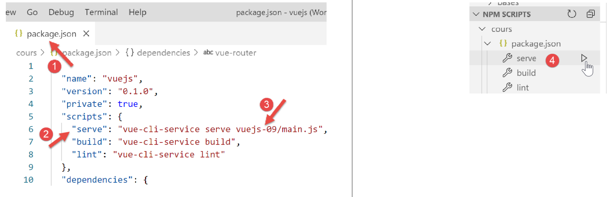

projet [vuejs-09] : utilisation d’un plugin [eventBus]
======================================================

Le projet **[vuejs-09]** est identique au projet **[vuejs-08]** si ce
n’est qu’il introduit la notion de plugin. L’arborescence du projet est
la suivante :

|image0|

Le plugin [./plugins/event-bus]
-------------------------------

Le script **[./event-bus.js]** reste ce qu’il était dans l’exemple
précédent :

.. code-block:: javascript
  :linenos:

   import Vue from 'vue';
   const eventBus = new Vue();
   export default eventBus;

Le plugin **[./plugins/event-bus.js]** est le suivant :

.. code-block:: javascript
  :linenos:

   export default {
     install(Vue, eventBus) {
       // ajoute une propriété [$eventBus] à la classe Vue
       Object.defineProperty(Vue.prototype, '$eventBus', {
         // lorsque Vue.$eventBus est référencé, on rend le 2ième paramètre [eventBus]
         get: () => eventBus,
       })
     }
   }

**Commentaires**

-  un plugin **[Vue]** est un objet ayant une fonction **[install]**
   (ligne 2). Celle-ci sera automatiquement appelée lorsqu’un code
   déclare l’utilisation du plugin ;

-  lignes 1-9 : l’objet exporté par le script ;

-  ligne 2 : la fonction **[install]** accepte ici deux paramètres :

   -  **[Vue]** : la fonction obtenue par l’instruction **[import Vue
      from ‘Vue’]**. Peut-être assimilée à une classe ;

   -  **[eventBus]** : l’objet exporté par le script **[./event-bus]** ;

-  lignes 4-7 : modifient la définition (on dit le prototype) de la
   fonction **[Vue]** en lui ajoutant la propriété **[$eventBus]**. Si
   on raisonne avec le terme **[classe]**, la propriété **[$eventBus]**
   est ajoutée à la clase **[Vue]**. Les composants qui sont des
   instances de **[Vue]** auront donc accès à cette nouvelle propriété ;

-  la ligne 6 indique que lorsqu’on référencera la propriété
   **[Vue].$eventBus**, on obtiendra le paramètre **[eventBus]** de la
   ligne 2. Nous allons voir un peu plus loin que ce second paramètre
   sera l’objet **[eventBus]** exporté par le script
   **[./event-bus.js]**. Donc au final, lorsqu’un composant C utilisera
   l’expression **[C.$eventBus]** il référencera l’objet **[eventBus]**
   exporté par le script **[./event-bus.js]**. Cela lui évitera
   d’importer le script **[./event-bus.js]**. L’intérêt du plugin est
   là : simplifier l’accès à l’objet **[eventBus]** exporté par le
   script **[./event-bus.js]** ;

-  on notera que le plugin n’a pas à s’appeler lui-même
   **[event-bus.js]**. On aurait pu l’appeler **[plugin-event-bus]** par
   exemple ;

-  on notera également que le terme $ dans **[$eventBus]** est une
   convention pour désigner les propriétés de **[Vue]** qui ont été
   ajoutées via des plugins. On n’est pas obligés d’observer cette
   convention. Dans ce texte, nous l’observerons ;

Le script principal [main.js]
-----------------------------

Le script **[./plugins/event-bus.js]** définit un plugin pour le
framework **[Vue.js]**. Ce plugin n’est pas encore utilisé, juste
défini. C’est le script **[main.js]** qui l’active :

.. code-block:: javascript
  :linenos:

   // imports
   import Vue from 'vue'
   import App from './App.vue'

   // plugins
   import BootstrapVue from 'bootstrap-vue'
   Vue.use(BootstrapVue);

   // bootstrap
   import 'bootstrap/dist/css/bootstrap.css'
   import 'bootstrap-vue/dist/bootstrap-vue.css'

   // eventbus
   import eventBus from './event-bus';
   import PluginEventBus from './plugins/event-bus';
   Vue.use(PluginEventBus, eventBus);

   // configuration
   Vue.config.productionTip = false

   // instanciation projet [App]
   new Vue({
     render: h => h(App),
   }).$mount('#app')

**Commentaires**

-  les lignes 14-16 activent le plugin **[PluginEventBus]**. Après la
   ligne 16, toutes les instances de la classe (fonction) **[Vue]**
   possèdent la propriété **[$eventBus]** qui pointe pour chacune
   d’elles sur le même object exporté par le script
   **[./event-bus.js]**. Ce sera le cas pour chacun des composants du
   projet ;

La vue principale [App]
-----------------------

La vue principale **[App]** reste ce qu’elle était dans le projet
précédent.

Le composant [Component1]
-------------------------

Le composant **[Component1]** utilise désormais sa propriété
**[$eventBus]** pour écouter l’événement **[someEvent]** :

.. code-block:: html
  :linenos:

   <template>
     <b-row>
       <b-col>
         <b-alert show
                  variant="warning"
                  v-if="showMsg">Evénement [someEvent] intercepté par [Component1]. Valeur reçue={{data}}</b-alert>
       </b-col>
     </b-row>
   </template>

   

**Commentaires**

-  ligne 33, utilisation de la propriété **[this.$eventBus]** du
   composant. On remarquera de plus que le script ligne 11 n’importe
   plus le script **[./event-bus.js]** ;

Le composant [Component2]
-------------------------

Le composant **[Component2]** utilise désormais sa propriété
**[$eventBus]** pour émettre l’événement **[someEvent]** :

.. code-block:: html
  :linenos:

   <template>
     

       <b-button @click="createEvent">Créer un événement</b-button>
     

   </template>
   <!-- script -->
   

**Commentaires**

-  ligne 13, utilisation de la propriété **[this.$eventBus]** du
   composant. On remarquera de plus que le script ligne 7 n’importe plus
   le script **[./event-bus.js]** ;

Composant [Component3]
----------------------

Le composant **[Component3]** a le même code que **[Component1]**. Lui
également écoute l’événement **[someEvent]**.

Exécution du projet
-------------------

|image1|

On obtient les mêmes résultats que dans le projet précédent.

