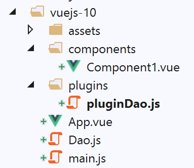
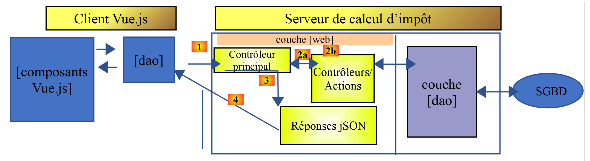
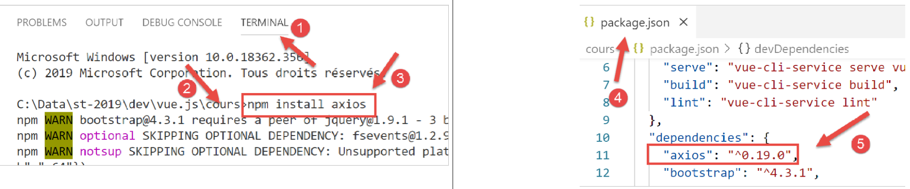
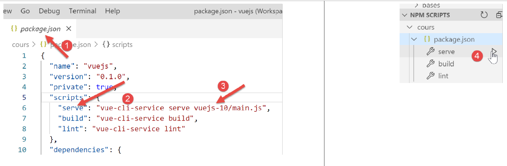
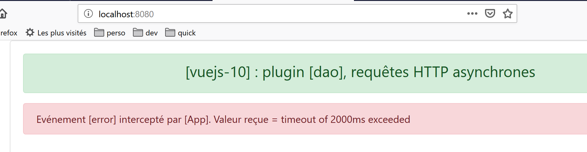
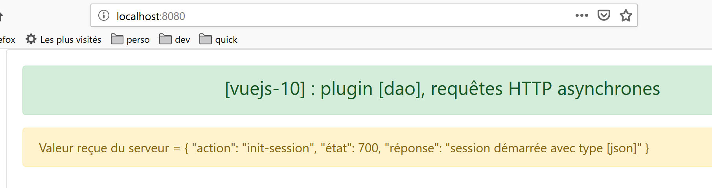

projet [vuejs-10] : plugin [dao], requêtes HTTP asynchrones
===========================================================

L’arborescence du projet **[vuejs-10]** est la suivante :

|image0|

Le projet **[vuejs-10]** montre un composant faisant une requête HTTP à
un serveur distant. L’architecture utilisée est la suivante :

|image1|

Un composant **[Vue.js]** utilise la couche **[dao]** pour dialoguer
avec le serveur de calcul de l’impôt.

Installation des dépendances
----------------------------

L’application **[vuejs-10]** utilise la bibliothèque **[axios]** pour
faire les requêtes asynchrones vers le serveur de calcul d’impôt. Il
nous faut installer cette dépendance :

|image2|

-  en **[4-5]**, la ligne ajoutée au fichier **[package.json]** après
   l’installation de la bibliothèque **[axios]** **[1-3]** ;

La classe [Dao]
---------------

La classe **[Dao]** est celle qui a été développée au paragraphe `[La
classe Dao] <#1.11.2.La classe [Dao]|outline>`__. Nous la redonnons ici
pour mémoire :

.. code-block:: javascript
  :linenos:

   'use strict';

   // imports
   import qs from 'qs'

   // classe [Dao]
   class Dao {

     // constructeur
     constructor(axios) {
       this.axios = axios;
       // cookie de session
       this.sessionCookieName = "PHPSESSID";
       this.sessionCookie = '';
     }

     // init session
     async  initSession() {
       // options de la requête HHTP [get /main.php?action=init-session&type=json]
       const options = {
         method: "GET",
         // paramètres de l'URL
         params: {
           action: 'init-session',
           type: 'json'
         }
       };
       // exécution de la requête HTTP
       return await this.getRemoteData(options);
     }

     async  authentifierUtilisateur(user, password) {
       // options de la requête HHTP [post /main.php?action=authentifier-utilisateur]
       const options = {
         method: "POST",
         headers: {
           'Content-type': 'application/x-www-form-urlencoded',
         },
         // corps du POST
         data: qs.stringify({
           user: user,
           password: password
         }),
         // paramètres de l'URL
         params: {
           action: 'authentifier-utilisateur'
         }
       };
       // exécution de la requête HTTP
       return await this.getRemoteData(options);
     }

     async getAdminData() {
       // options de la requête HHTP  [get /main.php?action=get-admindata]
       const options = {
         method: "GET",
         // paramètres de l'URL
         params: {
           action: 'get-admindata'
         }
       };
       // exécution de la requête HTTP
       const data = await this.getRemoteData(options);
       // résultat
       return data;
     }

     async  getRemoteData(options) {
       // pour le cookie de session
       if (!options.headers) {
         options.headers = {};
       }
       options.headers.Cookie = this.sessionCookie;
       // exécution de la requête HTTP
       let response;
       try {
         // requête asynchrone
         response = await this.axios.request('main.php', options);
       } catch (error) {
         // le paramètre [error] est une instance d'exception - elle peut avoir diverses formes
         if (error.response) {
           // la réponse du serveur est dans [error.response]
           response = error.response;
         } else {
           // on relance l'erreur
           throw error;
         }
       }
       // response est l'ensemble de la réponse HTTP du serveur (entêtes HTTP + réponse elle-même)
       // on récupère le cookie de session s'il existe
       const setCookie = response.headers['set-cookie'];
       if (setCookie) {
         // setCookie est un tableau
         // on cherche le cookie de session dans ce tableau
         let trouvé = false;
         let i = 0;
         while (!trouvé && i < setCookie.length) {
           // on cherche le cookie de session
           const results = RegExp('^(' + this.sessionCookieName + '.+?);').exec(setCookie[i]);
           if (results) {
             // on mémorise le cookie de session
             // eslint-disable-next-line require-atomic-updates
             this.sessionCookie = results[1];
             // on a trouvé
             trouvé = true;
           } else {
             // élément suivant
             i++;
           }
         }
       }
       // la réponse du serveur est dans [response.data]
       return response.data;
     }
   }

   // export de la classe
   export default Dao;

Le projet **[vuejs-10]** n’utilise que la méthode asynchrone
**[initSession]** des lignes 18-30. On rappelle que la classe **[Dao]**
est instanciée avec un paramètre **[axios]**, ligne 10, paramètre
initialisé par le code appelant. Ce code appelant sera ici le script
**[./main.js]**.

Le plugin [pluginDao]
---------------------

Le plugin **[pluginDao]** est le suivant :

.. code-block:: javascript
  :linenos:

   export default {
     install(Vue, dao) {
       // ajoute une propriété [$dao] à la classe Vue
       Object.defineProperty(Vue.prototype, '$dao', {
         // lorsque Vue.$dao est référencé, on rend le 2ième paramètre [dao]
         get: () => dao,
       })
     }
   }

Si on se souvient de l’explication donnée pour le plugin
**[event-bus]**, on voit que le plugin **[pluginDao]** crée dans la
classe / fonction **[Vue]**, une nouvelle propriété appelée **[$dao]**.
Cette propriété aura (ça reste à montrer) pour valeur, l’objet exporté
par le script **[./Dao]**, ç-à-d la classe **[Dao]** précédente.

Le script principal [main.js]
-----------------------------

Le code du script principal **[main.js]** est le suivant :

.. code-block:: javascript
  :linenos:

   // imports
   import Vue from 'vue'
   import App from './App.vue'
   import axios from 'axios';

   // plugins
   import BootstrapVue from 'bootstrap-vue'
   Vue.use(BootstrapVue);

   // bootstrap
   import 'bootstrap/dist/css/bootstrap.css'
   import 'bootstrap-vue/dist/bootstrap-vue.css'

   // couche [dao]
   import Dao from './Dao';
   // configuration axios
   axios.defaults.timeout = 2000;
   axios.defaults.baseURL = 'http://localhost/php7/scripts-web/impots/version-14';
   axios.defaults.withCredentials = true;
   // instanciation couche [dao]
   const dao = new Dao(axios);

   // plugin [dao]
   import pluginDao from './plugins/dao'
   Vue.use(pluginDao, dao)

   // configuration
   Vue.config.productionTip = false

   // instanciation projet [App]
   new Vue({
     render: h => h(App),
   }).$mount('#app')

Le script **[main.js]** :

-  instancie la couche **[dao]** aux lignes 14-21 ;

-  intègre le plugin **[pluginDao]** aux lignes 24-25 ;

-  ligne 15 : la classe **[Dao]** est importée ;

-  lignes 17-18 : on configure l’objet **[axios]** qui réalise les
   requêtes HTTP. Cet objet est importé à la ligne 4 ;

   -  ligne 17 : définition d’un **[timeout]** de 2 secondes ;

   -  ligne 18 : l’URL du serveur de calcul de l’impôt ;

   -  ligne 19 : pour pouvoir échanger des cookies avec le serveur ;

-  lignes 24-25 : utilisation du plugin **[pluginDao]**

   -  ligne 24 : import du plugin ;

   -  ligne 25 : intégration du plugin. On voit que le second paramètre
      de la méthode **[Vue.use]** est la référence de la couche
      **[dao]** définie ligne 21. C’est pour cette raison que la
      propriété **[Vue.$dao]** désignera la couche **[dao]** dans toutes
      les instances de la classe / fonction **[Vue]**, ç-à-d dans tous
      les composants **[Vue.js]** ;

La vue principale [App.vue]
---------------------------

Le code de la vue principale **[App]** est le suivant :

.. code-block:: html
  :linenos:

   <template>
     

       <b-card>
         <!-- message -->
         <b-alert show variant="success" align="center">
           <h4>[vuejs-10] : plugin [dao], requêtes HTTP asynchrones</h4>
         </b-alert>
         <!-- composant faisant une requête asynchrone au serveur de calcul d'impôt-->
         <Component1 @error="doSomethingWithError" @endWaiting="endWaiting" @beginWaiting="beginWaiting" />
         <!-- affichage d'une éventuelle erreur -->
         <b-alert show
                  variant="danger"
                  v-if="showError">Evénement [error] intercepté par [App]. Valeur reçue = {{error}}</b-alert>
         <!-- message d'attente avec un spinner -->
         <b-alert show v-if="showWaiting" variant="light">
           <strong>Requête au serveur de calcul d'impôt en cours...</strong>
           <b-spinner variant="primary" label="Spinning"></b-spinner>
         </b-alert>
       </b-card>
     

   </template>

   

**Commentaires**

-  ligne 9 : **[Component1]** est le composant qui fait la requête HTTP
   asynchrone. Il peut émettre trois événements :

   -  **[beginWaiting]** : la requête va être faite. Il faut afficher un
      message d’attente à destination de l’utilisateur ;

   -  **[endWaiting]** : la requête est terminée. Il faut arrêter
      l’attente ;

   -  **[error]** : la requête s’est mal passée. Il faut afficher un
      message d’erreur ;

-  lignes 10-13 : l’alerte qui affiche l’éventuel message d’erreur. Elle
   est contrôlée par le booléen **[showError]** de la ligne 33. Elle
   affiche l’erreur de la ligne 35 ;

-  lignes 14-18 : l’alerte qui affiche le message d’attente avec un
   spinner. Elle est contrôlée par le booléen **[showWaiting]** de la
   ligne 47 ;

-  lignes 45-50 : **[beginWaiting]** est la méthode exécutée à réception
   de l’événement **[beginWaiting]**. Elle affiche le message d’attente
   (ligne 47) et cache le message d’erreur (ligne 49) au cas où celui-ci
   serait visible suite à une opération précédente ;

-  lignes 52-55 : **[endWaiting]** est la méthode exécutée à réception
   de l’événement **[endWaiting]**. Elle cache le message d’attente
   (ligne 54) ;

-  lignes 57-62 : **[doSomethingWithError]** est la méthode exécutée à
   réception de l’événement **[error]**. Elle enregistre l’erreur reçue
   (ligne 59) et affiche le message d’erreur (ligne 61) ;

Le composant [Component1]
-------------------------

Le code du composant **[Component1]** est le suivant :

.. code-block:: html
  :linenos:

   <template>
     <b-row>
       <b-col>
         <b-alert show
                  variant="warning"
                  v-if="showMsg">Valeur reçue du serveur = {{data}}</b-alert>
       </b-col>
     </b-row>
   </template>

   

**Commentaires**

-  lignes 4-6 : le composant est constitué d’une unique alerte qui
   affiche la valeur renvoyée par le serveur de calcul de l’impôt, ceci
   uniquement en cas de succès de la requête HTTP. Cette alerte est
   contrôlée par le booléen **[showMsg]** de la ligne 17 ;

-  lignes 31-53 : la requête HTTP est faite dès que le composant a été
   créé. On met donc son code dans la méthode **[created]** de la ligne
   31 ;

-  ligne 35 : on indique au composant parent que la requête asynchrone
   va démarrer ;

-  lignes 37-39 : la méthode **[this.$dao.initSession]** est exécutée.
   Elle initialise une session jSON avec le serveur de calcul d’impôt.
   Le résultat immédiat de cette méthode est une **[Promise]** ;

-  lignes 41-44 : ce code s’exécute lorsque le serveur a rendu son
   résultat sans erreur. Le résultat du serveur est dans **[data]**.
   Ligne 43, on demande à la méthode **[doSomethingWithData]** de
   traiter ce résultat ;

-  lignes 46-49 : ce code s’exécute en cas d’erreur lors de l’exécution
   de la requête. Ligne 48, on indique au composant parent qu’une erreur
   est survenue et on lui passe le message de l’erreur
   **[error.message]** ;

-  lignes 49-52 : ce code s’exécute dans tous les cas. On indique au
   composant parent que la requête HTTP est terminée ;

-  lignes 23-28 : la méthode **[doSomethingWithData]** est la méthode
   chagée d’exploiter la donnée **[data]** envoyée par le serveur. Ligne
   25, on enregistre cette donnée et ligne 27 on l’affiche ;

Exécution du projet
-------------------

|image3|

Si lorsqu’on lance le projet, le serveur de calcul d’impôt n’est pas
lancé alors on obtient le résultat suivant :

|image4|

Lançons le serveur **[Laragon]** (cf
https://tahe.developpez.com/tutoriels-cours/php7) et rechargeons la page
ci-dessus. Le résultat est alors le suivant :

|image5|

**Note** : nous utilisons ici la version 14 du serveur de calcul d’impôt
définie au https://tahe.developpez.com/tutoriels-cours/php7.

