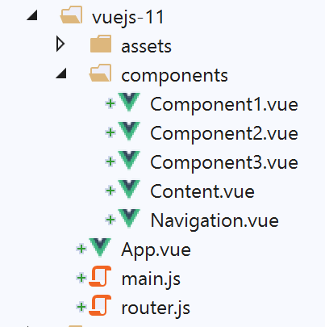
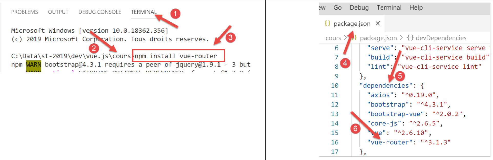
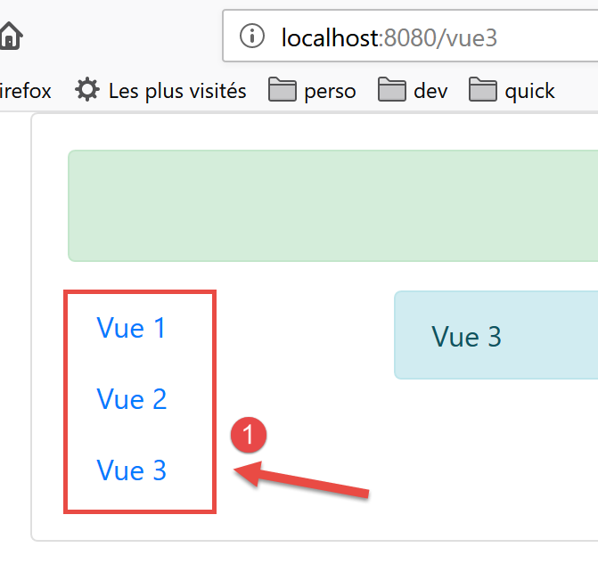
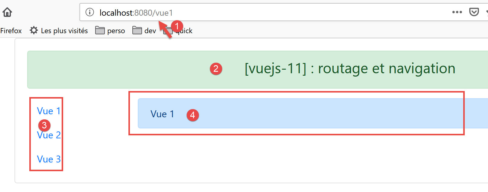
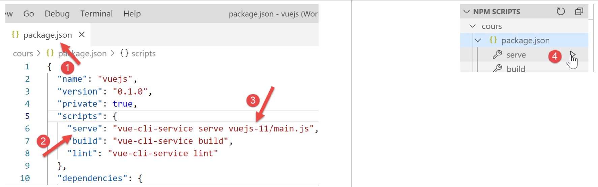
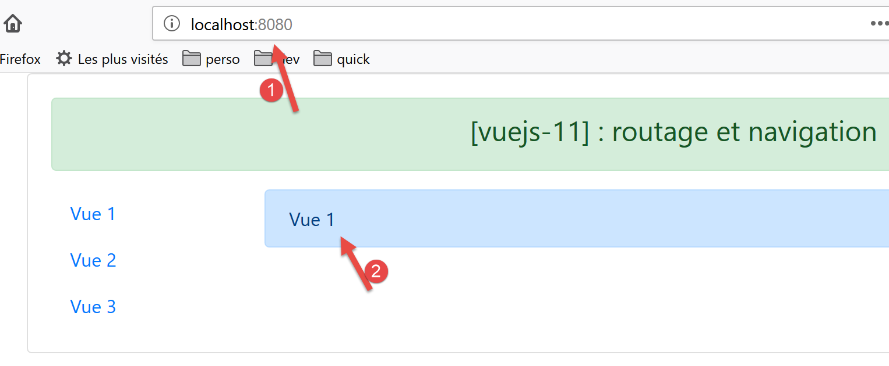
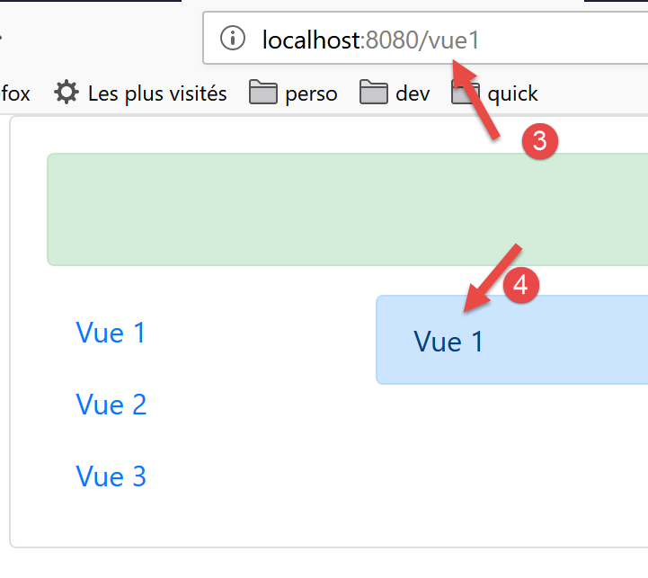
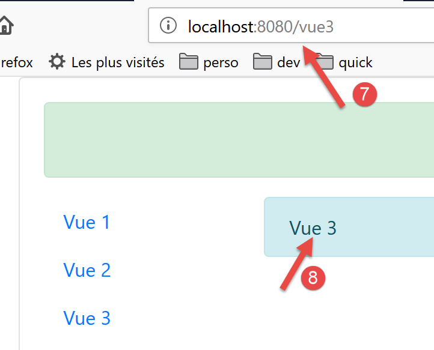

projet [vuejs-11] : routage et navigation
=========================================

Le routage est ce qui va permettre à l’utilisateur de naviguer entre les
différentes pages de l’application.

L’arborescence du projet est la suivante :

|image0|

Installation des dépendances
----------------------------

Le routage dans **[Vue.js]** nécessite la dépendance **[vue-router]** :

|image1|

-  en **[1-3]**, on installe la dépendance **[vue-router]** ;

-  en **[4-6]**, après installation de la dépendance, le fichier
   **[package.json]** a été modifié ;

Le script de routage [router.js]
--------------------------------

Les règles de navigation de l’application sont inscrites dans le fichier
**[router.js]** (le nom du script peut être quelconque) :

.. code-block:: javascript
  :linenos:

   // imports nécessaires au routage
   import Vue from 'vue'
   import VueRouter from 'vue-router'

   // plugin de routage
   Vue.use(VueRouter)

   // les composants cibles du routage
   import Component1 from './components/Component1.vue'
   import Component2 from './components/Component2.vue'
   import Component3 from './components/Component3.vue'

   // les routes de l'application
   const routes = [
     // home
     { path: '/', name: 'home', component: Component1 },
     // Component1
     {
       path: '/vue1', name: 'vue1', component: Component1
     },
     {
       // Component2
       path: '/vue2', name: 'vue2', component: Component2
     },
     // Component3
     {
       path: '/vue3', name: 'vue3', component: Component3
     },
   ]

   // le routeur
   const router = new VueRouter({
     routes,
     mode: 'history',
   })

   // export du routeur
   export default router

**Commentaires**

-  le script **[router.js]** va fixer les règles de routage de notre
   application ;

-  ligne 1-6 : activation du plugin **[vue-router]** nécessaire au
   routage. Cette activation nécessite l’import de la classe / fonction
   **[Vue]** (ligne 2) et celui du plugin de routage (ligne 3). Ce
   plugin a été installé avec la dépendance **[router]** que nous venons
   d’installer ;

-  lignes 8-11 : import des vues cibles du routage ;

-  lignes 15-21 : définition du tableau des routes. Chaque élément de ce
   tableau est un objet avec les propriétés suivantes :

   -  **[path]** : l’URL de la vue, celle que nous voulons voir affichée
      dans le champ **[URL]** du navigateur. On est libre de mettre ce
      qu’on veut ;

   -  **[name]** : le nom de la route. Là également on peut mettre ce
      qu’on veut ;

   -  **[component]** : le composant qui affiche la vue. Là c’est
      forcément un composant existant ;

..

   On aura donc ici quatre routes **[/, /vue1, /vue2, /vue3]**.

-  lignes 33-36 : le routeur est une instance de la classe
   **[VueRouter]** importée ligne 3. Le constructeur de **[VueRouter]**
   est ici utilisé avec deux paramètres :

   -  les routes de l’application ;

   -  un mode d’écriture des URL dans le navigateur : le mode par défaut
      **[hash]** écrit les URL sous la forme **[localhost:8080/#/vue1]**
      (# est le hash). Le mode **[history]** enlève le #
      **[localhost:8080/vue1]** ;

-  ligne 39 : on exporte le routeur ;

Le script principal [main.js]
-----------------------------

Le script principal **[main.js]** est le suivant :

.. code-block:: javascript
  :linenos:

   // imports
   import Vue from 'vue'
   import App from './App.vue'

   // plugins
   import BootstrapVue from 'bootstrap-vue'
   Vue.use(BootstrapVue);

   // bootstrap
   import 'bootstrap/dist/css/bootstrap.css'
   import 'bootstrap-vue/dist/bootstrap-vue.css'

   // routeur
   import monRouteur from './router'

   // configuration
   Vue.config.productionTip = false

   // instanciation projet [App]
   new Vue({
     name: "app",
     // vue principale
     render: h => h(App),
     // routeur
     router: monRouteur,
   }).$mount('#app')

**Commentaires**

-  ligne 14 : on importe le routeur exporté par le script
   **[router.js]** ;

-  ligne 25 : ce routeur est passé en paramètre du constructeur de la
   classe **[Vue]** qui va afficher la vue principale **[App]**, associé
   à la propriété **[router]** de la vue ;

La vue principale [App]
-----------------------

Le code de la vue principale est le suivant :

.. code-block:: html
  :linenos:

   <template>
     

       <b-card>
         <!-- un message -->
         <b-alert show variant="success" align="center">
           <h4>[vuejs-11] : routage et navigation</h4>
         </b-alert>
         <!-- la vue courante du routage -->
         <router-view />
       </b-card>
     

   </template>

   

**Commentaires**

-  ligne 9 : affiche la vue courante du routage. La balise
   <**router-view**> n’est reconnue que si la propriété **[router]** de
   la vue a été initialisée ;

La mise en page des vues
------------------------

La mise en page des vues est assurée par le composant **[Layout]**
suivant :

.. code-block:: html
  :linenos:

   <template>
     <!-- ligne -->
     

       <b-row>
         <!-- zone à trois colonnes -->
         <b-col cols="2" v-if="left">
           <slot name="left" />
         </b-col>
         <!-- zone à neuf colonnes -->
         <b-col cols="10" v-if="right">
           <slot name="right" />
         </b-col>
       </b-row>
     

   </template>

   

Nous avons déjà utilisé et expliqué cette mise en page dans le projet
**[vuejs-06]** du paragraphe
`[vuejs-06] <#1.7.projet [vuejs-06] : mise en page d’une vue avec des slots|outline>`__.

Le composant de navigation
--------------------------

Le composant **[Navigation]** offre un menu de navigation à
l’utilisateur :

|image2|

Le composant qui génère le bloc **[1]** est le suivant :

.. code-block:: html
  :linenos:

   <template>
     <!-- menu Bootstrap à trois options -->
     <b-nav vertical>
       <b-nav-item to="/vue1" exact exact-active-class="active">Vue 1</b-nav-item>
       <b-nav-item to="/vue2" exact exact-active-class="active">Vue 2</b-nav-item>
       <b-nav-item to="/vue3" exact exact-active-class="active">Vue 3</b-nav-item>
     </b-nav>
   </template>

-  ce code génère le bloc 1 de trois liens permettant la navigation ;

-  l’attribut **[to]** des balises <b-nav-item> doit correspondre à
   l’une des propriétés **[path]** des routes du routeur de
   l’application ;

Les vues
--------

La vue n° 1 est la suivante :

|image3|

Les zone **[3-4]** sont générées par le composant **[Component1]**
suivant :

.. code-block:: html
  :linenos:

   <template>
     <Layout :left="true" :right="true">
       <!-- navigation -->
       <Navigation slot="left" />
       <!-- message-->
       <b-alert show variant="primary" slot="right">Vue 1</b-alert>
     </Layout>
   </template>

   

**Commentaires**

-  ligne 2 : la vue n° 1 utilise la mise en page du composant
   **[Layout]** composée de deux slots appelés **[left, right]** ;

-  ligne 4 : le menu de navigation est placé dans le slot de gauche.
   C’est la zone **[3]** qu’on voit ci-dessus ;

-  ligne 6 : un message est placé dans le slot de droite. C’est la zone
   **[4]** qu’on voit ci-dessus ;

Les vues 2 et 3 sont analogues.

Vue n° 2 affichée par le composant **[Component2]** :

.. code-block:: html
  :linenos:

   <!-- vue n° 2 -->
   <template>
     <Layout :left="true" :right="true">
       <!-- navigation -->
       <Navigation slot="left" />
       <!-- message -->
       <b-alert show variant="secondary" slot="right">Vue 2</b-alert>
     </Layout>
   </template>

   

Vue n° 3 affichée par le composant **[Component3]** :

.. code-block:: html
  :linenos:

   <!-- vue n° 3 -->
   <template>
     <Layout :left="true" :right="true">
       <!-- navigation -->
       <Navigation slot="left" />
       <!-- message -->
       <b-alert show variant="info" slot="right">Vue 3</b-alert>
     </Layout>
   </template>

   

Exécution du projet
-------------------

|image4|

A l’exécution la vue suivante s’affiche :

|image5|

-  en **[1]**, l’URL est **[http://localhost:8080]**. C’est alors la
   règle de routage suivante qui s’est exécutée :

.. code-block:: json
  :linenos:

   { path: '/', name: 'home', component: Component1 }

..

   C’est donc le composant **[Component1]** qui a été affiché. Il
   affiche la vue n° 1 **[2]**. Maintenant cliquons sur le lien **[Vue
   1]** dont le code est le suivant :

.. code-block:: html
  :linenos:

   <b-nav-item to="/vue1" exact exact-active-class="active">Vue 1</b-nav-item>

..

   L’affichage devient le suivant :

-  en **[3]**, la règle suivante de routage s’est exécutée :

..

   path: '/vue1', name: 'vue1', component: Component1

   C’est donc de nouveau le composant **[Component1]** qui a été affiché
   et donc la vue n° 1 **[4]**. Maintenant cliquons sur le lien **[Vue
   2]** dont le code est le suivant :

   <b-nav-item to="/vue2" exact exact-active-class="active">Vue
   2</b-nav-item>

   La nouvelle vue est alors la suivante :

   |image6|

-  en **[5]**, la règle suivante de routage s’est exécutée :

.. code-block:: json
  :linenos:

   path: '/vue2', name: 'vue2', component: Component2

..

   C’est donc le composant **[Component2]** qui a été affiché et donc la
   vue n° 2. Si maintenant nous cliquons sur le lien **[Vue 3]**, dont
   le code est le suivant :

.. code-block:: html
  :linenos:

   <b-nav-item to="/vue3" exact exact-active-class="active">Vue 3</b-nav-item>

..

   Nous obtenons la nouvelle vue suivante :

|image7|

-  en **[6]**, la règle de routage suivante s’est exécutée :

.. code-block:: json
  :linenos:

   path: '/vue3', name: 'vue3', component: Component3

C’est donc le composant **[Component3]** qui s’est affiché, ç-à-d la vue
n° 3 **[8]**.

