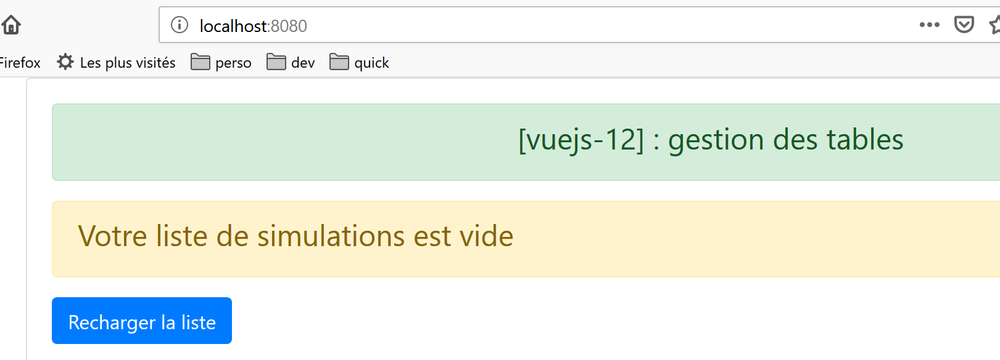
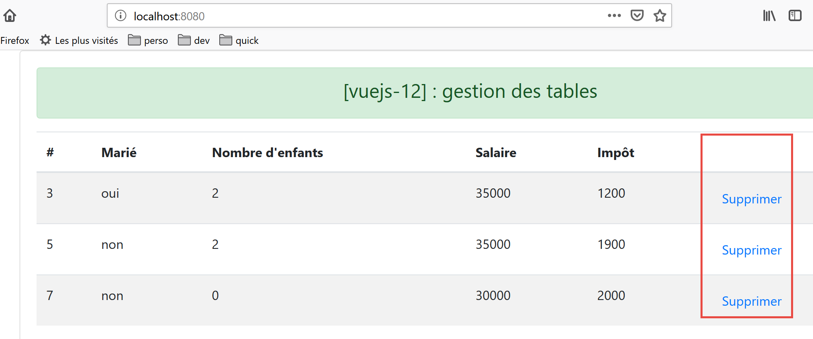

projet [vuejs-12] : gestion des tables HTML
===========================================

L’arborescence du projet **[vuejs-12]** est la suivante :

|image0|

Le script principal [main.js]
-----------------------------

Le script principal redevient ce qu’il était dans les premiers projets :

.. code-block:: javascript
  :linenos:

   // imports
   import Vue from 'vue'
   import App from './App.vue'

   // plugins
   import BootstrapVue from 'bootstrap-vue'
   Vue.use(BootstrapVue);

   // bootstrap
   import 'bootstrap/dist/css/bootstrap.css'
   import 'bootstrap-vue/dist/bootstrap-vue.css'

   // configuration
   Vue.config.productionTip = false

   // instanciation projet [App]
   new Vue({
     name: "app",
     render: h => h(App),
   }).$mount('#app')

La vue principale [App]
-----------------------

Le code de la vue principale **[App]** est le suivant :

.. code-block:: html
  :linenos:

   <template>
     

       <b-card>
         <!-- message -->
         <b-alert show variant="success" align="center">
           <h4>[vuejs-12] : gestion des tables</h4>
         </b-alert>
         <!-- composant Table -->
         <Table @supprimerLigne="supprimerLigne" :lignes="lignes" @rechargerListe="rechargerListe" />
       </b-card>
     

   </template>

   

**Commentaires**

-  la vue principale affiche un composant **[Table]** (lignes 9, 15,
   21) ;

-  ligne 9 : le composant **[Table]** admet le paramètre **[:lignes]**
   qui représente les lignes à afficher dans une table HTML. Ces lignes
   sont définies par les lignes 27-31 du code ;

-  ligne 9 : le composant **[Table]**\ est susceptible d’émettre deux
   événements :

   -  **[supprimerLigne]** : pour supprimer une ligne dont on donne
      l’index (ligne 38) ;

   -  **[rechargerListe]** : pour régénérer la liste des lignes 27-31.
      En effet, nous allons voir que l’utilisateur peut supprimer
      certaines des lignes affichées ;

-  lignes 38-43 : la méthode chargée de gérer l’événement
   **[supprimerLigne]**. Elle reçoit en paramètre l’index de la ligne à
   supprimer ;

-  lignes 45-54 : la méthode chargée de gérer l’événement
   **[rechargerListe]**. En modifiant l’attribut **[lignes]** de la
   ligne 27, on provoque la mise à jour du composant **[Table]** de la
   ligne 9, puisqu’il a un paramètre **[:lignes="lignes"]** ;

Le composant [Table]
--------------------

Le composant **[Table]** est le suivant :

.. code-block:: html
  :linenos:

   <template>
     

       <!-- liste vide -->
       <template v-if="lignes.length==0">
         <b-alert show variant="warning">
           <h4>Votre liste de simulations est vide</h4>
         </b-alert>
         <!-- bouton de rechargement-->
         <b-button variant="primary" @click="rechargerListe">Recharger la liste</b-button>
       </template>
       <!-- liste non vide-->
       <template v-if="lignes.length!=0">
         <b-alert show variant="primary" v-if="lignes.length==0">
           <h4>Liste de vos simulations</h4>
         </b-alert>
         <!-- tableau des simulations -->
         <b-table striped hover responsive :items="lignes" :fields="fields">
           <template v-slot:cell(action)="row">
             <b-button variant="link" @click="supprimerLigne(row.index)">Supprimer</b-button>
           </template>
         </b-table>
       </template>
     

   </template>

   

**Commentaires**

Ce composant a deux états :

1. il affiche une liste dans un tableau HTML ;

2. ou bien un message indiquant que la liste à afficher est vide ;

Le 1\ :sup:`er` état est affiché si la condition **[lignes.length!=0]**
est vérifiée (ligne 12) :

|image1|

Le second est affiché si la condition **[lignes.length==0]** est
vérifiée (ligne 4).

|image2|

-  **[lignes]** est un paramètre d’entrée du composant (lignes 29-33) ;

-  lignes 4-10 : au lieu d’introduire un bloc de code avec une balise
   
, on a ici utilisé une balise <template>. la différence entre
   les deux est que la balise <template> n’est pas insérée dans le code
   HTML généré ;

-  ligne 9 : lorsque la liste affichée par la table HTML est vide, un
   bouton propose de la régénérer. Lorsqu’on clique sur ce bouton, la
   méthode **[rechargerListe]** des lignes 57-62 est exécutée. Celle-ci
   se contente d’émettre vers le composant parent l’événement
   **[rechargerListe]** qui demande au parent de régénérer la liste
   affichée par la table HTML ;

-  lignes 12-22 : le code affiché lorsque la liste à afficher n’est pas
   vide ;

-  ligne 17 : la balise <b-table> est la balise qui génère une table
   HTML. Les attributs utilisés ici sont les suivants :

   -  **[striped]** : la couleur de fond des lignes alterne. Il y a une
      couleur pour les lignes paires et une autre pour les lignes
      impaires. Cela améliore la visibilité ;

   -  **[hover]** : la ligne sur laquelle on passe la souris change de
      couleur ;

   -  **[responsive]** : la taille de la table s’adapte à l’écran qui
      l’affiche ;

   -  **[:items]** : le tableau des éléments à afficher. Ici le tableau
      **[lignes]** passé en paramètre au composant (lignes 30-32) ;

   -  **[:fields]** : un tableau définissant la mise en page de la table
      HTML (lignes 37-44) ;

      -  chaque élément du tableau **[fields]** définit une colonne de
         la table HTML ;

      -  **[label]** : désigne le titre de la colonne ;

      -  **[key]** : désigne le contenu de la colonne ;

-  ligne 38 : définit la colonne 0 de la table HTML :

   -  **[#]** : est le titre de la colonne ;

   -  **[id]** : est son contenu. C’est le champ **[id]** de la ligne
      affichée qui remplira la colonne 0 ;

-  ligne 39 : définit la colonne 1 de la table HTML :

   -  **[Marié]** : est le titre de la colonne ;

   -  **[marié]** : est son contenu. C’est le champ **[marié]** de la
      ligne affichée qui remplira la colonne 0 ;

-  ligne 43 : définit la dernière colonne de la table HTML :

   -  la colonne n’a pas de titre ;

   -  son contenu est défini par un champ **[action]**, un champ qui
      n’existe pas dans les lignes affichées. Cette clé est référencée
      ligne 18 du **[template]**. La clé est donc utilisée ici
      uniquement pour identifier une colonne ;

-  lignes 18-20 : ce code sert à définir la dernière colonne de la table
   HTML, celle de clé **[action]** :

..

   <template v-slot:cell(action)="row">

   La syntaxe **[v-slot:cell(action)]** désigne la colonne de clé
   **[action]**. Cette syntaxe permet de définir une colonne lorsque la
   syntaxe du tableau **[fields]** n’est pas suffisante pour la décrire.
   Ici nous voulons que la dernière colonne contienne un lien permettant
   de supprimer une ligne de la table HTML :

   |image3|

   Dans la syntaxe **[<template v-slot:cell(action)="row">]**, le nom
   **[row]** désigne la ligne de la table. On peut utiliser le nom que
   l’on veut. On aurait pu écrire **[<template
   v-slot:cell(action)="ligne">]** ;

-  ligne 19 : un bouton <b-button> affiché comme un lien
   **[variant=’link’]**. Un clic sur ce lien provoque l’exécution de la
   méthode **[supprimerLigne(row.index)]**. Ici **[row]** est le nom
   donné à la ligne de la table HTML, ligne 18 du code ;

-  lignes 50-55 : la méthode **[supprimerLigne]** ;

-  ligne 54 : on émet l’événement **[supprimerLigne]** vers le composant
   parent accompagné du n° de la ligne à supprimer ;

-  lignes 57-62 : la méthode **[rechargerListe]** ;

-  ligne 61 : on émet l’événement **[rechargerListe]** vers le composant
   parent ;

Exécution du projet
-------------------

|image4|

La 1ère vue affichée est la suivante :

|image5|

Après avoir supprimé la ligne 1 **[1]**, la vue devient la suivante :

|image6|

Après avoir supprimé toutes les lignes :

|image7|

Après avoir cliqué sur le bouton **[2]**, on obtient de nouveau la
liste :

|image8|

