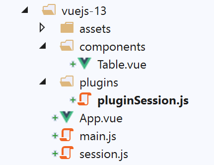
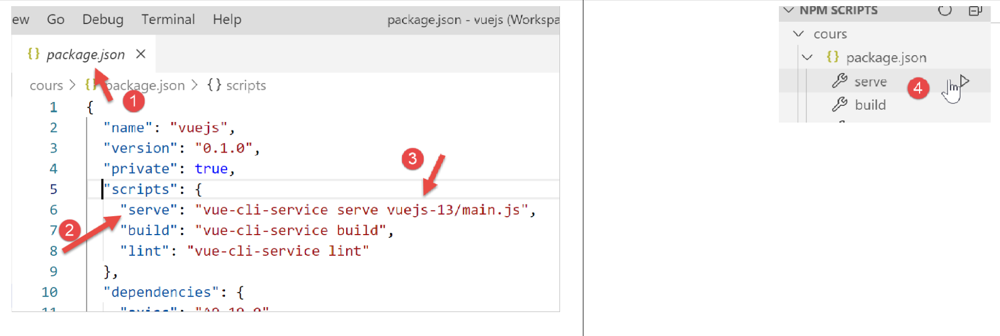

projet [vuejs-13] : mise à jour d’un composant, utilisation d’une session
=========================================================================

Le projet **[vuejs-13]** reprend le projet **[vuejs-12]** en amenant la
modification suivante : le tableau affiché par la table HTML est défini
dans un objet **[session]** connu de tous les composants. C’est donc une
façon de partager de l’information entre composants. Ce concept est
directement inspiré de la session web. Nous utilisons la méthode du
plugin pour rendre disponible cet objet partagé dans un attribut
**[Vue.$session]**.

L’arborescence du projet est la suivante :

|image0|

L’objet [session]
-----------------

L’objet **[session]** partagé par tous les composants est défini dans le
script **[./session.js]** :

.. code-block:: javascript
  :linenos:

   const session = {
     // liste des simulations
     get lignes() {
       return this._lignes;
     },
     // génération de la liste des simulations
     generateLignes() {
       this._lignes =
         [
           { id: 3, marié: "oui", enfants: 2, salaire: 35000, impôt: 1200 },
           { id: 5, marié: "non", enfants: 2, salaire: 35000, impôt: 1900 },
           { id: 7, marié: "non", enfants: 0, salaire: 30000, impôt: 2000 }
         ]
     },
     // suppression ligne n° index
     deleteLigne(index) {
       this._lignes.splice(index, 1);
     }
   }
   // export de l'objet [session]
   export default session;

Le plugin [./plugins/pluginSession]
-----------------------------------

Le script **[pluginSession]** est le suivant :

.. code-block:: javascript
  :linenos:

   export default {
     install(Vue, session) {
       // ajoute une propriété [$session] à la classe vue
       Object.defineProperty(Vue.prototype, '$session', {
         // lorsque Vue.$session est référencé, on rend le 2ième paramètre [session] de la méthode [install]
         get: () => session,
       })
     }
   }

-  ligne 4 : l’objet partagé **[session]** sera disponible dans la
   propriété **[$session]** de tous les composants ;

Le script principal [main.js]
-----------------------------

Le script principal **[main.js]** est le suivant :

.. code-block:: javascript
  :linenos:

   // imports
   import Vue from 'vue'
   import App from './App.vue'

   // plugins
   import BootstrapVue from 'bootstrap-vue'
   Vue.use(BootstrapVue);

   // bootstrap
   import 'bootstrap/dist/css/bootstrap.css'
   import 'bootstrap-vue/dist/bootstrap-vue.css'

   // session
   import session from './session';
   import pluginSession from './plugins/pluginSession'
   Vue.use(pluginSession, session)

   // configuration
   Vue.config.productionTip = false

   // instanciation projet [App]
   new Vue({
     name: "app",
     render: h => h(App),
   }).$mount('#app')

-  lignes 14-16 : le plugin **[pluginSession]** est intégré au framework
   **[Vue.js]** ;

-  après la ligne 16, l’attribut **[$session]** est disponible pour tous
   les composants ;

La vue principale [App]
-----------------------

La vue **[App]** est désormais la suivante :

.. code-block:: html
  :linenos:

   <template>
     

       <b-card>
         <!-- message -->
         <b-alert show variant="success" align="center">
           <h4>[vuejs-13] : mise à jour d'un composant, partage des données avec une session</h4>
         </b-alert>
         <!-- table HTML -->
         <Table @updateTable="updateTable" :key="versionTable"/>
       </b-card>
     

   </template>

   

**Commentaires**

-  la vue **[App]** ne gère plus désormais le tableau affiché par le
   composant **[Table]** de la ligne 9 ;

-  ligne 9 : le composant **[Table]** émet l’événement **[updateTable]**
   qui demande à ce que le composant **[Table]** soit régénéré. Une
   façon de faire cela est d’utiliser l’attribut **[:key]**. On donne à
   cet attribut une valeur modifiable. A chaque fois qu’elle est
   modifiée, le composant **[Table]** est régénéré ;

-  ligne 9 : la valeur de l’attribut **[:key]** est l’attribut
   **[versionTable]** de la ligne 27. La méthode **[updateTable]**
   (lignes 33-38) est chargée de régénérer le composant **[Table]** de
   la ligne 9. Pour cela, la méthode incrémente la valeur de l’attribut
   **[:key]** du composant **[Table]**, ligne 37. Le composant
   **[Table]** est alors automatiquement régénéré ;

Le composant [Table]
--------------------

Le composant **[Table]** évolue de la façon suivante :

.. code-block:: html
  :linenos:

   <template>
     

       <!-- liste vide -->
       <template v-if="lignes.length==0">
         <b-alert show variant="warning">
           <h4>Votre liste de simulations est vide</h4>
         </b-alert>
         <!-- bouton de rechargement-->
         <b-button variant="primary" @click="rechargerListe">Recharger la liste</b-button>
       </template>
       <!-- liste non vide-->
       <template v-if="lignes.length!=0">
         <b-alert show variant="primary" v-if="lignes.length==0">
           <h4>Liste de vos simulations</h4>
         </b-alert>
         <!-- tableau des simulations -->
         <b-table striped hover responsive :items="lignes" :fields="fields">
           <template v-slot:cell(action)="row">
             <b-button variant="link" @click="supprimerLigne(row.index)">Supprimer</b-button>
           </template>
         </b-table>
       </template>
     

   </template>

   

**Commentaires :**

-  l’attribut **[lignes]** (lignes 4, 12, 17) n’est plus un paramètre
   fixé par le composant parent mais un attribut calculé du composant
   **[Table]** (lignes 30-32). **[lignes]** est alors le tableau
   **[$session.lignes]** (ligne 31) ;

-  lignes 49-56 : la méthode **[supprimerLigne]** fait supprimer une
   ligne du tableau **[$session.lignes]**. Cette suppression ne change
   pas, par défaut, l’affichage de la table HTML. En effet, les éléments
   de **[$session]** **ne sont pas réactifs** : leur modification n’est
   pas répercutée sur les composants qui les utilisent. Pour cette
   raison, le composant **[Table]** demande à son parent de le régénérer
   au moyen de l’événement **[updateTable]** (ligne 55). On a vu que le
   composant parent allait alors incrémenter l’attribut **[:key]** du
   composant **[Table]** pour forcer sa régénération ;

-  lignes 58-65 : la méthode **[rechargerListe]** demande à l’objet
   **[$session]** de régénérer le tableau **[$session.lignes]**. Pour la
   même raison que précédemment, cette modification de
   **[$session.liste]** ne change pas, par défaut, l’affichage de la
   table HTML. Pour cette raison, le composant **[Table]** demande à son
   parent de le régénérer au moyen de l’événement **[updateTable]**
   (ligne 64).

Exécution du projet
-------------------

|image1|

On obtient les mêmes résultats que dans le projet **[vuejs-12]**.

