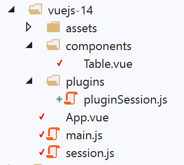
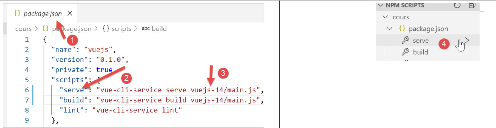

projet [vuejs-14] : rendre la session réactive
==============================================

On a vu que l’objet **[session]** utilisé dans le projet précédent avait
des propriétés **non réactives** : si on les modifie, les vues utilisant
ces propriétés ne sont pas mise à jour. Il est possible d’avoir un objet
[session] réactif si on le stocke dans les données réactives des vues.
C’est ce que montre le projet [vuejs-14].

L’arborescence du projet est la suivante :

|image0|

L’objet [session]
-----------------

L’objet **[session]** partagé par tous les composants ne change pas.

Le plugin [./plugins/pluginSession]
-----------------------------------

Le script **[pluginSession]** ne change pas. L’objet partagé
**[session]** est disponible dans la propriété **[$session]** de tous
les composants.

Le script principal [main.js]
-----------------------------

Le script principal **[main.js]** ne change pas.

La vue principale [App]
-----------------------

La vue **[App]** est désormais la suivante :

.. code-block:: html
  :linenos:

   <template>
     

       <b-card>
         <!-- message -->
         <b-alert show variant="success" align="center">
           <h4>[vuejs-14] : utilisation d'un objet partagé entre composants</h4>
         </b-alert>
         <!-- table HTML -->
         <Table/>
       </b-card>
     

   </template>

   

**Commentaires**

-  ligne 9 : le composant **[Table]** n’émet plus l’événement
   **[updateTable]** qui demande à ce que le composant **[Table]** soit
   régénéré. Du coup, la méthode [updateTable] a disparu ;

Le composant [Table]
--------------------

Le composant **[Table]** évolue de la façon suivante :

.. code-block:: html
  :linenos:

   <template>
     

       <!-- liste vide -->
       <template v-if="lignes.length==0">
         <b-alert show variant="warning">
           <h4>Votre liste de simulations est vide</h4>
         </b-alert>
         <!-- bouton de rechargement-->
         <b-button variant="primary" @click="rechargerListe">Recharger la liste</b-button>
       </template>
       <!-- liste non vide-->
       <template v-if="lignes.length!=0">
         <b-alert show variant="primary" v-if="lignes.length==0">
           <h4>Liste de vos simulations</h4>
         </b-alert>
         <!-- tableau des simulations -->
         <b-table striped hover responsive :items="lignes" :fields="fields">
           <template v-slot:cell(action)="row">
             <b-button variant="link" @click="supprimerLigne(row.index)">Supprimer</b-button>
           </template>
         </b-table>
       </template>
     

   </template>

   

**Commentaires :**

-  la nouveauté est lignes 49-51 : lorsque la vue est créée, la session
   [this.$session] est stockée dans la propriété [session] de la ligne
   45. Placée ici, la propriété [session] est réactive ;

-  lignes 58 et 65 : au lieu d’utiliser [this.$session] pour ajouter /
   supprimer une ligne de la table, on utilise la propriété réactive
   [this.session] ;

Exécution du projet
-------------------

|image1|

On obtient les mêmes résultats que dans le projet **[vuejs-12]**.

