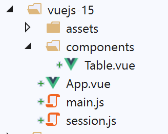
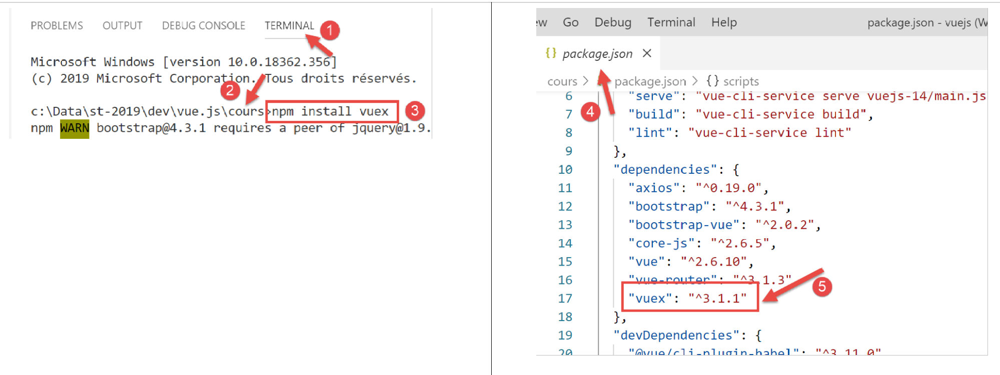

projet [vuejs-15] : utilisation du plugin [Vuex]
================================================

Le projet **[vuejs-15]** reprend le projet **[vuejs-14]** en utilisant
un objet **[session]** réactif généré par **[Vuex]**. L’aborescence du
projet est la suivante :

|image0|

Installation de la dépendance [vuex]
------------------------------------

|image1|

Le script [./session.js]
------------------------

L’objet **[session]** devient le suivant :

.. code-block:: javascript
  :linenos:

   // plugin Vuex
   import Vue from 'vue'
   import Vuex from 'vuex'
   Vue.use(Vuex);

   // la session est un store Vuex
   const session = new Vuex.Store({
     state: {
       // le tableau des simulations
       lignes: []
     },
     mutations: {
       // génération de la liste des simulations
       generateLignes(state) {
         // eslint-disable-next-line no-console
         console.log("mutation generateLignes");
         // on initialise [state.lignes]
         state.lignes =
           [
             { id: 3, marié: "oui", enfants: 2, salaire: 35000, impôt: 1200 },
             { id: 5, marié: "non", enfants: 2, salaire: 35000, impôt: 1900 },
             { id: 7, marié: "non", enfants: 0, salaire: 30000, impôt: 2000 }
           ];
         // eslint-disable-next-line no-console
         console.log(state.lignes);
       },
       // suppression ligne n° index
       deleteLigne(state, index) {
         // eslint-disable-next-line no-console
         console.log("mutation deleteLigne");
         // on supprime la ligne n° [index]
         state.lignes.splice(index, 1);
       }
     }
   });
   // export de l'objet [session]
   export default session;

**Commentaires**

-  lignes 2-4 : on intègre le plugin **[Vuex]** au framework **[Vue]** ;

-  ligne 7 : la session devient un objet de type **[Vuex.Store]** ;

-  lignes 8-11 : la propriété **[state]** contient l’état partagé de
   l’application **[Vue]**. Cette propriété sera accessible à tous les
   composants de l’application. Ici nous partageons le tableau des
   simulations **[lignes]** (ligne 10) ;

-  lignes 12-35 : la propriété **[mutations]** rassemble les méthodes
   qui modifie le contenu de l’objet **[state]** ;

-  lignes 14-26 : la propriété **[generateLignes]** est une fonction
   générant une valeur initiale pour la propriété **[state.lignes]**.
   Elle admet ici **[state]** comme paramètre. Lignes 18-23 : la
   propriété **[state.lignes]** est initialisée ;

-  lignes 28-35 : la propriété **[deleteLigne]** est une fonction
   supprimant une ligne du tableau **[state.lignes]**. Elle a pour
   paramètres :

   -  **[state]** qui représente l’objet des lignes 8-11 ;

   -  **[index]** qui est le n° de la ligne à supprimer ;

-  les fonctions de la propriété **[mutations]** admettent toujours
   comme 1\ :sup:`er` paramètre, un objet représentant la propriété
   **[state]** de la ligne 8. Les paramètres suivants sont fournis par
   le code appelant la mutation ;

-  ligne 37 : l’objet **[session]** est exporté.

Contrairement au projet précédent **[vuejs-13]** nous n’aurons pas ici
de plugin pour rendre la session accessible aux composants dans un
attribut **[Vue.$session]**.

Le script principal [./main.js]
-------------------------------

Le script principal évolue de la façon suivante :

.. code-block:: javascript
  :linenos:

   // imports
   import Vue from 'vue'
   import App from './App.vue'

   // plugins
   import BootstrapVue from 'bootstrap-vue'
   Vue.use(BootstrapVue);

   // bootstrap
   import 'bootstrap/dist/css/bootstrap.css'
   import 'bootstrap-vue/dist/bootstrap-vue.css'

   // session
   import session from './session';

   // configuration
   Vue.config.productionTip = false

   // instanciation projet [App]
   new Vue({
     name: "app",
     // utilisation store de Vuex
     store: session,
     render: h => h(App),
   }).$mount('#app')

**Commentaires**

-  ligne 14 : la session est importée ;

-  ligne 23 : elle est passée à la vue principale dans un attribut nommé
   **[store]** (c’est imposé). Grâce au plugin **[Vuex]**, cet attribut
   devient alors disponible à tous les composants dans un attribut
   **[Vue.$store]**. On est donc dans une configuration très proche de
   celle du projet précédent : là où dans un composant on accédait à la
   session via la notation **[this.$session]**, on y accèdera maintenant
   via la notation **[this.$store]** ;

La vue principale [App]
-----------------------

La vue principale **[App]** évolue comme suit :

.. code-block:: html
  :linenos:

   <template>
     

       <b-card>
         <!-- message -->
         <b-alert show variant="success" align="center">
           <h4>[vuejs-14] : utilisation du plugin [Vuex]</h4>
         </b-alert>
         <!-- table HTML -->
         <Table />
       </b-card>
     

   </template>

   

**Commentaires**

-  ligne 9 : la vue **[App]** utilise le composant **[Table]** mais ne
   reçoit plus d’événements de sa part, ceci grâce au fait que le store
   **[Vuex]** est **réactif** ;

-  lignes 24-27 : la méthode **[created]** est exécutée juste après la
   création du composant **[App]**. Dans celle-ci, on exécute la
   mutation nommée **[generateLignes]** qui génère une valeur initiale
   pour le tableau des simulations. On notera la syntaxe particulière de
   l’instruction. On rappelle que la notation **[this.$store]** fait
   référence à la propriété **[store]** de la vue instanciée dans
   **[main.js]** :

.. code-block:: javascript
  :linenos:

   // instanciation vue [App]
   new Vue({
     name: "app",
     // utilisation store de Vuex
     store: session,
     render: h => h(App),
   }).$mount('#app')

..

   La notation **[this.$store]** désigne donc l’objet **[session]**. On
   écrit ensuite **[this.$store.commit("generateLignes")]** pour
   exécuter la mutation s’appelant **[generateLignes]**. Cette mutation
   est une fonction ;

Le composant [Table]
--------------------

Le composant **[Table]** évolue de la façon suivante :

.. code-block:: html
  :linenos:

   <template>
     

       <!-- liste vide -->
       <template v-if="lignes.length==0">
         <b-alert show variant="warning">
           <h4>Votre liste de simulations est vide</h4>
         </b-alert>
         <!-- bouton de rechargement-->
         <b-button variant="primary" @click="rechargerListe">Recharger la liste</b-button>
       </template>
       <!-- liste non vide-->
       <template v-if="lignes.length!=0">
         <b-alert show variant="primary" v-if="lignes.length==0">
           <h4>Liste de vos simulations</h4>
         </b-alert>
         <!-- tableau des simulations -->
         <b-table striped hover responsive :items="lignes" :fields="fields">
           <template v-slot:cell(action)="row">
             <b-button variant="link" @click="supprimerLigne(row.index)">Supprimer</b-button>
           </template>
         </b-table>
       </template>
     

   </template>

   

**Commentaires**

-  le **[template]** des lignes 1-24 ne change pas ;

-  lignes 30-32 : la propriété calculée **[lignes]** utilise désormais
   le **[store]** de **[Vuex]** ;

-  lignes 49-54 : pour supprimer une ligne de la table HTML, on utilise
   la mutation **[deleteLigne]** du **[store]** de **[Vuex]**. On passe
   en paramètre le n° **[index]** de la ligne à supprimer (ligne 53) ;

-  lignes 56-61 : pour recharger la table HTML avec une nouvelle liste,
   on utilise la mutation **[generateLignes]** du **[store]** de
   **[Vuex]** ;

Conclusion
----------

Les attributs **[Vue.$session]** du projet **[vuejs-13]** et
**[Vue.$store]** du projet **[vuejs-15]** sont très proches l’un de
l’autre. Ils visent le même objectif : partager de l’information entre
vues. L’avantage de l’objet **[store]** est d’être réactif alors que
l’objet **[session]** ne l’est pas. Mais le projet [vuejs-14] a montré
qu’il était aisé de rendre réactif l’objet [session] en le dupliquant
dans les propriétés réactives des vues.

