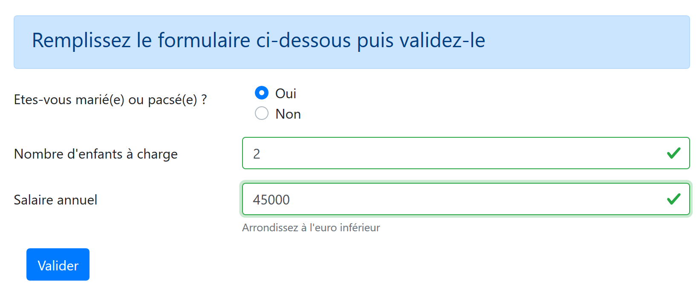
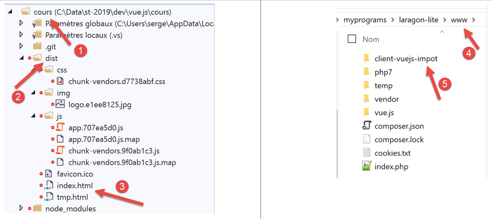

Client Vue.js du serveur de calcul de l’impôt
=============================================

Architecture
------------

Nous allons implémenter une application client / serveur avec
l’architecture suivante :

|image0|

Le serveur de calcul de l’impôt sera la version 14 développée
`d <#1.Introduction au framework VUE.JS|outline>`__\ ans le document
\|\ https://tahe.developpez.com/tutoriels-cours/php7\ \|

Les vues de l’application
-------------------------

Les vues de l’application **[vuejs-10]** sont celles de la version 13 du
document \|\ https://tahe.developpez.com/tutoriels-cours/php7\ \| du
serveur de calcul de l’impôt lorsqu’il est utilisé en mode HTML. Mais
dans l’application présente, ces vues seront générées par le client
Javascript et non par le serveur PHP.

La 1ère vue est la vue d’authentification :

|image1|

La seconde vue est celle du calcul de l’impôt :

|image2|

La 3ième vue est celle qui affiche la liste des simulations faites par
l’utilisateur :

|image3|

L’écran ci-dessus montre qu’on peut supprimer la simulation n° 1. On
obtient alors la vue suivante :

|image4|

Si on supprime maintenant la dernière simulation, on obtient la nouvelle
vue suivante :

|image5|

Eléments du projet [vuejs-20]
-----------------------------

L’arborescence du projet **[vuejs-20]** est la suivante :

|image6|

Les éléments du projet sont les suivants :

-  **[assets/logo.jpg]** : le logo du projet ;

-  **[couches]** : les couches **[métier]** et **[dao]** de
   l’application ;

-  **[plugins]** : les plugins de l’application ;

-  **[views]** : les vues de l’application ;

-  **[config.js]** : configure l’application ;

-  **[router.js]** : définit le routage de l’application ;

-  **[store.js]** : le store de **[Vuex]** ;

-  **[main.js]** : le script principal de l’application ;

Les couches [métier] et [dao]
~~~~~~~~~~~~~~~~~~~~~~~~~~~~~

La couche [dao]
^^^^^^^^^^^^^^^

La couche **[dao]** est implémentée par la classe **[Dao]** du
paragraphe
`\|vuejs-10\| <#1.11.projet [vuejs-10] : plugin [dao], requêtes HTTP asynchrones|outline>`__

La couche [métier]
^^^^^^^^^^^^^^^^^^

La couche **[métier]** est implémentée par la classe **[Métier]** du
`d <#1.Introduction au framework VUE.JS|outline>`__\ ocument
\|\ https://tahe.developpez.com/tutoriels-cours/php7\ \|. On y a ajouté
la méthode **[setTaxAdminData]** suivante :

.. code-block:: php
  :linenos:

   // constructeur
     constructor(taxAdmindata) {
       // this.taxAdminData : données de l'administration fiscale
       this.taxAdminData = taxAdmindata;
     }

     // setter
     setTaxAdminData(taxAdmindata) {
       // this.taxAdminData : données de l'administration fiscale
       this.taxAdminData = taxAdmindata;
   }

La méthode **[setTaxAdminData]** fait la même chose que le constructeur.
Sa présence permet la séquence suivante :

1. instancier la classe **[Métier]** avec une instruction **[métier=new
   Métier()]** lorsqu’on veut instancier la classe mais qu’on n’a pas
   encore la donnée **[taxAdminData]** ;

2. puis renseigner ultérieurement sa propriété **[taxAdminData]** par
   une opération **[métier.setTaxAdminData(taxAdmindata)]** ;

Le fichier de configuration [config]
~~~~~~~~~~~~~~~~~~~~~~~~~~~~~~~~~~~~

Le fichier **[config.js]** est le suivant :

.. code-block:: javascript
  :linenos:

   // utilisation de la bibliothèque [axios]
   const axios = require('axios');
   // timeout des requêtes HTTP
   axios.defaults.timeout = 2000;
   // la base des URL du serveur de calcul de l'impôt
   // le schéma [https] pose des problèmes à Firefox parce que le serveur de calcul
   // de l'impôt envoie un certificat autosigné. ok avec Chrome et Edge. Safari pas testé.
   axios.defaults.baseURL = 'https://localhost/php7/scripts-web/impots/version-14';
   // on va utiliser des cookies
   axios.defaults.withCredentials = true;

   // export de la configuration
   export default {
     axios: axios
   }

Cette configuration est celle de la bibliothèque **[axios]** que la
couche **[dao]** utilise pour faire ses requêtes HTTP. On notera ligne
8, que le serveur opère sur port sécurisé **[https]**.

Les plugins
~~~~~~~~~~~

Les plugins **[pluginDao, pluginMétier, pluginConfig]** ont pour but de
créer trois nouvelles propriétés à la fonction / classe **[Vue]** :

-  **[$dao]** : aura pour valeur une instance de la classe **[Dao]** ;

-  **[$métier]** : aura pour valeur une instance de la classe
   **[Métier]** ;

-  **[$config]** : aura pour valeur l’objet exporté par le fichier de
   configuration **[config]** ;

**[pluginDao]**

.. code-block:: javascript
  :linenos:

   export default {
     install(Vue, dao) {
       // ajoute une propriété [$dao] à la classe Vue
       Object.defineProperty(Vue.prototype, '$dao', {
         // lorsque Vue.$dao est référencé, on rend le 2ième paramètre [dao]
         get: () => dao,
       })
     }
   }

   [pluginMétier]

   export default {
     install(Vue, métier) {
       // ajoute une propriété [$métier] à la classe Vue
       Object.defineProperty(Vue.prototype, '$métier', {
         // lorsque Vue.$métier est référencé, on rend le 2ième paramètre [métier]
         get: () => métier,
       })
     }
   }

**[pluginConfig]**

.. code-block:: javascript
  :linenos:

   export default {
     install(Vue, config) {
       // ajoute une propriété [$config] à la classe vue
       Object.defineProperty(Vue.prototype, '$config', {
         // lorsque Vue.$config est référencé, on rend le 2ième paramètre [config]
         get: () => config,
       })
     }
   }

Le store [Vuex]
~~~~~~~~~~~~~~~

Le store de **[Vuex]** est implémenté par le fichier **[store]**
suivant :

.. code-block:: javascript
  :linenos:

   // plugin Vuex
   import Vue from 'vue'
   import Vuex from 'vuex'
   Vue.use(Vuex);

   // store Vuex
   const store = new Vuex.Store({
     state: {
       // le tableau des simulations
       simulations: [],
       // le n° de la dernière simulation
       idSimulation: 0
     },
     mutations: {
       // suppression ligne n° index
       deleteSimulation(state, index) {
         // eslint-disable-next-line no-console
         console.log("mutation deleteSimulation");
         // on supprime la ligne n° [index]
         state.simulations.splice(index, 1);
         // eslint-disable-next-line no-console
         console.log("store simulations", state.simulations);
       },
       // ajout d'une simulation
       addSimulation(state, simulation) {
         // eslint-disable-next-line no-console
         console.log("mutation addSimulation");
         // n° de la simulation
         state.idSimulation++;
         simulation.id = state.idSimulation;
         // on ajoute la simulation au tableau des simulations
         state.simulations.push(simulation);
       },
       // nettoyage state
       clear(state) {
         state.simulations = [];
         state.idSimulation = 1;
       }
     }
   });
   // export de l'objet [store]
   export default store;

**Commentaires**

-  lignes 2-4 : le plugin **[Vuex]** est intégré au framework
   **[Vue]** ;

-  lignes 8-13 : nous mettons dans le store de **[Vuex]** les éléments
   suivants :

   -  **[simulations]** : la liste des simulations faites par
      l’utilisateur ;

   -  **[idSimulation]** : le n° de la dernière simulation faite par
      l’utilisateur ;

..

   On rappelle que le store va être partagé entre les vues et que son
   contenu est réactif : lorsqu’il est modifié, les vues qui l’utilisent
   sont automatiquement mises à jour. Dans notre application, seul
   l’élément **[simulations]** a besoin d’être réactif, pas l’élément
   **[idSimulation]**. On a laissé cet élément dans le store par
   commodité ;

-  lignes 14-40 : les mutations autorisées sur l’objet **[state]** des
   lignes 8-13. On rappelle que celles-ci reçoivent toujours l’objet
   **[state]** des lignes 8-13 en 1\ :sup:`er` paramètre ;

   -  ligne 16 : la mutation **[deleteSimulation]** permet de supprimer
      une simulation dont on donne le n° **[index]** ;

   -  ligne 25 : la mutation **[addSimulation]** permet d’ajouter une
      nouvelle simulation au tableau des simulations ;

   -  ligne 35 : la mutation **[clear]** permet de réinitialiser l’objet
      **[state]** des lignes 8-13 ;

Le fichier de routage [router]
~~~~~~~~~~~~~~~~~~~~~~~~~~~~~~

Le fichier de routage est le suivant :

.. code-block:: javascript
  :linenos:

   // imports
   import Vue from 'vue'
   import VueRouter from 'vue-router'
   // les vues
   import Authentification from './views/Authentification'
   import CalculImpot from './views/CalculImpot'
   import ListeSimulations from './views/ListeSimulations'

   // plugin de routage
   Vue.use(VueRouter)

   // les routes de l'application
   const routes = [
     // authentification
     {
       path: '/', name: 'authentification', component: Authentification
     },
     // calcul de l'impôt
     {
       path: '/calcul-impot', name: 'calculImpot', component: CalculImpot
     },
     // liste des simulations
     {
       path: '/liste-des-simulations', name: 'listeSimulations', component: ListeSimulations
     },
     // fin de session
     {
       path: '/fin-session', name: 'finSession', component: Authentification
     }
   ]

   // le routeur
   const router = new VueRouter({
     // les routes
     routes,
     // le mode d'affichage des routes dans le navigateur
     mode: 'history',
   })

   // export du router
   export default router

**Commentaires**

-  ligne 16 : au démarrage de l’application, c’est la vue
   **[Authentification]** qui est affichée car son URL est la racine
   **[/]** ;

-  ligne 20 : la vue **[CalculImpot]** est affichée lorsque l’URL
   **[/calcul-impot]** est demandée ;

-  ligne 24 : la vue **[ListeSimulations]** est affichée lorsque l’URL
   **[/liste-des-simualtions]** est demandée ;

-  ligne 28 : la vue **[Authentification]** est affichée lorsque l’URL
   **[/fin-session]** est demandée ;

-  lignes 33-38 : un objet **[router]** est créé avec ces routes (ligne
   35) et le mode **[history]** (ligne 37) de gestion des URL ;

-  ligne 41 : ce routeur est exporté ;

Le script principal [main.js]
~~~~~~~~~~~~~~~~~~~~~~~~~~~~~

Le script **[main.js]** est le suivant :

.. code-block:: javascript
  :linenos:

   // imports
   import Vue from 'vue'

   // vue principale
   import Main from './views/Main.vue'

   // plugin [bootstrap-vue]
   import BootstrapVue from 'bootstrap-vue'
   Vue.use(BootstrapVue);

   // CSS bootstrap
   import 'bootstrap/dist/css/bootstrap.css'
   import 'bootstrap-vue/dist/bootstrap-vue.css'

   // routeur
   import router from './router'

   // plugin [config]
   import config from './config';
   import pluginConfig from './plugins/pluginConfig'
   Vue.use(pluginConfig, config)

   // instanciation couche [dao]
   import Dao from './couches/Dao';
   const dao = new Dao(config.axios);

   // plugin [dao]
   import pluginDao from './plugins/pluginDao'
   Vue.use(pluginDao, dao)

   // instanciation couche [métier]
   import Métier from './couches/Métier';
   const métier = new Métier();

   // plugin [métier]
   import pluginMétier from './plugins/pluginMétier'
   Vue.use(pluginMétier, métier)

   // store Vuex
   import store from './store'

   // démarrage de l'UI
   new Vue({
     el: '#app',
     // le routeur
     router: router,
     // le store Vuex
     store: store,
     // la vue principale
     render: h => h(Main),
   })

On notera les points suivants :

-  lignes 18-21, l’objet exporté par le script **[./config]** va être
   disponible dans l’attribut **[Vue.$config]** donc disponible à toutes
   les vues de l’application. C’était inutile ici car l’objet
   **[config]** n’est utilisé que par le script **[main]** (ligne 25).
   Néanmoins il est fréquent que la configuration soit nécessaire à
   plusieurs vues. On a donc voulu ici garder le principe de la rendre
   disponible dans un attribut de la vue ;

-  lignes 24-25 : instanciation de la couche **[dao]**. La classe
   **[Dao]** est importée ligne 24 puis instanciée ligne 25. Son
   constructeur admet pour unique paramètre l’objet **[axios]**,
   propriété de configuration ;

-  lignes 27-29 : la couche **[dao]** est rendue disponible dans
   l’attribut **[$dao]** de toutes les vues ;

-  lignes 31-37 : on répète la même séquence pour la couche
   **[métier]**. Le constructeur de la classe **[Métier]** a pour
   paramètre **[taxAdminData]** qui représente les données de
   l’administration fiscale. Nous n’avons pas encore cette donnée.
   L’objet **[métier]** de la ligne 33 devra donc être complété
   ultérieurement ;

-  ligne 40 : on importe le store **[Vuex]** ;

-  lignes 43-51 : on instancie la vue principale **[Main]** (lignes 5 et
   50), en lui passant deux paramètres :

   -  ligne 46 : le routeur **[router]** défini ligne 16 ;

   -  ligne 48 : le store **[Vuex]** **[store]** défini ligne 40 ;

   -  dans les deux cas, le nom de la propriété est à gauche et sa
      valeur à droite. Les noms des propriétés **[router, store]** sont
      fixés par les frameworks **[vue-router]** et **[vuex]**. Les
      valeurs associées peuvent elles être quelconques ;

.. _les-vues-de-lapplication-1:

Les vues de l’application
-------------------------

La vue principale [Main]
~~~~~~~~~~~~~~~~~~~~~~~~

Le code de la vue principale **[Main]** est le suivant :

.. code-block:: html
  :linenos:

   <!-- définition HTML de la vue -->
   <template>
     

       <b-card>
         <!-- jumbotron -->
         <b-jumbotron>
           <b-row>
             <b-col cols="4">
               
             </b-col>
             <b-col cols="8">
               <h1>Calculez votre impôt</h1>
             </b-col>
           </b-row>
         </b-jumbotron>
         <!-- erreur requête HTTP -->
         <b-alert
           show
           variant="danger"
           v-if="showError"
         >L'erreur suivante s'est produite : {{error.message}}</b-alert>
         <!-- vue courante -->
         <router-view v-if="showView" @loading="mShowLoading" @error="mShowError" />
         <!-- loading -->
         <b-alert show v-if="showLoading" variant="light">
           <strong>Requête au serveur de calcul d'impôt en cours...</strong>
           

         </b-alert>
       </b-card>
     

   </template>

   

**Commentaires**

-  la vue **[Main]** assure une mise en page de la vue routée et
   affichée ligne 23 :

|image7|

-  les lignes 5-15 affichent la zone 1 ;

-  le ligne 23 affiche la vue routée **[2]** ;

-  lignes 16-19 : une alerte affichée seulement en cas d’erreur de
   communication avec le serveur de calcul de l’impôt ;

-  lignes 25-28 : un message d’attente affiché à chaque requête HTTP
   faite au serveur ;

-  toutes les vues vont être affichées avec cette mise en page puisque
   chaque vue routée est affichée par les lignes 20-24. La vue
   **[Main]** sert à factoriser ce qui peut être partagé par les
   différentes vues ;

-  ligne 23 : chaque vue routée peut émettre trois événements :

   -  **[loading]** : une requête HTTP a été lancée. Il faut montrer le
      message d’attente de la réponse ;

   -  **[error]** : la requête HTTP s’est terminée sur une erreur. Il
      faut montrer le message d’erreur et cacher la vue routée ;

-  lignes 38-49 : l’état de la vue :

   -  ligne 41 : **[showLoading]** contrôle l’affichage du message
      d’attente de la fin d’une requête HTTP (ligne 25) ;

   -  ligne 43 : **[showError]** contrôle l’affichage du message
      d’erreur d’une requête HTTP (lignes 17-21) ;

   -  ligne 45 : **[showView]** contrôle l’affichage de la vue routée
      (ligne 23) ;

-  lignes 53-63 : la méthode **[mShowError]** gère l’événement
   **[error]** émis par la vue routée (ligne 23) ;

-  lignes 65-70 : la méthode **[mShowLoading]** gère l’événement
   **[loading]** émis par la vue routée (ligne 23) ;

-  ligne 23 : on prêtera attention aux événements **[error]** et
   **[loading]**. Ils ne sont interceptés que si la vue routée est
   affichée **[showView=true]**. C’est pourquoi la vue routée est au
   départ affichée (ligne 45). Elle n’est cachée qu’en cas d’erreur
   (ligne 60). Pour éviter ce problème on aurait pu utiliser la
   directive **[v-show]** au lieu de **[v-if]**. la différence entre ces
   deux directives est la suivante :

   -  **[v-if=’false’]** cache le bloc contrôlé en l’éliminant du code
      HTML global. Les événements de la vue routée ne peuvent plus alors
      être interceptés ;

   -  **[v-show=’false’]** cache le bloc contrôlé en jouant sur son CSS,
      mais le code du bloc reste présent dans le HTML global et peut
      ainsi intercepter les événements de la vue routée ;

La vue de mise en page [Layout]
~~~~~~~~~~~~~~~~~~~~~~~~~~~~~~~

Le code de la vue **[Layout]** est le suivant :

.. code-block:: html
  :linenos:

   <!-- définition HTML de la mise en page de la vue routée -->
   <template>
     <!-- ligne -->
     

       <b-row>
         <!-- zone de trois colonnes à gauche -->
         <b-col cols="3" v-if="left">
           <slot name="left" />
         </b-col>
         <!-- zone de neuf colonnes à droite -->
         <b-col cols="9" v-if="right">
           <slot name="right" />
         </b-col>
       </b-row>
     

   </template>

   

**Commentaires**

-  la vue **[Layout]** permet de diviser la vue routée en deux zones :

   -  une zone de 3 colonnes Bootstrap à gauche (lignes 7-9). Cette zone
      accueillera le menu de navigation lorsqu’il y en a un ;

   -  une zone de 9 colonnes à droite (lignes 11-13). Cette zone
      accueillera l’information amenée par la vue routée ;

La vue [Authentification]
~~~~~~~~~~~~~~~~~~~~~~~~~

La vue d’authentification est la suivante :

|image8|

Cette vue est obtenue à partir du **[Layout]** en supprimant la colonne
de gauche pour n’afficher que la colonne de droite.

Son code est le suivant :

.. code-block:: html
  :linenos:

   <!-- définition HTML de la vue -->
   <template>
     <Layout :left="false" :right="true">
       <template slot="right">
         <!-- formulaire HTML - on poste ses valeurs avec l'action [authentifier-utilisateur] -->
         <b-form @submit.prevent="login">
           <!-- titre -->
           <b-alert show variant="primary">
             <h4>Bienvenue. Veuillez vous authentifier pour vous connecter</h4>
           </b-alert>
           <!-- 1ère ligne -->
           <b-form-group label="Nom d'utilisateur" label-for="user" label-cols="3">
             <!-- zone de saisie user -->
             <b-col cols="6">
               <b-form-input type="text" id="user" placeholder="Nom d'utilisateur" v-model="user" />
             </b-col>
           </b-form-group>
           <!-- 2ième ligne -->
           <b-form-group label="Mot de passe" label-for="password" label-cols="3">
             <!-- zone de saisie password -->
             <b-col cols="6">
               <b-input type="password" id="password" placeholder="Mot de passe" v-model="password" />
             </b-col>
           </b-form-group>
           <!-- 3ième ligne -->
           <b-alert
             show
             variant="danger"
             v-if="showError"
             class="mt-3"
           >L'erreur suivante s'est produite : {{message}}</b-alert>
           <!-- bouton de type [submit] sur une 3ième ligne -->
           <b-row>
             <b-col cols="2">
               <b-button variant="primary" type="submit" :disabled="!valid">Valider</b-button>
             </b-col>
           </b-row>
         </b-form>
       </template>
     </Layout>
   </template>

   <!-- dynamique de la vue -->
   

**Commentaires**

-  ligne 3 : la vue **[Authentification]** utilise uniquement la colonne
   de droite du **[Layout]** (lignes 3 et 4) ;

-  lignes 6-38 : le formulaire Bootstrap qui génère la zone 1 de la
   copie d’écran ci-dessus ;

-  ligne 6 : l’événement **[@submit]** se produit lorsque l’utilisateur
   va cliquer sur le bouton de type **[submit]** de la ligne 35. Le
   modificateur **[prevent]** demande à ce que la page ne soit pas
   rechargée lors du **[submit]**. On aurait pu écrire également :

   -  une balise <b-form> sans gestion de l’événement **[submit]** ;

   -  une balise <b-button> avec l’événement **[@click=’login’]** et
      sans l’attribut **[type=’submit’]** ;

..

   Ca marche également. L’avantage de la solution retenue est que le
   submit se fait non seulement avec un clic sur le bouton **[Valider]**
   mais également sur une validation (touche **[Entrée]**) dans les
   zones de saisie. C’est donc par commodité pour l’utilisateur que la
   solution **[<b-form @submit.prevent="login">]** a été retenue ici ;

-  lignes 33-37 : une alerte qui apparaît lorsque le serveur a rejeté
   les identifiants saisis par l’utilisateur :

|image9|

-  ligne 35 : le bouton **[Valider]** n’est pas toujours actif. Son état
   dépend de l’attribut calculé **[valid]** des lignes 71-73. L’attribut
   **[valid]** est vrai si :

   -  il y a quelque chose dans les champs **[user, password]** du
      formulaire ;

   -  la session jSON a démarré. Au départ, cette session n’a pas
      démarré (ligne 59) et donc le bouton **[Valider]** est inactif.

-  lignes 49-60 : l’état de la vue ;

   -  **[user]** représente la saisie de l’utilisateur dans le champ
      **[user]** (lignes 12-17) du formulaire. La directive
      **[v-model]** de la ligne 15 établit une liaison bidirectionnelle
      entre la saisie de l’utilisateur et l’attribut **[user]** de la
      vue ;

   -  **[password]** représente la saisie de l’utilisateur dans le champ
      **[password]** (lignes 19-24) du formulaire. La directive
      **[v-model]** de la ligne 22 établit une liaison bidirectionnelle
      entre la saisie de l’utilisateur et l’attribut **[password]** de
      la vue ;

   -  **[showError]** contrôle (ligne 29) l’affichage de l’alerte des
      lignes 26-31 ;

   -  **[message]** est le message d’erreur (ligne 31) à afficher dans
      l’alerte des lignes 26-31 ;

   -  **[sessionStarted]** indique si la session jSON avec le serveur a
      démarré ou non. Au départ cet attribut a la valeur **[false]**
      (ligne 59). La session jSON avec le serveur est initialisée dans
      l’événement **[created]** du cycle de vie de la vue, lignes
      126-156. Si le serveur répond positivement, alors l’attribut
      **[sessionStarted]** est passé à **[true]** (ligne 149) ;

-  lignes 126-156 : la fonction **[created]** est exécutée lorsque la
   vue **[Authentification]** a été créée (pas forcément encore
   affichée). En tâche de fond, on initialise alors une session jSON
   avec le serveur. On sait que c’est la 1ère action à faire avec le
   serveur de calcul de l’impôt. Pour ce faire, on utilise la couche
   **[dao]** de l’application (ligne 134). Toutes les méthodes de cette
   couche sont asynchrones. On utilise ici la promesse (Promise) rendue
   par la méthode **[$dao.initSession]** qui initialise la session jSON
   avec le serveur.

-  lignes 138-150 : le code exécuté lorsque le serveur a rendu sa
   réponse sans erreur ;

-  ligne 142 : on vérifie la propriété **[état]** de la réponse. Elle
   doit avoir la valeur **[700]** pour une opération réussie. Sinon, il
   s’est produit une erreur dont la cause est indiquée dans la propriété
   **[response.réponse]** (ligne 144). On affiche alors le message
   d’erreur de la vue (ligne 145) ;

-  ligne 149 : on note que la session jSON a démarré ;

-  lignes 152-155 : le code exécuté en cas d’erreur. Celle-ci est
   remontée à la vue parente **[Main]** qui

   -  affichera l’erreur ;

   -  cachera le message d’attente ;

   -  cachera la vue routée, la vue **[Autentification]** ;

-  lignes 79-124 : la méthode **[login]** traite le clic sur le bouton
   **[Valider]** ;

-  ligne 79 : la méthode a été préfixée avec le mot clé **[async]** pour
   permettre l’utilisation du mot clé **[await]**, lignes 84 et 103 ;

-  lignes 84-87 : appel bloquant à la méthode
   **[$dao.authentifierUtilisateur(user, password)]**. On aurait pu
   utiliser une promesse **[Promise]** comme il a été fait dans la
   fonction **[created]**. Nous avons voulu varier les styles. Il n’y a
   pas de risque à bloquer l’utilisateur car nous avons mis un
   **[timeout]** de 2 secondes à toutes les requêtes HTTP. Il n’attendra
   pas longtemps. De plus, il ne peut rien faire tant que le serveur n’a
   pas rendu sa réponse car alors le bouton **[Valider]** reste
   inactif ;

-  ligne 91 : le serveur de calcul de l’impôt envoie des réponses jSON
   ayant toutes la structure **[{‘action’:action, ‘état’:val,
   ‘réponse’:réponse}]**. L’authentification a réussi si
   **[état==200]**. Si ce n’est pas le cas, un message d’erreur est
   affiché, lignes 93-94 ;

-  ligne 98 : on cache un éventuel message d’erreur d’une opération
   précédente ;

-  lignes 99-116 : on demande mainteant au serveur les données de
   l’administration fiscale qui permettent le calcul de l’impôt. Dans
   **[this.$métier]** nous avons une instance de la classe **[Métier]**
   qui pour l’instant ne peut rien faire car elle n’a pas ces données ;

-  ligne 103 : les données de l’administration fiscale sont demandées au
   serveur par une opération bloquante ;

-  lignes 107-112 : la réponse du serveur est analysée. Elle doit avoir
   une valeur d’état égale à 1000 sinon c’est qu’il s’est produit une
   erreur. Dans ce dernier cas, on affiche le message d’erreur (lignes
   109-110) ;

-  lignes 113-118 : en cas de réussite de l’opération, on :

   -  cache le message d’erreur, ligne 114 ;

   -  on transmet les données de l’administration fiscale à la couche
      **[métier]** (ligne 116) ;

   -  on fait afficher la vue **[CalculImpot]**, ligne 118. On se
      rappelle que **[this.$router]** désigne le routeur de
      l’application. La méthode **[push]** permet de fixer la prochaine
      vue routée. Ici on la désigne par son attribut **[name]**. On
      aurait pu également la désigner par son attribut **[path]**. Ces
      informations sont dans le fichier de routage :

.. code-block:: javascript
  :linenos:

   // calcul de l'impôt
     {
       path: '/calcul-impot', name: 'calculImpot', component: CalculImpot
     },

-  lignes 119-122 : le **[catch]** se déclenche lorsqu’une des deux
   requêtes HTTP a échoué (serveur pas présent, timeout dépassé, ...).
   On signale alors l’erreur à la vue parente **[Main]** qui
   l’affichera, cachera le message d’attente et la vue
   **[Authentification]** ;

La vue [CalculImpot]
~~~~~~~~~~~~~~~~~~~~

La vue **[CalculImpot]** est la suivante :

|image10|

-  **[1]** : un menu de navigation occupe la colonne de gauche de la vue
   routée ;

-  **[2]** : le formulaire de calcul de l’impôt occupe la colonne de
   droite de la vue routée ;

Le code de la vue **[CalculImpot]** est le suivant :

.. code-block:: html
  :linenos:

   <!-- définition HTML de la vue -->
   <template>
     

       <Layout :left="true" :right="true">
         <!-- formulaire de calcul de l'impôt à droite -->
         <FormCalculImpot slot="right" @resultatObtenu="handleResultatObtenu" />
         <!-- menu de navigation à gauche -->
         <Menu slot="left" :options="options" />
       </Layout>
       <!-- zone d'affichage des résultat du calcul de l'impôt sous le formulaire -->
       <b-row v-if="résultatObtenu" class="mt-3">
         <!-- zone de trois colonnes vide -->
         <b-col cols="3" />
         <!-- zone de neuf colonnes -->
         <b-col cols="9">
           <b-alert show variant="success">
             
           </b-alert>
         </b-col>
       </b-row>
     

   </template>

   

**Commentaires**

-  ligne 4 : les deux colonnes du **[Layout]** sont ici présentes ;

-  ligne 6 : le formulaire de calcul de l’impôt occupe la colonne de
   droite. Il émet l’événement **[resultatObtenu]** lorsque le résultat
   du calcul de l’impôt a été obtenu. On notera que les noms
   d’événements et les noms des méthodes qui les gèrent ne peuvent
   contenir de caractères accentués ;

-  ligne 8 : le menu de navigation occupe la colonne de gauche ;

-  lignes 11-20 : le résultat du calcul de l’impôt est affiché sous le
   formulaire :

|image11|

ligne 11 : le résultat n’est affiché que si l’attribut
**[résultatObtenu]** (ligne 47) vaut **[true]** ;

-  lignes 34-48 : l’état de la vue :

   -  **[options]** : la liste des options du menu de navigation. Ce
      tableau est passé en paramètre au composant **[Menu]**, ligne 8 ;

   -  **[résultat]** : le résultat du calcul de l’impôt. Ce résultat est
      une chaîne HTML. C’est pourquoi on a utilisé la directive
      **[v-html]** à la ligne 17 pour l’afficher ;

   -  **[résultatObtenu]** : le booléen qui contrôle l’affichage du
      résultat, ligne 11 ;

-  lignes 59-81 : la méthode **[handleResultatObtenu]** affiche le
   résultat du calcul de l’impôt que lui a envoyé la vue fille
   **[FormCalculImpot]**, ligne 6. Ce résultat est un objet avec les
   propriétés **[impot, décôte, réduction, surcôte, taux, marié,
   enfants, salaire]** ;

-  lignes 61-75 : on inscrit l’objet **[impot, décôte, réduction,
   surcôte, taux]** dans un texte HTML qui est visualisé par la ligne 17
   du template ;

-  ligne 77 : on affiche ce résultat ;

-  ligne 80 : on appelle la mutation **[addSimulation]** du store Vuex
   qui va ajouter **[résultat]** aux simulations déjà présentes dans le
   store ;

Le menu de navigation [Menu]
~~~~~~~~~~~~~~~~~~~~~~~~~~~~

Le menu de navigation s’affiche dans la colonne de gauche des vues
routées :

|image12|

Le code de la vue **[Menu]** est le suivant :

.. code-block:: html
  :linenos:

   <!-- définition HTML de la vue -->
   <template>
     <!-- menu Bootstrap vertical -->
     <b-nav vertical>
       <!-- options du menu -->
       <b-nav-item
         v-for="(option,index) of options"
         :key="index"
         :to="option.path"
         exact
         exact-active-class="active"
       >{{option.text}}</b-nav-item>
     </b-nav>
   </template>

   

**Commentaires**

-  les options du menu sont fournies par le paramètre **[options]**
   (lignes 7, 20-22) ;

-  chaque élément du tableau **[options]** a une propriété **[text]**
   (ligne 12) qui est le texte du lien et une propriété **[path]**
   (ligne 9) qui sera le chemin de la vue cible du lien ;

La vue [FormCalculImpot]
~~~~~~~~~~~~~~~~~~~~~~~~

Cette vue fournit le formulaire de calcul de l’impôt :

|image13|

Son code est le suivant :

.. code-block:: html
  :linenos:

     <!-- définition HTML de la vue -->
     <template>
     <!-- formulaire HTML -->
     <b-form @submit.prevent="calculerImpot" class="mb-3">
       <!-- message sur 12 colonnes sur fond bleu -->
       <b-alert show variant="primary">
         <h4>Remplissez le formulaire ci-dessous puis validez-le</h4>
       </b-alert>
       <!-- éléments du formulaire -->
       <!-- première ligne -->
       <b-form-group label="Etes-vous marié(e) ou pacsé(e) ?" label-cols="4">
         <!-- boutons radio sur 5 colonnes-->
         <b-col cols="5">
           <b-form-radio v-model="marié" value="oui">Oui</b-form-radio>
           <b-form-radio v-model="marié" value="non">Non</b-form-radio>
         </b-col>
       </b-form-group>
       <!-- deuxième ligne -->
       <b-form-group label="Nombre d'enfants à charge" label-cols="4" label-for="enfants">
         <b-input
           type="text"
           id="enfants"
           placeholder="Indiquez votre nombre d'enfants"
           v-model="enfants"
           :state="enfantsValide"
         />
         <!-- message d'erreur éventuel -->
         <b-form-invalid-feedback :state="enfantsValide">Vous devez saisir un nombre positif ou nul</b-form-invalid-feedback>
       </b-form-group>
       <!-- troisème ligne -->
       <b-form-group
         label="Salaire annuel"
         label-cols="4"
         label-for="salaire"
         description="Arrondissez à l'euro inférieur"
       >
         <b-input
           type="text"
           id="salaire"
           placeholder="Salaire annuel"
           v-model="salaire"
           :state="salaireValide"
         />
         <!-- message d'erreur éventuel -->
         <b-form-invalid-feedback :state="salaireValide">Vous devez saisir un nombre positif ou nul</b-form-invalid-feedback>
       </b-form-group>
       <!-- quatrième ligne, bouton [submit] sur 5 colonnes -->
       <b-col cols="5">
         <b-button type="submit" variant="primary" :disabled="formInvalide">Valider</b-button>
       </b-col>
     </b-form>
   </template>

   <!-- script -->
   

**Commentaires**

-  lignes 4-51 : le formulaire Bootstrap ;

-  lignes 11-17 : un groupe de boutons radio avec leur libellé ;

-  lignes 14-15 : la balise <b-form-radio> assure l’affichage d’un
   bouton radio :

   -  ligne 14 : la directive **[v-model]** assure que lors d’un clic
      sur le bouton, l’attribut **[marié]** de la ligne 61 recevra la
      valeur **[oui]** (attribut **[value="oui"]**) ;

   -  ligne 15 : la directive **[v-model]** assure que lors d’un clic
      sur le bouton, l’attribut **[marié]** de la ligne 61 recevra la
      valeur **[non]** (attribut **[value="non"]**) ;

-  lignes 19-29 : la partie saisie du nombre d’enfants :

   -  ligne 24 : la saisie du nombre d’enfants est liée à l’attribut
      **[enfants]** de la ligne 63 ;

   -  ligne 25 : la validité de la saisie est vérifiée par l’attribut
      calculé **[enfantsValide]** des lignes 87-89 ;

   -  ligne 28 : assure l’affichage d’un message d’erreur si la saisie
      est invalide ;

-  lignes 31-45 : la partie saisie du salaire annuel :

   -  ligne 35 : affiche un message d’aide juste sous la zone de
      saisie ;

   -  ligne 41 : la saisie du salaire est liée à l’attribut
      **[salaire]** de la ligne 65 ;

   -  ligne 42 : la validité de la saisie est vérifiée par l’attribut
      calculé **[salaireValide]** des lignes 82-85 ;

   -  ligne 45 : assure l’affichage d’un message d’erreur si la saisie
      est invalide ;

-  lignes 48-50 : un bouton de type **[submit]**. Lorsqu’on clique sur
   ce bouton ou lorsqu’on valide une saisie avec la touche **[Entrée]**,
   la méthode **[calculerImpot]** est exécutée (ligne 94) ;

   -  ligne 49 : l’état du bouton actif / inactif est contrôlé par
      l’attribut calculé **[formInvalide]** des lignes 71-80 ;

-  lignes 71-80 : le formulaire est valide si :

   -  le nombre d’enfants est valide ;

   -  le salaire est valide ;

   -  l’application a obtenu du serveur les données de l’administration
      fiscale permettant le calcul de l’impôt. On rappelle que cette
      donnée est enregistrée dans la propriété
      **[$métier.taxAdminData]**. La vue **[FormCalculImpot]** peut être
      affichée avant que cette donnée ait été obtenue car elle est
      demandée de façon asynchrone en même temps que se produit
      l’affichage de la vue. On s’assure ici que l’utilisateur ne peut
      pas cliquer sur le bouton **[Valider]** tant que la donnée n’a pas
      été obtenue ;

-  lignes 94-109 : la méthode de calcul de l’impôt :

   -  lignes 96-100 : c’est la couche **[métier]** qui fait ce calcul.
      C’est un calcul synchrone. Une fois la donnée **[taxAdminData]** a
      été obtenue, le client **[Vue]** n’a plus à communiquer avec le
      serveur. Tout se fait localement. On obtient un objet
      **[résultat]** avec les propriétés **[impôt, décôte, surcôte,
      réduction, taux]** ;

   -  lignes 104-106 : on ajoute les propriétés **[marié, enfants,
      salaire]** au résultat ;

   -  ligne 108 : le résultat est passé à la vue parent
      **[CalculImpot]** via l’événement **[resultatObtenu]**. Cette vue
      est chargée d’afficher le résultat ;

La vue [ListeSimulations]
~~~~~~~~~~~~~~~~~~~~~~~~~

La vue **[ListeSimulations]** affiche la liste des simulations faites
par l’utilisateur :

|image14|

Le code de la vue est le suivant :

.. code-block:: html
  :linenos:

   <!-- définition HTML de la vue -->
   <template>
     

       <!-- mise en page -->
       <Layout :left="true" :right="true">
         <!-- simulations dans colonne de droite -->
         <template slot="right">
           <template v-if="simulations.length==0">
             <!-- pas de simulations -->
             <b-alert show variant="primary">
               <h4>Votre liste de simulations est vide</h4>
             </b-alert>
           </template>
           <template v-if="simulations.length!=0">
             <!-- il y a des simulations -->
             <b-alert show variant="primary">
               <h4>Liste de vos simulations</h4>
             </b-alert>
             <!-- tableau des simulations -->
             <b-table striped hover responsive :items="simulations" :fields="fields">
               <template v-slot:cell(action)="data">
                 <b-button variant="link" @click="supprimerSimulation(data.index)">Supprimer</b-button>
               </template>
             </b-table>
           </template>
         </template>
         <!-- menu de navigation dans colonne de gauche -->
         <Menu slot="left" :options="options" />
       </Layout>
     

   </template>

   

**Commentaires**

-  ligne 5 : la vue occupe les deux colonnes de la mise en page
   **[Layout]** des vues routées ;

-  lignes 7-26 : les simulations vont dans la colonne de droite ;

-  ligne 28 : le menu de navigation va dans la colonne de gauche ;

-  lignes 8, 14, 20, 75 : les simulations proviennent du store
   **[Vuex]** **[$this.store]** ;

-  lignes 8-13 : alerte affichée lorsque la liste des simulations est
   vide ;

-  lignes 14-25 : la table HTML affichée lorsque la liste des
   simulations n’est pas vide ;

-  lignes 20-24 : la table HTML est générée par une balise <b-table> ;

   -  ligne 20 : le tableau des simulations est fourni par l’attribut
      calculé **[simulations]** des lignes 74-76 ;

   -  ligne 20 : la configuration de la table HTML est faite par
      l’attribut calculé **[fields]** des lignes 58-69. Ligne 67, la
      colonne de clé **[action]** est la dernière colonne de la table
      HTML ;

   -  lignes 21-23 : template de la dernière colonne de la table HTML ;

   -  ligne 22 : on y met un bouton de type lien. Lorsqu’on clique
      dessus, la méthode **[supprimerSimulation(data.index)]** est
      appelée, où **[data]** représente la ligne courante (ligne 21).
      **[data.index]** représente le n° de cette ligne dans la liste des
      lignes affichées ;

-  ligne 28 : génération du menu de navigation. Les options de celui-ci
   sont fournies par l’attribut **[options]** des lignes 47-56 ;

-  lignes 80-85 : la méthode qui réagit au clic sur un lien
   **[Supprimer]** de la page HTML ;

   -  ligne 84 : on fait appel à la mutation **[deleteSimulation]** du
      store **[Vuex]** (cf paragraphe
      `\|vuejs-15\| <#1.16.projet [vuejs-15] : utilisation du plugin [Vuex]|outline>`__) ;

Exécution du projet
-------------------

|image15|

Il faut également lancer le serveur **[Laragon]** (cf
`d <#1.Introduction au framework VUE.JS|outline>`__\ ocument
\|\ https://tahe.developpez.com/tutoriels-cours/php7\ \|) pour que le
serveur de calcul d’impôt soit en ligne.

Déploiement de l’application sur un serveur local
-------------------------------------------------

Actuellement, notre client **[Vue]** est déployé sur un serveur de test
à l’URL **[http://localhost:8080]**. Nous allons le déployer sur le
serveur **[Laragon]** à l’URL **[http://localhost:80]**. Il y a
plusieurs étapes à effectuer pour en arriver là.

**étape 1**

Tout d’abord, nous allons faire en sorte que le client **[Vue]** soit
déployé sur le serveur de test à l’URL
**[http://localhost:8080/client-vuejs-impot/]**.

Nous créons un fichier **[vue.config.js]** à la racine de notre projet
**[VSCode]** actuel :

|image16|

Le fichier **[vue.config.js]** **[1]** aura le contenu suivant :

.. code-block:: javascript
  :linenos:

   // vue.config.js
   module.exports = {
     // l'URL de service du client [vuejs] du serveur de calcul de l'impôt
     publicPath: '/client-vuejs-impot/'
   }

Il nous faut également modifier le fichier de routage **[router.js]**
**[2]** :

.. code-block:: javascript
  :linenos:

   // imports
   import Vue from 'vue'
   import VueRouter from 'vue-router'
   // les vues
   import Authentification from './views/Authentification'
   import CalculImpot from './views/CalculImpot'
   import ListeSimulations from './views/ListeSimulations'

   // plugin de routage
   Vue.use(VueRouter)

   // les routes de l'application
   const routes = [
     // authentification
     {
       path: '/', name: 'authentification', component: Authentification
     },
     // calcul de l'impôt
     {
       path: '/calcul-impot', name: 'calculImpot', component: CalculImpot
     },
     // liste des simulations
     {
       path: '/liste-des-simulations', name: 'listeSimulations', component: ListeSimulations
     },
     // fin de session
     {
       path: '/fin-session', name: 'finSession', component: Authentification
     }
   ]

   // le routeur
   const router = new VueRouter({
     // les routes
     routes,
     // le mode d'affichage des routes dans le navigateur
     mode: 'history',
     // l'URL de base de l'application
     base: '/client-vuejs-impot/'
   })

   // export du router
   export default router

-  ligne 39 : on indique au routeur que les chemins des routes définies
   lignes 13-30 sont relatives au chemin défini ligne 39. Par exemple,
   le chemin de la ligne 20 **[/calcul-impot]** deviendra
   **[/client-vuejs-impot/calcul-impot]** ;

On peut alors tester de nouveau le projet **[vuejs-20]** pour vérifier
le changement des chemins de l’application :

|image17|

**étape 2**

Nous construisons maintenant la version de production du projet
**[vuejs-20]** :

|image18|

-  en **[1-2]**, nous configurons la tâche **[build]** **[2]** dans le
   fichier **[package.json]** **[1]** ;

-  en **[3-5]**, nous exécutons cette tâche. C’est elle qui va
   construire la version de production du projet **[vuejs-20]** ;

L’exécution de la tâche **[build]** se passe dans un terminal de
**[VSCode]** :

|image19|

|image20|

-  en **[3-6]**, des avertissements nous disent que le code généré est
   trop gros et qu’il faudrait le découper **[8]**. Cela relève de
   l’optimisation de l’architecture du code que nous n’aborderons pas
   ici ;

-  en **[7]**, on nous dit que le dossier **[dist]** contient la version
   de production générée :

|image21|

-  en **[3]**, le fichier **[index.html]** est le fichier qui sera
   utilisé lorsqu’on demandera l’URL
   **[https://localhost:80/client-vue-js-impot/]**;

On a ici un site **statique** qui peut être déployé sur n’importe quel
serveur. Nous allons le déployer sur le serveur Laragon local (cf
`d <#1.Introduction au framework VUE.JS|outline>`__\ ocument
\|\ https://tahe.developpez.com/tutoriels-cours/php7\ \|). Le dossier
**[dist]** **[2]** est copié dans le dossier **[<laragon>/www]** **[4]**
où <laragon> est le dossier d’installation du serveur Laragon. Nous
renommons ce dossier **[client-vuejs-impot]** **[5]** puisque nous avons
configuré la version de production pour fonctionner à l’URL
**[/client-vuejs-impot/]**.

**étape 3**

Nous ajoutons dans le dossier **[client-vuejs-impot]** qui vient d’être
créé le fichier **[.htaccess]** suivant :

.. code-block:: apache
  :linenos:

   <IfModule mod_rewrite.c>
     RewriteEngine On
     RewriteBase /client-vuejs-impot/
     RewriteRule ^index\.html$ - [L]
     RewriteCond %{REQUEST_FILENAME} !-f
     RewriteCond %{REQUEST_FILENAME} !-d
     RewriteRule . /client-vuejs-impot/index.html [L]
   </IfModule>

|image22|

Ce fichier est un fichier de configuration du serveur web Apache. Si
nous ne le mettons pas et que nous demandons directement l’URL
**[https://localhost/client-vuejs-impot/calcul-impot]**, sans passer
d’abord par l’URL **[https://localhost/client-vuejs-impot/]** nous
obtenons une erreur 404. Avec ce fichier, nous obtenons bien la vue
**[CalculImpot]**.

Ceci fait, nous lançons le serveur Laragon si ce n’est déjà fait et
demandons l’URL **[https://localhost/client-vuejs-impot/]** :

|image23|

Le lecteur est invité à tester la version de production de notre
application.

Nous pouvons modifier le serveur de calcul de l’impôt sur un point : les
entêtes CORS qu’il envoie systématiquement à ses clients. Cela avait été
nécessité pour la version du client exécutée à partir du domaine
**[localhost:8080]**. Maintenant que client et serveur s’exécutent tous
deux dans le domaine **[localhost:80]**, les entêtes CORS deviennent
inutiles.

Nous modifions le fichier **[config.json]** de la version 14 du
serveur :

|image24|

-  en **[4]**, nous indiquons que désormais les requêtes CORS sont
   refusées ;

Sauvegardons cette modification et redemandons l’URL
**[https://localhost/client-vuejs-impot/]**. Ca doit continuer à
marcher.

Gestion des URL manuelles
-------------------------

Au lieu d’utiliser sagement les liens du menu de navigation,
l’utilisateur peut vouloir taper les URL de l’application manuellement
dans le champ d’adresse du navigateur. Demandons par exemple l’URL
**[https://client-vuejs-impot/calcul-impot]** sans passer par la case
d’authentification. Un hacker tenterait sûrement ça. On obtient la vue
suivante ;

|image25|

On obtient bien la vue du calcul de l’impôt. Maintenant essayons de
remplir les zones de saisie et de les valider :

|image26|

On découvre alors que le bouton **[1]** **[Valider]** reste toujours
désactivé même si les saisies sont correctes. Regardons le code de la
vue **[FormCalculImpot]** :

.. code-block:: html
  :linenos:

   <b-col cols="5">
         <b-button type="submit" variant="primary" :disabled="formInvalide">Valider</b-button>
   </b-col>

Ligne 2, on voit que son état actif / inactif dépend de la propriété
**[formInvalide]**. Celle-ci est la propriété calculée suivante :

.. code-block:: javascript
  :linenos:

   formInvalide() {
         return (
           // salaire invalide
           !this.salaireValide ||
           // ou enfants invalide
           !this.enfantsValide ||
           // ou données fiscales pas obtenues
           !this.$métier.taxAdminData
         );
   },

Ligne 8, on voit que pour que le formulaire soit valide, il faut avoir
obtenu les données fiscales. Or celles-ci sont obtenues lors de la
validation de la vue **[Authentification]** que l’utilisateur a
‘sautée’. Il ne pourra donc pas valider le formulaire. S’il avait pu le
faire, il aurait reçu un message d’erreur du serveur lui indiquant qu’il
n’était pas authentifié. Les vérifications doivent toujours être faites
côté serveur. Les vérifications côté navigateur peuvent toujours être
contournées. Il suffit de prendre un client de type **[Postman]** qui
enverra des requêtes brutes au serveur.

Maintenant demandons l’URL
**[https://localhost/client-vuejs-impot/liste-des-simulations]**. On
obtient la vue suivante :

|image27|

Maintenant l’URL **[https://localhost/client-vuejs-impot/fin-session]**.
Nous obtenons la vue suivante :

|image28|

Maintenant une vue qui n’existe pas
**[https://localhost/client-vuejs-impot/abcd]** :

|image29|

Notre application résiste plutôt bien aux URL tapées à la main. Lorsque
celles-ci sont appelées, le routeur de l’application le sait. Il est
donc possible d’intervenir avant que la vue ne soit finalement affichée.
Nous allons regarder ce point dans le projet **[vuejs-21]**.

Un autre point à regarder est le suivant. Imaginons que l’utilisateur
ait fait quelques simulations dans les règles :

|image30|

Maintenant rafraîchissons la page par un F5 :

|image31|

On a fait quelque chose de déconseillé : taper l’URL à la main (faire F5
revient à ça). Nous avons alors perdu nos simulations.

Le projet suivant **[vuejs-21]** se propose d’apporter deux
améliorations :

-  contrôler les URL tapées par l’utilisateur ;

-  garder une mémoire de l’application même si l’utilisateur tape une
   URL. Ci-dessus, on voit qu’on a perdu la liste des simulations ;

.. |image1| image:: chap-19/media/image2.png
   :width: 4.95709in
   :height: 3.11024in
.. |image2| image:: chap-19/media/image3.png
   :width: 5.78346in
   :height: 3.57835in
.. |image3| image:: chap-19/media/image4.png
   :width: 5.74449in
   :height: 3.2126in
.. |image4| image:: chap-19/media/image5.png
   :width: 5.70472in
   :height: 2.92165in

.. |image24| image:: chap-19/media/image25.png
   :width: 5.55906in
   :height: 2.58268in

