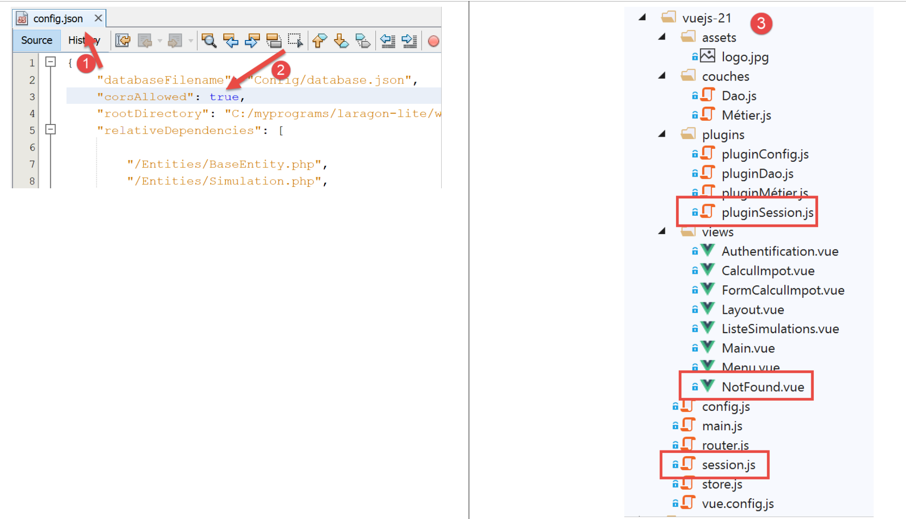
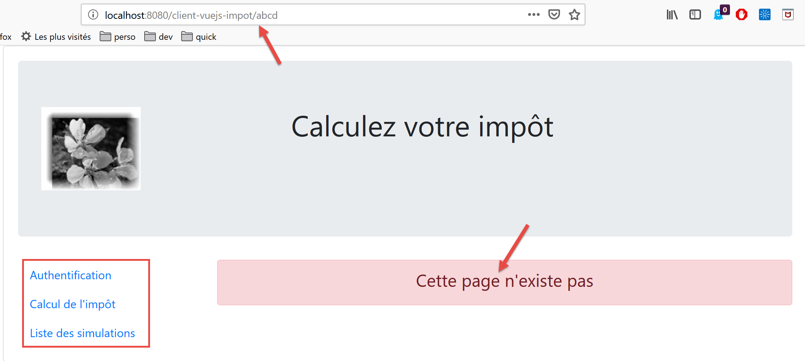
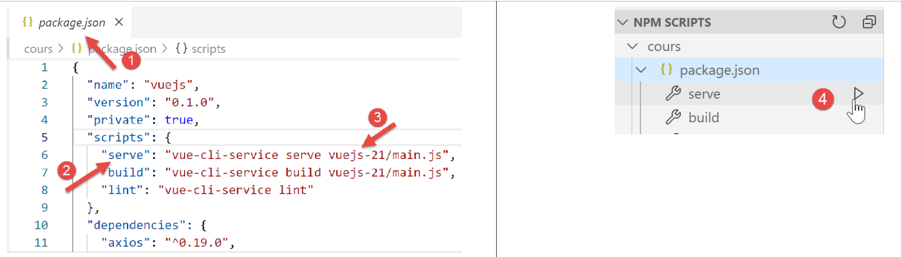
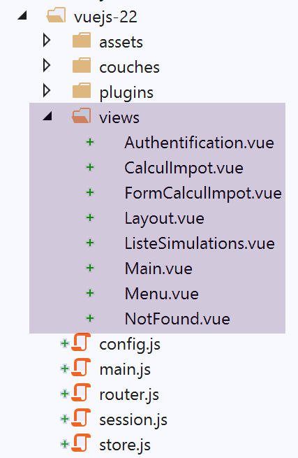
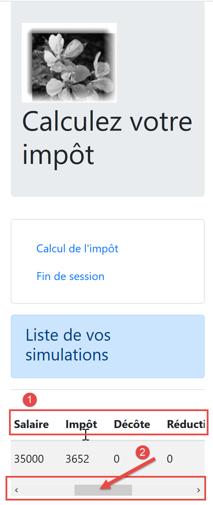
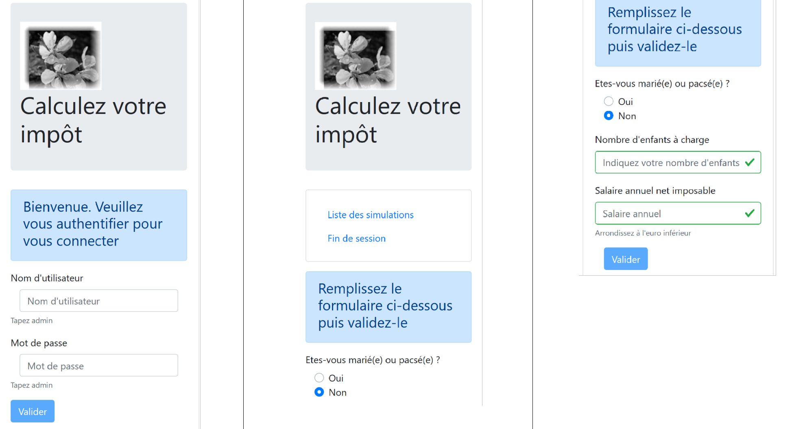
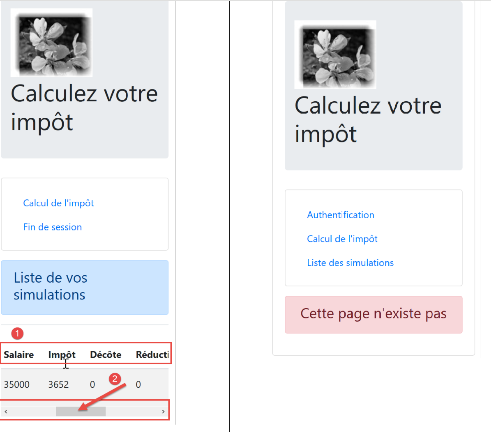

Améliorations du client Vue.js
==============================

Introduction
------------

Nous allons tester le projet **[vuejs-21]** avec le serveur de
développement. Nous allons donc avoir besoin de nouveau que le serveur
envoie les entêtes CORS. Il faut donc que le fichier **[config.json]**
de la version 14 du serveur de calcul de l’impôt autorise ces entêtes :

|image0|

Le projet **[vuejs-21]** est créé initialement par duplication du projet
**[vuejs-20]**. Il est ensuite modifié **[3]**.

De nouveaux fichiers apparaissent :

-  **[session.js]** : exporte un objet **[session]** qui va encapsuler
   des informations sur la session courante ;

-  **[pluginSession]** : rend disponible l’objet **[session]** précédent
   dans la propriété **[$session]** des vues ;

-  **[NotFound.vue]** : une nouvelle vue affichée lorsque l’utilisateur
   demande manuellement une URL qui n’existe pas ;

Des fichiers seront modifiés :

-  **[main.js]** : va initialiser la session courante puis, lorsque
   l’utilisateur va taper manuellement des URL va la restaurer ;

-  **[router.js]** : des contrôles sont ajoutés pour traiter le cas des
   URL tapées par l’utilisateur ;

-  **[store.js]** : une nouvelle mutation est ajoutée ;

-  **[config.js]** : une nouvelle configuration est ajoutée ;

-  différentes vues essentiellement pour sauver la session courante à
   des moments clés de la vie de l’application. Celle-ci est ensuite
   restaurée à chaque fois que l’utilisateur tape manuellement des URL ;

Le store [Vuex]
---------------

Le script **[./store]** évolue de la façon suivante :

.. code-block:: javascript
  :linenos:

   // plugin Vuex
   import Vue from 'vue'
   import Vuex from 'vuex'
   Vue.use(Vuex);

   // store Vuex
   const store = new Vuex.Store({
     state: {
       // le tableau des simulations
       simulations: [],
       // le n° de la dernière simulation
       idSimulation: 0
     },
     mutations: {
       // suppression ligne n° index
       deleteSimulation(state, index) {
         ...
       },
       // ajout d'une simulation
       addSimulation(state, simulation) {
         ...
       },
       // nettoyage state
       clear(state) {
         // plus de simulations
         state.simulations = [];
         // la numérotation des simulations repart de 0
         state.idSimulation = 0;
       }
     }
   });
   // export de l'objet [store]
   export default store;

-  lignes 24-29 : la mutation **[clear]** supprime la liste des
   simulations enregistrées et remet à 0 le n° de la dernière
   simulation.

La session
----------

Le besoin d’une session vient du fait que lorsque l’utilisateur tape une
URL dans le champ adresse du navigateur, le script **[main.js]** **est
exécuté de nouveau**. Or celui-ci contient l’instruction :

.. code-block:: javascript
  :linenos:

   // store Vuex
   import store from './store'

Cette instruction importe le fichier **[./store]** suivant :

.. code-block:: javascript
  :linenos:

   // plugin Vuex
   import Vue from 'vue'
   import Vuex from 'vuex'
   Vue.use(Vuex);

   // store Vuex
   const store = new Vuex.Store({
     state: {
       // le tableau des simulations
       simulations: [],
       // le n° de la dernière simulation
       idSimulation: 0
     },
     mutations: {
       ...
     }
   });
   // export de l'objet [store]
   export default store;

On voit, lignes 7-13, qu’on importe un tableau de simulations vide. Si
donc on avait des simulations avant que l’utilisateur ne tape une URL
dans le champ adresse du navigateur, après on n’en a plus. L’idée est :

-  d’utiliser une session qui stockerait les informations qu’on veut
   conserver si l’utilisateur tape manuellement des URL ;

-  de la sauvegarder à des moments clés de l’application ;

-  de la restaurer dans **[main.js]** qui **est toujours exécuté**
   lorsqu’une URL est tapée manuellement ;

Le script **[./session]** est le suivant :

.. code-block:: javascript
  :linenos:

   // on importe le store Vuex
   import store from './store'
   // on importe la configuration
   import config from './config';

   // l'objet [session]
   const session = {
     // session démarrée
     started: false,
     // authentification
     authenticated: false,
     // heure de sauvegarde
     saveTime: "",
     // couche [métier]
     métier: null,
     // état Vuex
     state: null,

     // sauvegarde de la session dans une chaîne jSON
     save() {
       // on ajoute à la session quelques proprités
       this.saveTime = Date.now();
       this.state = store.state;
       // on la transforme en jSON
       const json = JSON.stringify(this);
       // on la stocke sur le navigateur
       localStorage.setItem("session", json);
       // eslint-disable-next-line no-console
       console.log("session save", json);
     },

     // restauration de la session
     restore() {
       // on récupère la session jSON à partir du navigateur
       const json = localStorage.getItem("session")
       // si on a récupéré qq chose
       if (json) {
         // on restaure toutes les clés de la session
         const restore = JSON.parse(json);
         for (var key in restore) {
           if (restore.hasOwnProperty(key)) {
             this[key] = restore[key];
           }
         }
         // si on a dépassé une certaine durée d'inactivité depuis le début de la session, on repart de zéro
         let durée = Date.now() - this.saveTime;
         if (durée > config.duréeSession) {
           // on vide la session - elle sera également sauvegardée
           session.clear();
         } else {
           // on régénère le store Vuex
           store.replaceState(JSON.parse(JSON.stringify(this.state)));
         }
       }
       // eslint-disable-next-line no-console
       console.log("session restore", this);
     },

       // on nettoie la session
     clear() {
       // eslint-disable-next-line no-console
       console.log("session clear");
       // raz de certains champs de la session
       this.authenticated = false;
       this.saveTime = "";
       this.started = false;
       if (this.métier) {
         // on réinitialise le champ [taxAdminData]
         this.métier.taxAdminData = null;
       }
       // le store Vuex est nettoyé également
       store.commit("clear");
       // on sauvegarde la nouvelle session
       this.save();
     },
   }

   // export de l'objet [session]
   export default session;

**Commentaires**

-  ligne 2 : la session va encapsuler également le store **[Vuex]**
   (liste des simulations, n° de la dernière simulation faite) ;

-  lignes 7-17 : les informations conservées par la session :

   -  **[started]** : la session jSON avec le serveur a démarré ou non ;

   -  **[authenticated]** : l’utilisateur s’est authentifié ou pas ;

   -  **[saveTime]** : la date en millisecondes de la dernière
      sauvegarde ;

   -  **[métier]** : une référence sur la couche **[métier]**. Celle-ci
      contient la donnée **[taxAdminData]** qui permet le calcul de
      l’impôt ;

   -  **[state]** : le state du store **[Vuex]** (liste des simulations,
      n° de la dernière simulation faite) ;

-  lignes 20-30 : la méthode **[save]** sauvegarde la session localement
   sur le navigateur exécutant l’application ;

   -  ligne 22 : on note l’heure de sauvegarde ;

   -  ligne 23 : on récupère le **[state]** du store **[Vuex]** ;

   -  ligne 25 : on crée la chaîne jSON de la session ;

   -  ligne 27 : on la stocke localement sur le navigateur associée à la
      clé **[session]** ;

-  lignes 33-57 : la méthode **[restore]** permet de restaurer une
   session à partir de sa sauvegarde locale sur le navigateur ;

   -  ligne 35 : on récupère la sauvegarde jSON locale ;

   -  ligne 37 : si on a récupéré quelque chose ;

   -  lignes 39-44 : l’objet **[session]** est reconstitué ;

   -  ligne 46 : on calcule la durée qui nous sépare de la dernière
      sauvegarde ;

   -  lignes 47-50 : si cette durée est supérieure à une valeur
      **[config.duréeSession]** fixée par configuration, la session est
      réinitialisée (ligne 49) et à cette occasion sauvegardée ;

   -  ligne 52 : sinon on régénère l’attribut **[state]** du store
      **[Vuex]** ;

-  lignes 60-75 : la méthode **[clear]** réinitialise la session ;

   -  lignes 64-70 : les propriétés de la session sont réinitialisées à
      leurs valeurs initiales ;

   -  ligne 72 : ainsi que le store **[Vuex]** ;

   -  ligne 74 : la nouvelle session est sauvegardée ;

Le fichier de configuration [config]
------------------------------------

Le fichier **[./config]** évolue de la façon suivante :

.. code-block:: javascript
  :linenos:

   // utilisation de la bibliothèque [axios]
   const axios = require('axios');
   // timeout des requêtes HTTP
   axios.defaults.timeout = 2000;
   ...

   // export de la configuration
   export default {
     // objet [axios]
     axios: axios,
     // délai maximal d'inactivité de la session : 5 mn = 300 s = 300000 ms
     duréeSession: 300000
   }

-  ligne 12 : on va gérer la session de l’application un peu comme on
   gère une session web. On fixe ici une durée d’inactivité maximale de
   5 minutes ;

Le plugin [pluginSession]
-------------------------

Comme il a été fait déjà de nombreuses fois, le plugin
**[pluginSession]** va permettre aux vues d’avoir accès à la session via
la propriété **[this.$session]** :

.. code-block:: javascript
  :linenos:

   export default {
     install(Vue, session) {
       // ajoute une propriété [$session] à la classe vue
       Object.defineProperty(Vue.prototype, '$session', {
         // lorsque Vue.$session est référencé, on rend le 2ième paramètre [session]
         get: () => session,
       })
     }
   }

Le script principal [main]
--------------------------

Le script principal **[./main.js]** évolue de la façon suivante :

.. code-block:: javascript
  :linenos:

   // log de démarrage
   // eslint-disable-next-line no-console
   console.log("main started");

   // imports
   import Vue from 'vue'

   ...

   // instanciation couche [métier]
   import Métier from './couches/Métier';
   const métier = new Métier();

   // plugin [métier]
   import pluginMétier from './plugins/pluginMétier'
   Vue.use(pluginMétier, métier)

   // store Vuex
   import store from './store'

   // session
   import session from './session';
   import pluginSession from './plugins/pluginSession'
   Vue.use(pluginSession, session)

   // on restore la session avant de redémarrer
   session.restore();

   // on restaure la couche [métier]
   if (session.métier && session.métier.taxAdminData) {
     métier.setTaxAdminData(session.métier.taxAdminData);
   }

   // démarrage de l'UI
   new Vue({
     el: '#app',
     // le routeur
     router: router,
     // le store Vuex
     store: store,
     // la vue principale
     render: h => h(Main),
   })

   // log de fin
   // eslint-disable-next-line no-console
   console.log("main terminated, session=", session);

-  ligne 19 : on importe la session ;

-  ligne 20 : on importe son plugin ;

-  ligne 21 : le plugin **[pluginSession]** est intégré à **[Vue]**.
   Après cette instruction toutes les vues disposent de la session dans
   leur attribut **[$session]** ;

-  ligne 27 : la session est restaurée. La session importée ligne 11 est
   alors initialisée avec le contenu de sa dernière sauvegarde ;

-  après la ligne 16, les vues disposent d’une propriété **[$métier]**
   initialisée ligne 12. Cette propriété n’a pas l’information
   **[taxAdminData]** qui permet de calculer l’impôt ;

-  lignes 30-32 : si la restauration qui vient d’être faite a restauré
   la propriété **[session.métier.taxAdminData]** alors la propriété
   **[$métier]** des vues est initialisée avec cette valeur ;

Le fichier de routage [router]
------------------------------

Le fichier de routage **[./router]** évolue comme suit :

.. code-block:: javascript
  :linenos:

   // imports
   import Vue from 'vue'
   import VueRouter from 'vue-router'
   // les vues
   import Authentification from './views/Authentification'
   import CalculImpot from './views/CalculImpot'
   import ListeSimulations from './views/ListeSimulations'
   import NotFound from './views/NotFound'
   // la session
   import session from './session'

   // plugin de routage
   Vue.use(VueRouter)

   // les routes de l'application
   const routes = [
     // authentification
     { path: '/', name: 'authentification', component: Authentification },
     { path: '/authentification', name: 'authentification', component: Authentification },
     // calcul de l'impôt
     {
       path: '/calcul-impot', name: 'calculImpot', component: CalculImpot,
       meta: { authenticated: true }
     },
     // liste des simulations
     {
       path: '/liste-des-simulations', name: 'listeSimulations', component: ListeSimulations,
       meta: { authenticated: true }
     },
     // fin de session
     {
       path: '/fin-session', name: 'finSession'
     },
     // page inconnue
     {
       path: '*', name: 'notFound', component: NotFound,
     },
   ]

   // le routeur
   const router = new VueRouter({
     // les routes
     routes,
     // le mode d'affichage des URL
     mode: 'history',
     // l'URL de base de l'application
     base: '/client-vuejs-impot/'
   })

   // vérification des routes
   router.beforeEach((to, from, next) => {
     // eslint-disable-next-line no-console
     console.log("router to=", to, "from=", from);
     // route réservée aux utilisateurs authentifiés ?
     if (to.meta.authenticated && !session.authenticated) {
       next({
         // on passe à l'authentification
         name: 'authentification',
       })
       // retour à la boucle événementielle
       return;
     }
     // cas particulier de la fin de session
     if (to.name === "finSession") {
       // on nettoie la session
       session.clear();
       // on va sur la vue [authentification]
       next({
         name: 'authentification',
       })
       // retour à la boucle événementielle
       return;
     }
     // autres cas - vue suivante normale du routage
     next();
   })

   // export du router
   export default router

**Commentaires**

-  lignes 16-38 : certaines routes ont été enrichies d’informations
   supplémentaires ;

-  ligne 19 : on a créé une nouvelle route pour aller à la vue
   **[Authentification]** ;

-  lignes 21-24 : la route qui mène à la vue **[CalculImpot]** a
   maintenant une propriété **[meta]** (ce nom est obligatoire). Le
   contenu de cet objet peut être quelconque et est fixé par le
   développeur ;

-  ligne 23 : on met dans **[meta]**, la propriété **[authenticated]**
   (ce nom peut être quelconque). Il signifiera pour nous que pour aller
   à la vue **[CalculImpot]**, l’utilisateur doit être authentifié ;

-  lignes 26-29 : on fait la même chose pour la route qui mène à la vue
   **[ListeSimulations]**. Là aussi, l’utilisateur doit être
   authentifié ;

-  la propriété **[meta.authenticated]** va nous permettre de vérifier
   qu’un utilisateur qui tape manuellement les URL des vues
   **[CalculImpot, ListeSimulations]** ne peut pas les obtenir s’il
   n’est pas authentifié ;

-  lignes 51-76 : la méthode **[beforeEach]** est exécutée avant qu’une
   vue ne soit routée. C’est le bon moment pour faire des
   vérifications ;

   -  **[to]** : la prochaine route si on ne fait rien ;

   -  **[from]** : la dernière route affichée ;

   -  **[next]** : fonction permettant de changer la prochaine route
      affichée ;

-  ligne 55 : on regarde si la prochaine route demande à ce que
   l’utilisateur soit authentifié ;

-  lignes 56-59 : si oui et que l’utilisateur n’est pas authentifié, on
   change la prochaine route vers la vue **[Authentification]** ;

-  lignes 64-73 : on traite le cas particulier de la route
   **[finSession]** des lignes 30-32. Celle-ci n’a pas de vue associée ;

   -  ligne 66 : on réinitialise la session à sa valeur initiale ;

   -  lignes 68-70 : on programme la vue **[Authentification]** comme
      prochaine vue ;

-  ligne 75 : si on n’est pas dans les deux cas précédents, on se
   contente de passer à la route prévue par le fichier de routage ;

-  lignes 35-37 : on prévoit une vue **[NotFound]** si la route tapée
   par l’utilisateur ne correspond à aucune route connue. Cette vue est
   importée ligne 8. Les routes sont vérifiées dans l’ordre du fichier
   de routage. Si donc on arrive à la ligne 36, c’est que la route
   demandée n’est aucune des routes des lignes 18-33 ;

La vue [NotFound]
-----------------

La vue **[NotFound]** est affichée si la route tapée par l’utilisateur
ne correspond à aucune route connue :

|image1|

Le code de la vue est le suivant :

.. code-block:: html 
  :linenos:

   <!-- définition HTML de la vue -->
   <template>
     <!-- mise en page -->
     <Layout :left="true" :right="true">
       <!-- alerte dans la colonne de droite -->
       <template slot="right">
         <!-- message sur fond jaune -->
         <b-alert show variant="danger" align="center">
           <h4>Cette page n'existe pas</h4>
         </b-alert>
       </template>
       <!-- menu de navigation dans la colonne de gauche -->
       <Menu slot="left" :options="options" />
     </Layout>
   </template>

   

**Commentaires**

-  ligne 4 : elle utilise les deux colonnes des vues routées ;

-  lignes 6-11 : un message d’erreur ;

-  ligne 13 : le menu de navigation occupe la colonne de gauche ;

-  lignes 31-36 : les options par défaut du menu ;

-  lignes 40-57 : code exécuté lorsque la vue est créée ;

-  ligne 44 : on regarde si l’utilisateur peut faire des simulations ;

-  lignes 45-55 : si oui, on ajoute deux options au menu de navigation,
   celles où il faut être authentifié et avoir une couche **[métier]**
   opérationnelle (lignes 46-55) ;

 La vue [Authentification]
-------------------------

La vue **[Authentification]** évolue comme suit :

.. code-block:: html
  :linenos:

   <!-- définition HTML de la vue -->
   <template>
     <Layout :left="false" :right="true">
       ...
     </Layout>
   </template>

   <!-- dynamique de la vue -->
   

**Commentaires**

-  on a surligné en jaune les instructions qui utilisent la session
   introduite dans cette version du client **[Vue.js]** ;

-  lignes 97, 148 : à la fin des méthodes **[login, created]**, la
   session est sauvegardée quelque soit le résultat des requêtes HTTP
   qui ont lieu dans ces méthodes (clause **[finally]** dans les deux
   cas) ;

-  la méthode **[created]** des lignes 102-150 est exécutée à chaque
   fois que la vue **[Authentification]** est créée. Si c’est
   l’utilisateur qui a tapé l’URL de la vue, la session va nous
   permettre de savoir quoi faire ;

-  lignes 106-115 : si la session jSON est démarrée, l’utilisateur
   authentifié et la donnée **[this.$métier.taxAdminData]** initialisée
   alors l’utilisateur peut directement aller au formulaire de calcul de
   l’impôt (ligne 112) ;

-  ligne 117 : la méthode **[created]** était utilisée dans la version
   précédente pour initialiser une session jSON avec le serveur. Cette
   phase est inutile si elle a déjà eu lieu ;

-  lignes 42-66 : la méthode d’authentification ;

-  ligne 66 : si l’authentification réussit, on le note dans la
   session ;

-  lignes 67-92 : la demande au serveur des données de l’administration
   fiscale **[taxAdminData]** ;

-  ligne 95 : à la fin de cette phase, on met à jour la propriété
   **[métier]** de la session que l’opération ait réussi ou pas ;

La vue [CalculImpot]
--------------------

Le code de la vue **[CalculImpot]** évolue comme suit :

.. code-block:: html
  :linenos:

   <!-- définition HTML de la vue -->
   <template>
     ...
   </template>

   

**Commentaires**

-  ligne 45 : la simulation calculée est ajoutée au store **[Vuex]**.
   Cela a un impact sur la session qui englobe la propriété **[state]**
   du store. Aussi sauvegarde-t-on la session (ligne 47) ;

-  ligne 51 : on crée une méthode **[created]** pour suivre dans les
   logs les créations des vues ;

La vue [ListeSimulations]
-------------------------

La vue **[ListeSimulations]** évolue comme suit :

.. code-block:: html
  :linenos:

   <!-- définition HTML de la vue -->
   <template>
     ...
     

   </template>

   

**Commentaires**

-  ligne 36 : après la suppression d’une simulation ligne 34, on
   sauvegarde la session pour tenir compte de ce changement d’état ;

-  lignes 40-43 : on continue à suivre la création des vues ;

Exécution du projet
-------------------

|image2|

Lors des tests vérifiez les points suivants :

-  si l’utilisateur ‘utilise’ l’application via les liens du menu de
   navigation et les boutons / liens d’action, celle-ci fonctionne ;

-  si l’utilisateur tape manuellement des URL, l’application continue à
   fonctionner. Faites en particulier le test suivant :

   -  faites simulations ;

   -  une fois sur la vue **[ListeSimulations]**, rechargez (F5) la vue.
      Dans l’application précédente **[vuejs-20]**, on perdait alors les
      simulations. Ici ce n’est pas le cas : on retrouve bien les
      simulations déjà faites ;

-  regardez les logs pour comprendre :

   -  à quel moment le script **[main]** est exécuté. Vous devez voir
      qu’il l’est à chaque fois que l’utilisateur tape une URL à la
      main ;

   -  à quels moments les vues sont créées. Vous devez voir qu’elles le
      sont à chaque fois qu’elles vont être affichées ;

   -  le fonctionnement du routage. Avant chaque routage un log est fait
      qui vous indique :

      -  la route d’où vous venez ;

      -  la route où vous allez ;

Déploiement de l’application sur un serveur local
-------------------------------------------------

Comme exercice, suivez le paragraphe `\|Déploiement sur un serveur
local\| <#1.17.6.Déploiement de l’application sur un serveur local|outline>`__,
pour déployer le projet **[vuejs-21]** sur le serveur Laragon local.
Puis testez-le.

Mise au point de la version mobile
----------------------------------

Théoriquement, l’utilisation de Bootstrap devrait nous permettre d’avoir
une application utilisable sur différents média : smartphone, tablette,
ordinateurs portable et de bureau. Cequi différencie ces média c’est la
taille de leur écran.

Si on teste la version **[vuejs-21]** sur un mobile, on constate que
c’est le chaos dans l’affichage des vues. La version **[vuejs-22]**
corrige ce point. Les modifications ont toutes lieu dans les templates
des vues. Elles ont consisté essentiellement à mettre au point un
affichage pour un écran de smartphone. Lorsque celui-ci est au point,
l’affichage sur des écrans de taille plus importante se passe de façon
fluide grâce à Bootstrap.

|image3|

La vue [Main]
~~~~~~~~~~~~~

La vue **[Main]** évolue de la façon suivante :

.. code-block:: html
  :linenos:

   <!-- définition HTML de la vue -->
   <template>
     

       <b-card>
         <!-- jumbotron -->
         <b-jumbotron>
           <b-row>
             <b-col sm="4">
               
             </b-col>
             <b-col sm="8">
               <h1>Calculez votre impôt</h1>
             </b-col>
           </b-row>
         </b-jumbotron>
         ....
       </b-card>
     

   </template>

**Commentaires**

-  ligne 8 : là où il y avait **[cols=’4’]** on écrit **[sm=’4’]**.
   **[sm]** signifie **[small]**. Les écrans des smartphones tombent
   dans cette catégorie. Les autres catégories sont **[xs=extra small,
   md=medium, lg=large, xl=extra large]** ;

-  ligne 11 : idem ;

La vue [Layout]
~~~~~~~~~~~~~~~

La vue **[Layout]** évolue comme suit :

.. code-block:: html
  :linenos:

   <!-- définition HTML de la mise en page de la vue routée -->
   <template>
     <!-- ligne -->
     

       <b-row>
         <!-- zone de trois colonnes à gauche -->
         <b-col sm="3" v-if="left">
           <slot name="left" />
         </b-col>
         <!-- zone de neuf colonnes à droite -->
         <b-col sm="9" v-if="right">
           <slot name="right" />
         </b-col>
       </b-row>
     

   </template>

.. _la-vue-authentification-1:

 La vue [Authentification]
~~~~~~~~~~~~~~~~~~~~~~~~~

La vue **[Authentification]** évolue comme suit :

.. code-block:: html
  :linenos:

   <!-- définition HTML de la vue -->
   <template>
     <Layout :left="false" :right="true">
       <template slot="right">
         <!-- formulaire HTML - on poste ses valeurs avec l'action [authentifier-utilisateur] -->
         <b-form @submit.prevent="login">
           <!-- titre -->
           <b-alert show variant="primary">
             <h4>Bienvenue. Veuillez vous authentifier pour vous connecter</h4>
           </b-alert>
           <!-- 1ère ligne -->
           <b-form-group label="Nom d'utilisateur" label-for="user" description="Tapez admin">
             <!-- zone de saisie user -->
             <b-col sm="6">
               <b-form-input type="text" id="user" placeholder="Nom d'utilisateur" v-model="user" />
             </b-col>
           </b-form-group>
           <!-- 2ième ligne -->
           <b-form-group label="Mot de passe" label-for="password" description="Tapez admin">
             <!-- zone de saisie password -->
             <b-col sm="6">
               <b-input type="password" id="password" placeholder="Mot de passe" v-model="password" />
             </b-col>
           </b-form-group>
           <!-- 3ième ligne -->
           <b-alert
             show
             variant="danger"
             v-if="showError"
             class="mt-3"
           >L'erreur suivante s'est produite : {{message}}</b-alert>
           <!-- bouton de type [submit] sur une 3ième ligne -->
           <b-row>
             <b-col sm="2">
               <b-button variant="primary" type="submit" :disabled="!valid">Valider</b-button>
             </b-col>
           </b-row>
         </b-form>
       </template>
     </Layout>
   </template>

**Commentaires**

-  lignes 11 et 19 : on a supprimé l’attribut **[label-cols]** qui
   fixait un nombre de colonnes au label de la saisie. En l’absence de
   cet attribut, le label est au-dessus de la zone de saisie. Cela
   convient mieux aux écrans des smartphones ;

.. _la-vue-calculimpot-1:

La vue [CalculImpot]
~~~~~~~~~~~~~~~~~~~~

La vue **[CalculImpot]** évolue comme suit :

.. code-block:: html
  :linenos:

   <!-- définition HTML de la vue -->
   <template>
     

       <Layout :left="true" :right="true">
         <!-- formulaire de calcul de l'impôt à droite -->
         <FormCalculImpot slot="right" @resultatObtenu="handleResultatObtenu" />
         <!-- menu de navigation à gauche -->
         <Menu slot="left" :options="options" />
       </Layout>
       <!-- zone d'affichage des résultat du calcul de l'impôt sous le formulaire -->
       <b-row v-if="résultatObtenu" class="mt-3">
         <!-- zone de trois colonnes vide -->
         <b-col sm="3" />
         <!-- zone de neuf colonnes -->
         <b-col sm="9">
           <b-alert show variant="success">
             
           </b-alert>
         </b-col>
       </b-row>
     

   </template>

La vue [FormCalculImpot]
~~~~~~~~~~~~~~~~~~~~~~~~

La vue **[FormCalculImpot]** évolue comme suit :

.. code-block:: html
  :linenos:

   <!-- définition HTML de la vue -->
     <template>
     <!-- formulaire HTML -->
     <b-form @submit.prevent="calculerImpot" class="mb-3">
       <!-- message sur 12 colonnes sur fond bleu -->
       <b-row>
         <b-col sm="12">
           <b-alert show variant="primary">
             <h4>Remplissez le formulaire ci-dessous puis validez-le</h4>
           </b-alert>
         </b-col>
       </b-row>
       <!-- éléments du formulaire -->
       <!-- première ligne -->
       <b-form-group label="Etes-vous marié(e) ou pacsé(e) ?">
         <!-- boutons radio sur 5 colonnes-->
         <b-col sm="5">
           <b-form-radio v-model="marié" value="oui">Oui</b-form-radio>
           <b-form-radio v-model="marié" value="non">Non</b-form-radio>
         </b-col>
       </b-form-group>
       <!-- deuxième ligne -->
       <b-form-group label="Nombre d'enfants à charge" label-for="enfants">
         <b-form-input
           type="text"
           id="enfants"
           placeholder="Indiquez votre nombre d'enfants"
           v-model="enfants"
           :state="enfantsValide"
         ></b-form-input>
         <!-- message d'erreur éventuel -->
         <b-form-invalid-feedback :state="enfantsValide">Vous devez saisir un nombre positif ou nul</b-form-invalid-feedback>
       </b-form-group>
       <!-- troisème ligne -->
       <b-form-group
         label="Salaire annuel net imposable"
         label-for="salaire"
         description="Arrondissez à l'euro inférieur"
       >
         <b-form-input
           type="text"
           id="salaire"
           placeholder="Salaire annuel"
           v-model="salaire"
           :state="salaireValide"
         ></b-form-input>
         <!-- message d'erreur éventuel -->
         <b-form-invalid-feedback :state="salaireValide">Vous devez saisir un nombre positif ou nul</b-form-invalid-feedback>
       </b-form-group>
       <!-- quatrième ligne, bouton [submit] -->
       <b-col sm="3">
         <b-button type="submit" variant="primary" :disabled="formInvalide">Valider</b-button>
       </b-col>
     </b-form>
   </template>

**Commentaires**

-  lignes 15, 23, 35 : on a supprimé l’attribut **[label-cols]** ;

Par ailleurs, on fait évoluer les tests de validité :

.. code-block:: javascript
  :linenos:

   ...
   // état interne calculé
     computed: {
       // validation du formulaire
       formInvalide() {
         return (
           // salaire invalide
           !this.salaire.match(/^\s*\d+\s*$/) ||
           // ou enfants invalide
           !this.enfants.match(/^\s*\d+\s*$/) ||
           // ou données fiscales pas obtenues
           !this.$métier.taxAdminData
         );
       },
       // validation du salaire
       salaireValide() {
         // doit être numérique >=0
         return Boolean(
           this.salaire.match(/^\s*\d+\s*$/) || this.salaire.match(/^\s*$/)
         );
       },
       // validation des enfants
       enfantsValide() {
         // doit être numérique >=0
         return Boolean(
           this.enfants.match(/^\s*\d+\s*$/) || this.enfants.match(/^\s*$/)
         );
       }
   },
   ...

**Commentaires**

-  ligne 19 : lorsque rien n’a été saisi, la saisie est considérée comme
   valide. Cela permet d’avoir une saisie valide lorsque la vue est
   initialement affichée. Dans la version précédente, la saisie
   apparaissait initialement comme erronée ;

-  ligne 26 : idem ;

-  lignes 5-14 : le bouton de validation n’est actif que si les deux
   saisies contiennent quelque chose et sont valides ;

La vue [Menu]
~~~~~~~~~~~~~

La vue **[Menu]** évolue comme suit :

.. code-block:: html
  :linenos:

   <!-- définition HTML de la vue -->
   <template>
     <b-card class="mb-3">
       <!-- menu Bootstrap vertical -->
       <b-nav vertical>
         <!-- options du menu -->
         <b-nav-item
           v-for="(option,index) of options"
           :key="index"
           :to="option.path"
           exact
           exact-active-class="active"
         >{{option.text}}</b-nav-item>
       </b-nav>
     </b-card>
   </template>

**Commentaires**

-  ligne 3 : on ajoute la balise <b-card> pour entourer le menu d’une
   fine bordure. Cela permet de mieux localiser le menu sur le
   smartphone ;

.. _la-vue-listesimulations-1:

La vue [ListeSimulations]
~~~~~~~~~~~~~~~~~~~~~~~~~

La vue **[ListeSimulations]** reste inchangée :

.. code-block:: html
  :linenos:

   <!-- définition HTML de la vue -->
   <template>
     

       <!-- mise en page -->
       <Layout :left="true" :right="true">
         <!-- simulations dans colonne de droite -->
         <template slot="right">
           <template v-if="simulations.length==0">
             <!-- pas de simulations -->
             <b-alert show variant="primary">
               <h4>Votre liste de simulations est vide</h4>
             </b-alert>
           </template>
           <template v-if="simulations.length!=0">
             <!-- il y a des simulations -->
             <b-alert show variant="primary">
               <h4>Liste de vos simulations</h4>
             </b-alert>
             <!-- tableau des simulations -->
             <b-table striped hover responsive :items="simulations" :fields="fields">
               <template v-slot:cell(action)="data">
                 <b-button variant="link" @click="supprimerSimulation(data.index)">Supprimer</b-button>
               </template>
             </b-table>
           </template>
         </template>
         <!-- menu de navigation dans colonne de gauche -->
         <Menu slot="left" :options="options" />
       </Layout>
     

   </template>

**Commentaires**

-  ligne 20 : on notera l’attribut **[responsive]** qui fait que
   l’affichage de la table s’adapte à la taille de l’écran :

|image4|

-  en **[2]**, sur les petits écrans, une barre de défilement horizontal
   permet d’afficher la table ;

.. _la-vue-notfound-1:

La vue [NotFound]
~~~~~~~~~~~~~~~~~

Elle reste inchangée.

Les vues sur mobile
~~~~~~~~~~~~~~~~~~~

|image5|

|image6|

**Note** : il y a sûrement possibilité d’obtenir des vues encore mieux
adaptées au mobile. Je pense notamment au menu de navigation qui
pourrait être amélioré mais il y a d’autres points. Ce document n’avait
pas pour objectif premier la création d’une application mobile. Dans ce
cas, on se serait peut-être tourné vers un framework comme Ionic
\|\ https://ionicframework.com/\ \|.

