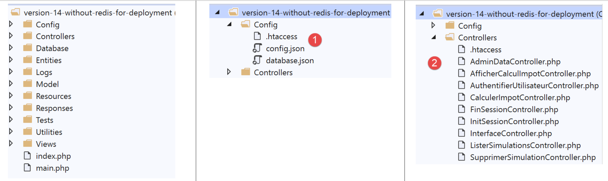
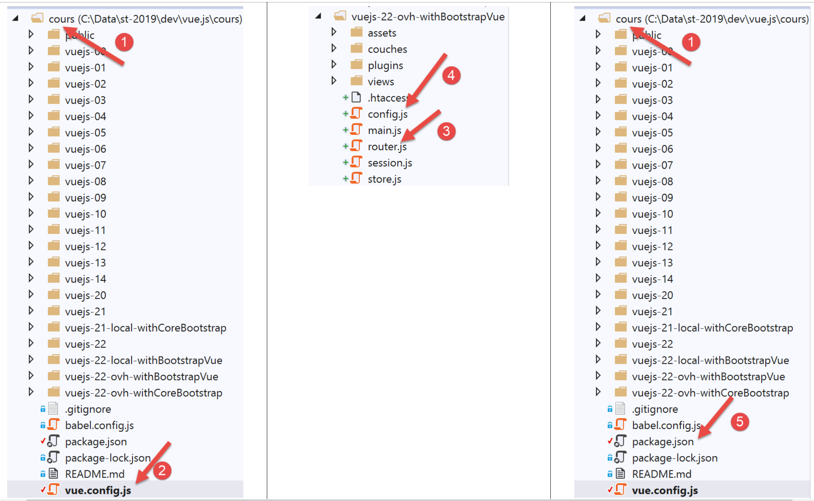

Déploiement de l’application client / serveur sur un service d’hébergement
==========================================================================

Nous donnons ici les grandes lignes du déploiement de l’application
client / serveur que nous avons développée sur un serveur OVH
**[https://www.ovh.com/fr/]**. Le déploiement sur d’autres fournisseurs
d’hébergement ne devrait pas être très différent. On veut simplement
montrer que notre application se prête bien à ce déploiement.

Déploiement du serveur
----------------------

L’hébergement OVH visé est un hébergement basique :

1. un environnement PHP 7.3 ;

2. un SGBD MySQL ;

3. pas de serveur **[Redis]** ;

Le 3ième point nous oblige à modifier la version 14 de notre serveur de
calcul de l’impôt.

|image0|

Il nous faut modifier :

-  les fichiers de configuration **[1]** ;

-  les contrôleurs **[AdminDataController]** et
   **[CalculerImpotController]** pour tenir compte du fait qu’il n’y a
   pas de serveur **[Redis]** ;

Le fichier **[config.json]** évolue de la façon suivante :

.. code-block:: json 
  :linenos: 

   {
       "databaseFilename": "Config/database.json",
       "corsAllowed": false,
       "redisAvailable":false,
       "rootDirectory": "/.../www/apps/impot/serveur-php7",
       "relativeDependencies": [

           "/Entities/BaseEntity.php",
           ...
           "/Controllers/AdminDataController.php"
       ],
       "absoluteDependencies": [
           "/.../vendor/autoload.php",
           "/.../vendor/predis/predis/autoload.php"
       ],
       "users": [
           {
               "login": "admin",
               "passwd": "admin"
           }
       ],
       ...
   }

**Commentaires**

-  ligne 4 : on introduit un booléen **[redisAvailable]** pour indiquer
   si on a accès ou non à un serveur **[Redis]** ;

-  lignes 5, 13, 14 : les chemins absolus vont changer ;

Le fichier **[database.json]** évolue comme suit :

.. code-block:: json 
  :linenos: 

   {
       "dsn": "mysql:host=...;dbname=...",
       "id": "...",
       "pwd": "...",
       "tableTranches": "dbimpots_tbtranches",
       "colLimites": "limites",
       "colCoeffR": "coeffr",
       "colCoeffN": "coeffn",
       "tableConstantes": "dbimpots_tbconstantes",
       "colPlafondQfDemiPart": "plafondQfDemiPart",
       ...
   }

**Commentaires**

-  lignes 2-4 : l’identité de la base de données ainsi que les
   identifiants de son propriétaire vont changer ;

Le contrôleur **[AdminDataController]** évolue de la façon suivante :

.. code-block:: php 
  :linenos: 

   <?php

   namespace Application;

   // dépendances Symfony
   use \Symfony\Component\HttpFoundation\Response;
   use \Symfony\Component\HttpFoundation\Request;
   use \Symfony\Component\HttpFoundation\Session\Session;
   // alias de la couche [dao]
   use \Application\ServerDaoWithSession as ServerDaoWithRedis;

   class AdminDataController implements InterfaceController {

     // $config est la configuration de l'application
     // traitement d'une requête Request
     // utile la session Session et peut la modifier
     // $infos sont des informations supplémentaires propres à chaque contrôleur
     // rend un tableau [$statusCode, $état, $content, $headers]
     public function execute(
       array $config,
       Request $request,
       Session $session,
       array $infos = NULL): array {

       // on doit avoir un unique paramètre GET
       $method = strtolower($request->getMethod());
       ...

       // on peut travailler
       // Redis
       if ($config["redisAvailable"]) {
         \Predis\Autoloader::register();
         ...
       } else {
         try {
           // on va chercher les données fiscales en base de données
           $dao = new ServerDaoWithRedis($config["databaseFilename"], NULL);
           // taxAdminData
           $taxAdminData = $dao->getTaxAdminData();
         } catch (\Throwable $ex) {
           // ça s'est mal passé
           // retour résultat avec erreur au contrôleur principal
           $état = 1051;
           return [Response::HTTP_INTERNAL_SERVER_ERROR, $état,
             ["réponse" => utf8_encode($ex->getMessage())], []];
         }
       }

       // retour résultat au contrôleur principal
       $état = 1000;
       return [Response::HTTP_OK, $état, ["réponse" => $taxAdminData], []];
     }

   }

**Commentaires**

-  ligne 31 : on teste désormais si on a ou non un serveur **[Redis]** ;

-  lignes 32-34 : si oui, le code précédent est repris dans son
   intégralité ;

-  lignes 35-46 : sinon, les données de l’administration fiscale sont
   prises dans la base de données ;

Le contrôleur **[CalculerImpotController]** qui lui également a besoin
des données de l’administration fiscale évolue de façon identique.

Ceci fait. Le déploiement sur le serveur OVH a consisté à faire du FTP.
On a téléchargé sur OVH :

-  la version **[vuejs-14-without-redis]** ;

-  le dossier **[vendor]** qui contient toutes les dépendances du
   serveur **[vuejs-14-without-redis]** ;

Le transfert FTP fait, on a généré les tables nécessaires au serveur
avec le script SQL suivant :

.. code-block:: sql 
  :linenos: 

   -- phpMyAdmin SQL Dump
   -- version 4.8.5
   -- https://www.phpmyadmin.net/
   --
   -- Host: localhost:3306
   -- Generation Time: Oct 12, 2019 at 07:45 AM
   -- Server version: 5.7.24
   -- PHP Version: 7.2.11

   SET SQL_MODE = "NO_AUTO_VALUE_ON_ZERO";
   SET AUTOCOMMIT = 0;
   START TRANSACTION;
   SET time_zone = "+00:00";

   /*!40101 SET @OLD_CHARACTER_SET_CLIENT=@@CHARACTER_SET_CLIENT */;
   /*!40101 SET @OLD_CHARACTER_SET_RESULTS=@@CHARACTER_SET_RESULTS */;
   /*!40101 SET @OLD_COLLATION_CONNECTION=@@COLLATION_CONNECTION */;
   /*!40101 SET NAMES utf8mb4 */;

   --
   -- Table structure for table `dbimpots_tbconstantes`
   --

   CREATE TABLE `dbimpots_tbconstantes` (
     `id` int(11) NOT NULL,
     `plafondQfDemiPart` decimal(10,2) NOT NULL,
     `plafondRevenusCelibatairePourReduction` decimal(10,2) NOT NULL,
     `plafondRevenusCouplePourReduction` decimal(10,2) NOT NULL,
     `valeurReducDemiPart` decimal(10,2) NOT NULL,
     `plafondDecoteCelibataire` decimal(10,2) NOT NULL,
     `plafondDecoteCouple` decimal(10,2) NOT NULL,
     `plafondImpotCelibatairePourDecote` decimal(10,2) NOT NULL,
     `plafondImpotCouplePourDecote` decimal(10,2) NOT NULL,
     `abattementDixPourcentMax` decimal(10,2) NOT NULL,
     `abattementDixPourcentMin` decimal(10,2) NOT NULL
   ) ENGINE=InnoDB DEFAULT CHARSET=utf8;

   --
   -- Dumping data for table `dbimpots_tbconstantes`
   --

   INSERT INTO `dbimpots_tbconstantes` (`id`, `plafondQfDemiPart`, `plafondRevenusCelibatairePourReduction`, `plafondRevenusCouplePourReduction`, `valeurReducDemiPart`, `plafondDecoteCelibataire`, `plafondDecoteCouple`, `plafondImpotCelibatairePourDecote`, `plafondImpotCouplePourDecote`, `abattementDixPourcentMax`, `abattementDixPourcentMin`) VALUES
   (8, '1551.00', '21037.00', '42074.00', '3797.00', '1196.00', '1970.00', '1595.00', '2627.00', '12502.00', '437.00');

   -- --------------------------------------------------------

   --
   -- Table structure for table `dbimpots_tbtranches`
   --

   CREATE TABLE `dbimpots_tbtranches` (
     `id` int(11) NOT NULL,
     `limites` decimal(10,2) NOT NULL,
     `coeffR` decimal(10,2) NOT NULL,
     `coeffN` decimal(10,2) NOT NULL
   ) ENGINE=InnoDB DEFAULT CHARSET=utf8;

   --
   -- Dumping data for table `dbimpots_tbtranches`
   --

   INSERT INTO `dbimpots_tbtranches` (`id`, `limites`, `coeffR`, `coeffN`) VALUES
   (36, '9964.00', '0.00', '0.00'),
   (37, '27519.00', '0.14', '1394.96'),
   (38, '73779.00', '0.30', '5798.00'),
   (39, '156244.00', '0.41', '13913.69'),
   (40, '0.00', '0.45', '20163.45');

   --
   -- Indexes for dumped tables
   --

   --
   -- Indexes for table `dbimpots_tbconstantes`
   --
   ALTER TABLE `dbimpots_tbconstantes`
     ADD PRIMARY KEY (`id`);

   --
   -- Indexes for table `dbimpots_tbtranches`
   --
   ALTER TABLE `dbimpots_tbtranches`
     ADD PRIMARY KEY (`id`);

   --
   -- AUTO_INCREMENT for dumped tables
   --

   --
   -- AUTO_INCREMENT for table `dbimpots_tbconstantes`
   --
   ALTER TABLE `dbimpots_tbconstantes`
     MODIFY `id` int(11) NOT NULL AUTO_INCREMENT, AUTO_INCREMENT=9;

   --
   -- AUTO_INCREMENT for table `dbimpots_tbtranches`
   --
   ALTER TABLE `dbimpots_tbtranches`
     MODIFY `id` int(11) NOT NULL AUTO_INCREMENT, AUTO_INCREMENT=41;
   COMMIT;

   /*!40101 SET CHARACTER_SET_CLIENT=@OLD_CHARACTER_SET_CLIENT */;
   /*!40101 SET CHARACTER_SET_RESULTS=@OLD_CHARACTER_SET_RESULTS */;
   /*!40101 SET COLLATION_CONNECTION=@OLD_COLLATION_CONNECTION */;

Lorsque tout ceci a été fait, on a adapté les fichiers **[config.json,
database.json]** à leur nouvel environnement.

Déploiement du client [Vue.js]
------------------------------

Il a été décidé de déployer le client **[Vue.js]** à l’URL
**[http://machine/apps/impot/client-vuejs/]**. Cela a entraîné les
modifications suivantes :

A la racine du **[workspace]** de **[VSCode]** on a créé le fichier
**[vue.config.js]** suivant :

|image1|

Le fichier **[vue.config.js]** est le suivant :

.. code-block:: javascript 
  :linenos: 

   // vue.config.js
   module.exports = {
     // l'URL de service du client [vuejs] du serveur de calcul de l'impôt
     publicPath: '/apps/impot/client-vuejs/'
   }

Le fichier **[router.js]** **[3]** a été également modifié :

.. code-block:: javascript 
  :linenos: 

   // imports
   import Vue from 'vue'
   import VueRouter from 'vue-router'
   ...

   // plugin de routage
   Vue.use(VueRouter)

   // les routes de l'application
   const routes = [
     ...
   ]

   // le routeur
   const router = new VueRouter({
     // les routes
     routes,
     // le mode d'affichage des URL
     mode: 'history',
     // l'URL de base de l'application
     base: '/apps/impot/client-vuejs/'
   })

   // vérification des routes
   router.beforeEach((to, from, next) => {
     ...
   })

   // export du router
   export default router

**Commentaires**

-  ligne 21 : la base des URL a été modifiée ;

Le fichier **[config.js]** est modifié de la façon suivante :

.. code-block:: javascript 
  :linenos: 

   // utilisation de la bibliothèque [axios]
   const axios = require('axios');
   // timeout des requêtes HTTP
   axios.defaults.timeout = 5000;
   // la base des URL du serveur de calcul de l'impôt
   // le schéma [https] pose des problèmes à Firefox parce que le serveur de calcul
   // de l'impôt envoie un certificat autosigné. ok avec Chrome et Edge. Safari pas testé.
   // avec Firefox c'est possible en demandant l'URL ci-dessous directement et en disant à Firefox
   // que vous acceptez le risque d'un certificat non signé. Ensuite le client [vuejs] fonctionnera.
   axios.defaults.baseURL = 'http://.../apps/impot/serveur-php7';
   // on va utiliser des cookies
   axios.defaults.withCredentials = true;

   // export de la configuration
   export default {
     // objet [axios]
     axios: axios,
     // délai maximal d'inactivité de la session : 5 mn = 300 s = 300000 ms
     duréeSession: 300000
   }

**Commentaires**

-  ligne 10 : on met l’URL du serveur de calcul de l’impôt ;

La version de production du projet a été générée avec la commande
**[build]** du fichier **[package.json]** **[5]** suivant :

.. code-block:: json 
  :linenos: 

   {
     "name": "vuejs",
     "version": "0.1.0",
     "private": true,
     "scripts": {
       "serve": "vue-cli-service serve vuejs-22/main.js",
       "build": "vue-cli-service build vuejs-22-ovh-withBootstrapVue/main.js",
       "lint": "vue-cli-service lint"
     },
     ...
   }

Ceci fait, le dossier **[dist]** qui contenait la version de production
générée a été ‘uploadée’ sur le serveur OVH dans le dossier
**[/.../apps/impot]** puis renommé **[client-vuejs]** pour que le code
du client soit dans le dossier **[/.../apps/impot/client-vuejs/]** comme
il était prévu. Puis dans ce dossier nous avons téléchargé le fichier
**[.htaccess]** suivant :

.. code-block:: apache 
  :linenos: 

   <IfModule mod_rewrite.c>
     RewriteEngine On
     RewriteBase /apps/impot/client-vuejs/
     RewriteRule ^index\.html$ - [L]
     RewriteCond %{REQUEST_FILENAME} !-f
     RewriteCond %{REQUEST_FILENAME} !-d
     RewriteRule . /apps/impot/client-vuejs/index.html [L]
   </IfModule>

ceci parce que le serveur web d’OVH utilisé ici est un serveur Apache.
Pour d’autres types de serveurs, on se reportera à la documentation
\|\ https://cli.vuejs.org/guide/deployment.html\ \|.

L’application serveur PHP 7 peut être testée
\|\ `ici <http://sergetahe.com/apps/impot/serveur-php7/>`__\ **\ \|**.

Le client [Vue.js] peut être testé
\|\ `ici <http://sergetahe.com/apps/impot/client-vuejs/>`__\ **\ \|**.

Conclusion
----------

La version **[vuejs-21]** n’était pas indispensable. On avait vu que la
version **[vuejs-20]** résistait correctement aux URL tapées par
l’utilisateur. Néanmoins la nouvelle version amène un confort
supplémentaire à l’utilisateur. Il peut naviguer en tapant des URL.
L’application lui propose alors la vue qui convient le mieux à l’état
actuel (la session) de l’application. Par ailleurs, la version
**[vuejs-22]** amène des améliorations pour l’affichage de l’application
sur mobiles.

